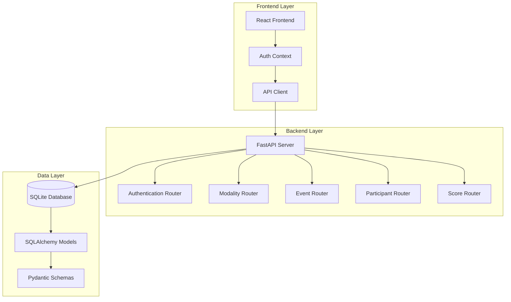
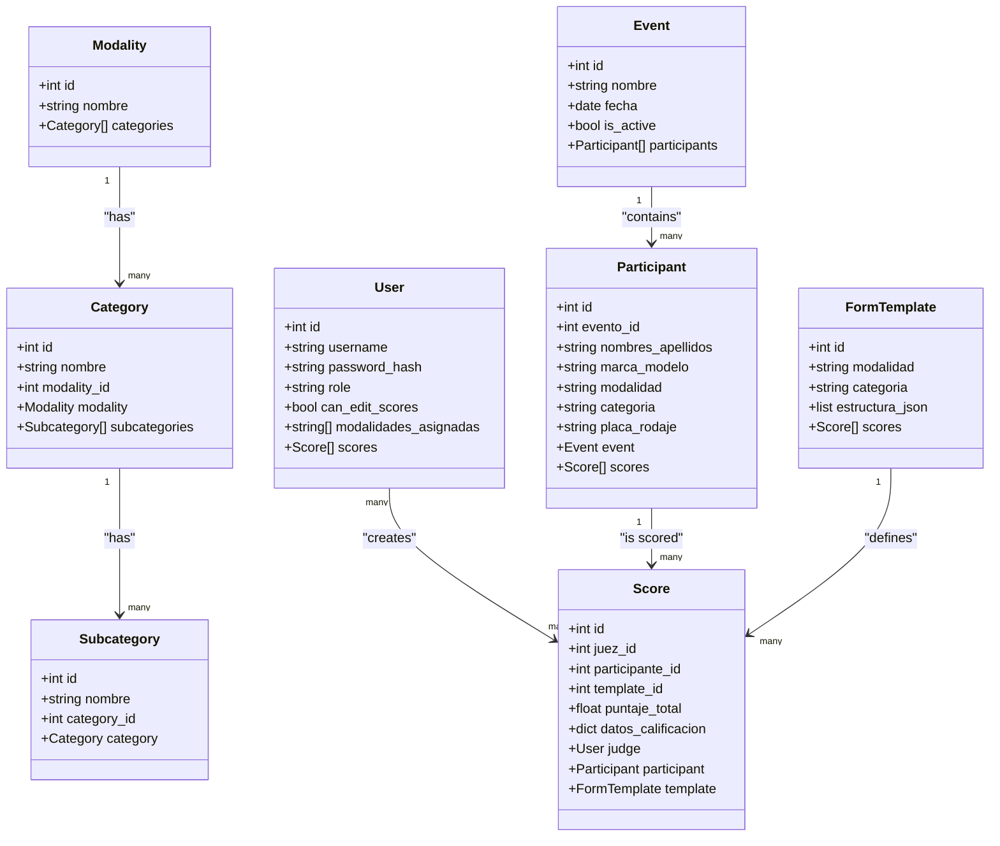
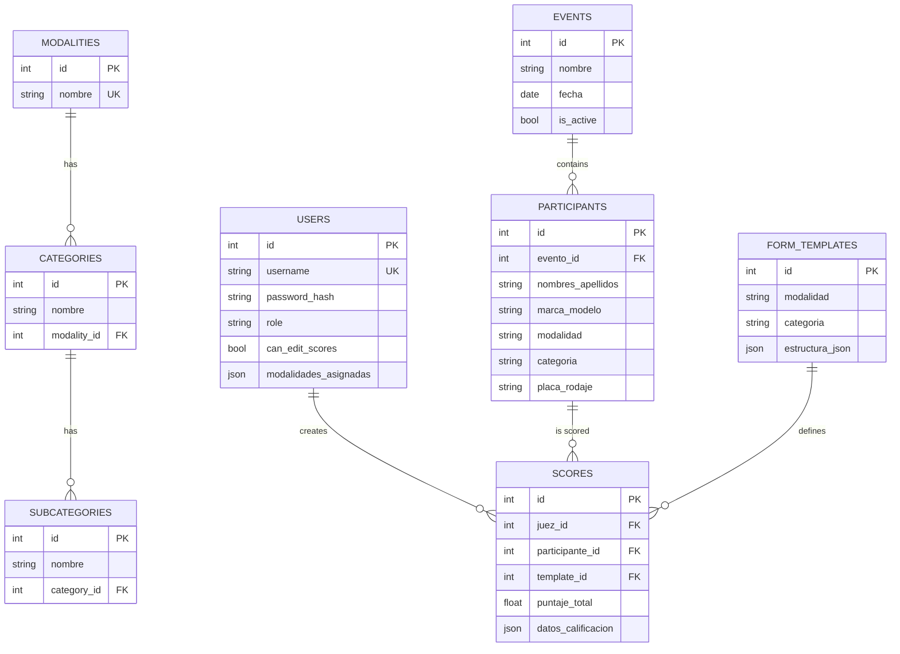
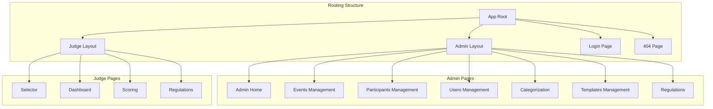
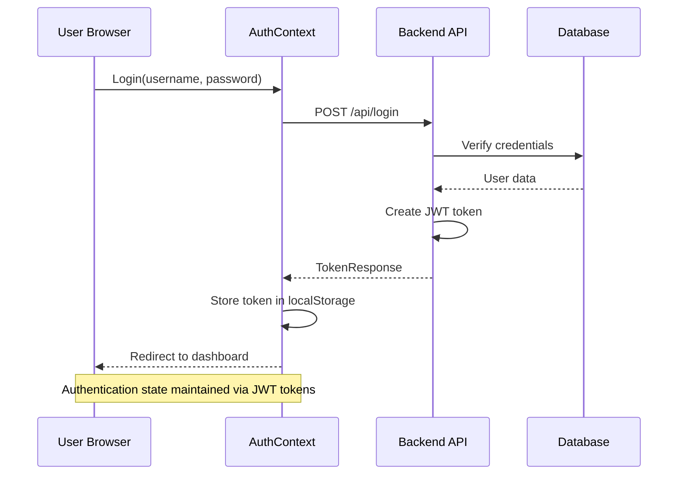
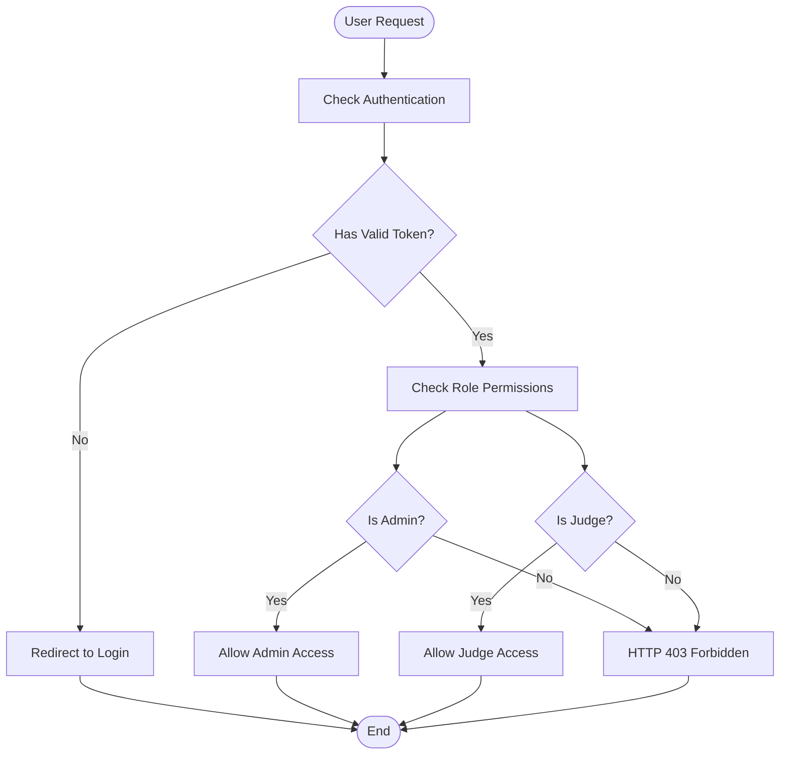
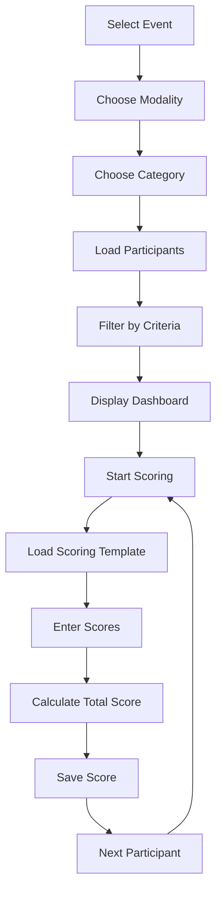
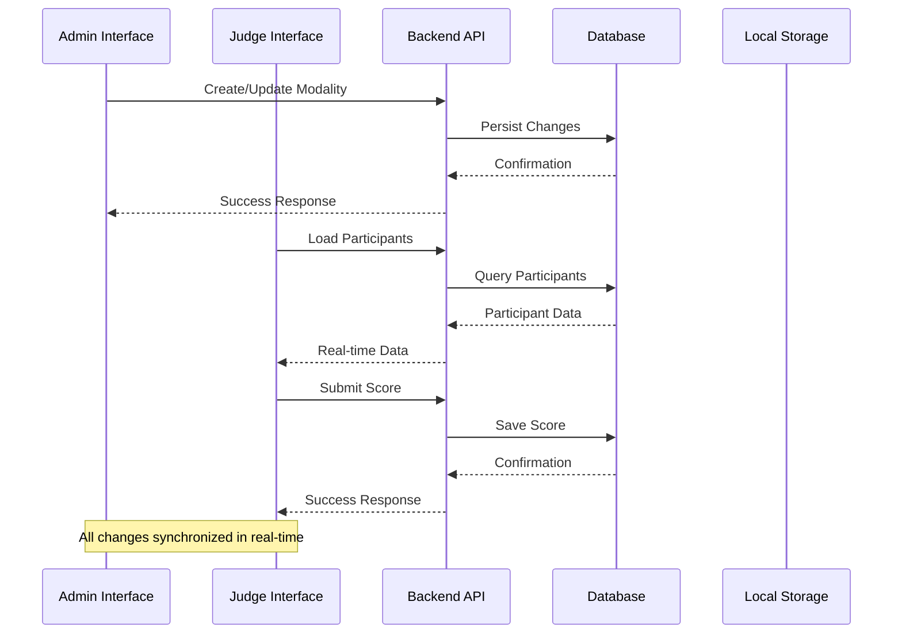

# Modality Management System

<cite>
**Referenced Files in This Document**
- [main.py](file://main.py)
- [models.py](file://models.py)
- [schemas.py](file://schemas.py)
- [routes/modalities.py](file://routes/modalities.py)
- [routes/auth.py](file://routes/auth.py)
- [utils/dependencies.py](file://utils/dependencies.py)
- [frontend/src/App.tsx](file://frontend/src/App.tsx)
- [frontend/src/contexts/AuthContext.tsx](file://frontend/src/contexts/AuthContext.tsx)
- [frontend/src/lib/api.ts](file://frontend/src/lib/api.ts)
- [frontend/src/pages/admin/Categorias.tsx](file://frontend/src/pages/admin/Categorias.tsx)
- [frontend/src/pages/juez/Selector.tsx](file://frontend/src/pages/juez/Selector.tsx)
- [frontend/src/pages/juez/Dashboard.tsx](file://frontend/src/pages/juez/Dashboard.tsx)
- [requirements.txt](file://requirements.txt)
</cite>

## Update Summary
**Changes Made**
- Consolidated all modality-related functionality into a single comprehensive document
- Enhanced documentation coverage of hierarchical competition structure
- Expanded frontend integration details for modality management
- Added comprehensive API endpoint documentation
- Improved database schema representation
- Enhanced authentication and authorization flow documentation

## Table of Contents
1. [Introduction](#introduction)
2. [System Architecture](#system-architecture)
3. [Core Components](#core-components)
4. [Database Schema](#database-schema)
5. [API Endpoints](#api-endpoints)
6. [Frontend Application](#frontend-application)
7. [Authentication & Authorization](#authentication--authorization)
8. [Modality Management Features](#modality-management-features)
9. [Data Flow Analysis](#data-flow-analysis)
10. [Performance Considerations](#performance-considerations)
11. [Troubleshooting Guide](#troubleshooting-guide)
12. [Conclusion](#conclusion)

## Introduction

The Modality Management System is a comprehensive judging platform designed for car audio and tuning competitions. This system provides a complete solution for managing competition modalities, categories, participants, scoring, and administrative functions. Built with a modern tech stack featuring FastAPI backend and React frontend, it offers real-time collaboration between administrators and judges during competition events.

The system supports hierarchical competition structures with modalities, categories, and subcategories, enabling complex tournament formats. It includes automated participant filtering, dynamic scoring forms, and comprehensive reporting capabilities for competition management.

**Section sources**
- [main.py:26-47](file://main.py#L26-L47)
- [models.py:113-153](file://models.py#L113-L153)

## System Architecture

The Modality Management System follows a clean architecture pattern with clear separation between frontend and backend components:



**Diagram sources**
- [main.py:26-47](file://main.py#L26-L47)
- [routes/modalities.py:16](file://routes/modalities.py#L16)
- [routes/auth.py:10](file://routes/auth.py#L10)

The architecture consists of three main layers:

1. **Presentation Layer**: React-based frontend with TypeScript and TailwindCSS
2. **Application Layer**: FastAPI backend with modular routing
3. **Data Layer**: SQLite database with SQLAlchemy ORM

**Section sources**
- [main.py:1-53](file://main.py#L1-L53)
- [requirements.txt:1-10](file://requirements.txt#L1-L10)

## Core Components

### Backend Services

The backend is built on FastAPI, providing automatic API documentation and type safety:

```mermaid
classDiagram
class FastAPIServer {
+CORSMiddleware cors_middleware
+StaticFiles uploads
+include_router() router
+health_check() status
}
class DatabaseManager {
+engine create_engine
+sessionmaker SessionLocal
+get_db() Session
+run_sqlite_migrations() void
}
class ModalityRouter {
+GET /api/modalities list_modalities()
+POST /api/modalities create_modality()
+POST /modality_id/categories create_category()
+POST /categories/{category_id}/subcategories create_subcategory()
+DELETE /{modality_id} delete_modality()
+DELETE /categories/{category_id} delete_category()
+DELETE /subcategories/{subcategory_id} delete_subcategory()
}
class AuthRouter {
+POST /api/login login()
}
FastAPIServer --> DatabaseManager : "uses"
FastAPIServer --> ModalityRouter : "includes"
FastAPIServer --> AuthRouter : "includes"
```

**Diagram sources**
- [main.py:26-47](file://main.py#L26-L47)
- [routes/modalities.py:16](file://routes/modalities.py#L16)
- [routes/auth.py:10](file://routes/auth.py#L10)

### Database Models

The system uses a hierarchical structure for competition organization:



**Diagram sources**
- [models.py:113-153](file://models.py#L113-L153)

**Section sources**
- [models.py:1-153](file://models.py#L1-L153)
- [schemas.py:1-202](file://schemas.py#L1-L202)

## Database Schema

The system uses SQLite as the primary database with SQLAlchemy ORM for data persistence:



**Diagram sources**
- [models.py:11-153](file://models.py#L11-L153)

**Section sources**
- [models.py:1-153](file://models.py#L1-L153)

## API Endpoints

The system provides a comprehensive REST API for all major functionalities:

### Authentication Endpoints

| Endpoint | Method | Description |
|----------|--------|-------------|
| `/api/login` | POST | User authentication and token generation |

### Modality Management Endpoints

| Endpoint | Method | Description |
|----------|--------|-------------|
| `/api/modalities` | GET | List all modalities with nested categories and subcategories |
| `/api/modalities` | POST | Create a new modality |
| `/api/modalities/{modality_id}/categories` | POST | Create a new category within a modality |
| `/api/modalities/categories/{category_id}/subcategories` | POST | Create a new subcategory within a category |
| `/api/modalities/{modality_id}` | DELETE | Delete a modality and all its categories and subcategories |
| `/api/modalities/categories/{category_id}` | DELETE | Delete a category and all its subcategories |
| `/api/modalities/subcategories/{subcategory_id}` | DELETE | Delete a subcategory |

### Additional Entity Endpoints

The system also provides endpoints for users, events, participants, scoring, and regulations management, all following consistent REST patterns with proper CRUD operations.

**Section sources**
- [routes/modalities.py:19-192](file://routes/modalities.py#L19-L192)
- [routes/auth.py:13-36](file://routes/auth.py#L13-L36)

## Frontend Application

The frontend is built with React 18, TypeScript, and TailwindCSS, providing a responsive and intuitive interface:



**Diagram sources**
- [frontend/src/App.tsx:95-127](file://frontend/src/App.tsx#L95-L127)

### Authentication Flow



**Diagram sources**
- [frontend/src/contexts/AuthContext.tsx:95-111](file://frontend/src/contexts/AuthContext.tsx#L95-L111)
- [routes/auth.py:13-36](file://routes/auth.py#L13-L36)

**Section sources**
- [frontend/src/App.tsx:1-128](file://frontend/src/App.tsx#L1-L128)
- [frontend/src/contexts/AuthContext.tsx:1-144](file://frontend/src/contexts/AuthContext.tsx#L1-L144)

## Authentication & Authorization

The system implements JWT-based authentication with role-based access control:

### Security Implementation



**Diagram sources**
- [utils/dependencies.py:32-47](file://utils/dependencies.py#L32-L47)

### Token Structure

The JWT tokens contain essential user information:
- `user_id`: Unique identifier for the user
- `role`: User role (admin/juez)
- `username`: User's username

**Section sources**
- [utils/dependencies.py:16-71](file://utils/dependencies.py#L16-L71)
- [routes/auth.py:23-35](file://routes/auth.py#L23-L35)

## Modality Management Features

### Hierarchical Competition Structure

The system supports a three-level hierarchy for competition organization:

1. **Modalities**: Primary competition categories (e.g., "Car Audio", "Tuning")
2. **Categories**: Secondary divisions within modalities (e.g., "Open", "Amateur")
3. **Subcategories**: Fine-grained groupings (e.g., "Street", "Track")

### Dynamic Scoring System



**Diagram sources**
- [frontend/src/pages/juez/Dashboard.tsx:51-119](file://frontend/src/pages/juez/Dashboard.tsx#L51-L119)

### Administrative Capabilities

Administrators can manage all aspects of the competition structure:

- Create and modify modalities, categories, and subcategories
- Assign judges to specific modalities
- Configure scoring templates
- Manage participant registration
- Upload and manage competition regulations

**Section sources**
- [frontend/src/pages/admin/Categorias.tsx:25-337](file://frontend/src/pages/admin/Categorias.tsx#L25-L337)
- [frontend/src/pages/juez/Selector.tsx:36-236](file://frontend/src/pages/juez/Selector.tsx#L36-L236)

## Data Flow Analysis

### Real-time Data Synchronization



**Diagram sources**
- [frontend/src/pages/juez/Dashboard.tsx:66-92](file://frontend/src/pages/juez/Dashboard.tsx#L66-L92)
- [routes/modalities.py:36-54](file://routes/modalities.py#L36-L54)

### Data Validation and Processing

The system implements comprehensive data validation at multiple levels:

1. **Frontend Validation**: Type-safe forms with real-time validation
2. **Backend Validation**: Pydantic models for request/response validation
3. **Database Constraints**: Unique constraints and referential integrity
4. **Business Logic Validation**: Custom validation rules for competition rules

**Section sources**
- [schemas.py:10-202](file://schemas.py#L10-L202)
- [models.py:40-153](file://models.py#L40-L153)

## Performance Considerations

### Database Optimization

The system implements several optimization strategies:

- **Indexing**: Strategic indexing on frequently queried fields
- **Connection Pooling**: Efficient database connection management
- **Lazy Loading**: Eager loading with joinedload for related entities
- **Migration Support**: Automatic database schema migrations

### Frontend Performance

- **Code Splitting**: Route-based code splitting for faster initial loads
- **State Management**: Efficient React state management with context
- **API Caching**: Local storage caching for authentication tokens
- **Responsive Design**: Mobile-first approach with TailwindCSS

### Scalability Considerations

- **Horizontal Scaling**: Stateless API design supports load balancing
- **Database Migration**: SQLite to PostgreSQL migration path
- **Caching Strategy**: Potential Redis integration for production
- **Monitoring**: Health check endpoints and logging infrastructure

## Troubleshooting Guide

### Common Issues and Solutions

#### Authentication Problems
- **Issue**: Login failures with invalid credentials
- **Solution**: Verify username/password combination and check database connectivity

#### Database Migration Errors
- **Issue**: Schema inconsistencies after updates
- **Solution**: Run database migration script and verify table structure

#### Frontend Routing Issues
- **Issue**: Navigation problems between admin and judge interfaces
- **Solution**: Check authentication state and route protection middleware

#### API Connectivity
- **Issue**: Frontend cannot reach backend API
- **Solution**: Verify CORS configuration and API endpoint accessibility

### Debugging Tools

The system includes built-in debugging capabilities:
- **Health Check Endpoint**: `/health` for system status verification
- **Error Logging**: Comprehensive error tracking and reporting
- **Development Mode**: Detailed error messages during development

**Section sources**
- [main.py:50-53](file://main.py#L50-L53)

## Conclusion

The Modality Management System provides a robust, scalable solution for car audio and tuning competition management. Its modular architecture, comprehensive feature set, and modern technology stack make it well-suited for both small-scale and large-scale competitions.

Key strengths include:
- **Hierarchical Organization**: Flexible competition structure supporting complex tournament formats
- **Real-time Collaboration**: Seamless coordination between administrators and judges
- **Security Focus**: Comprehensive authentication and authorization mechanisms
- **Developer Experience**: Clean codebase with extensive documentation and testing support
- **Future-Ready**: Designed for easy extension and customization

The system successfully balances functionality with maintainability, providing a solid foundation for competition management while allowing for future enhancements and scaling requirements.