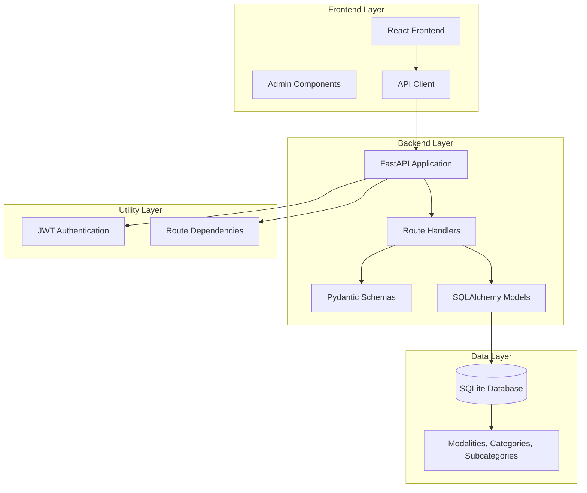
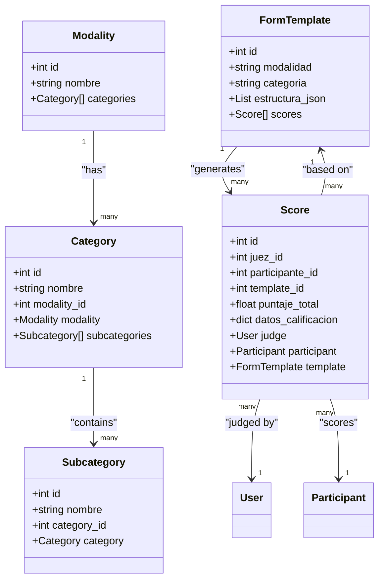
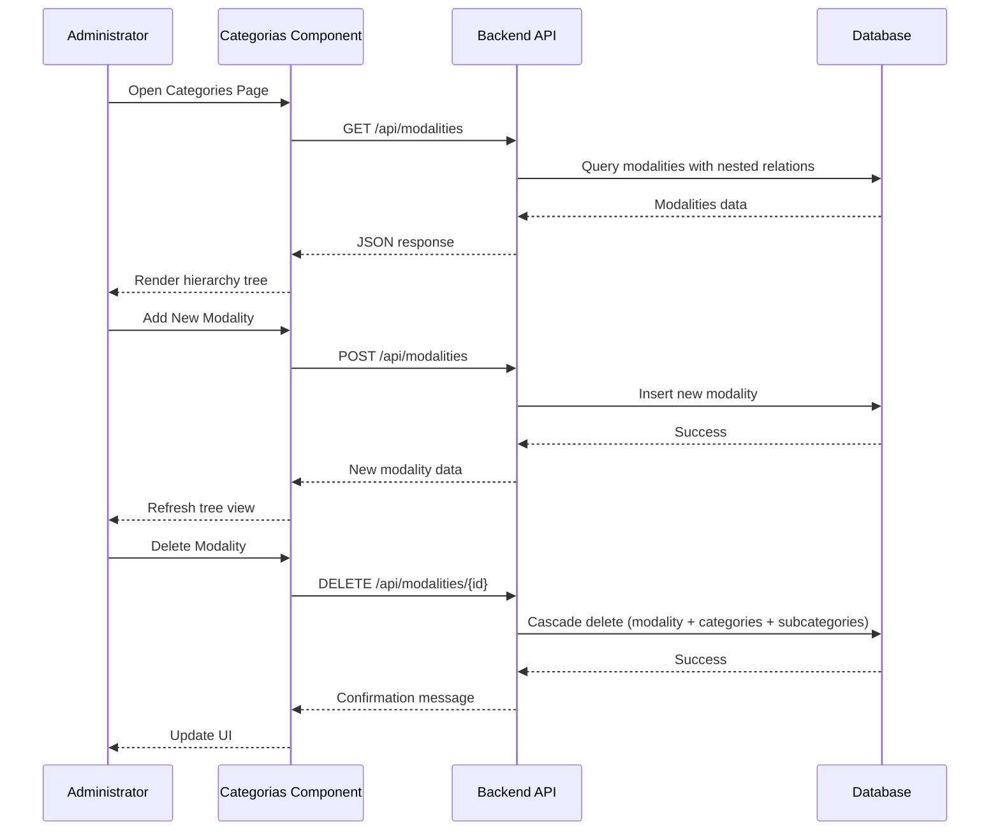
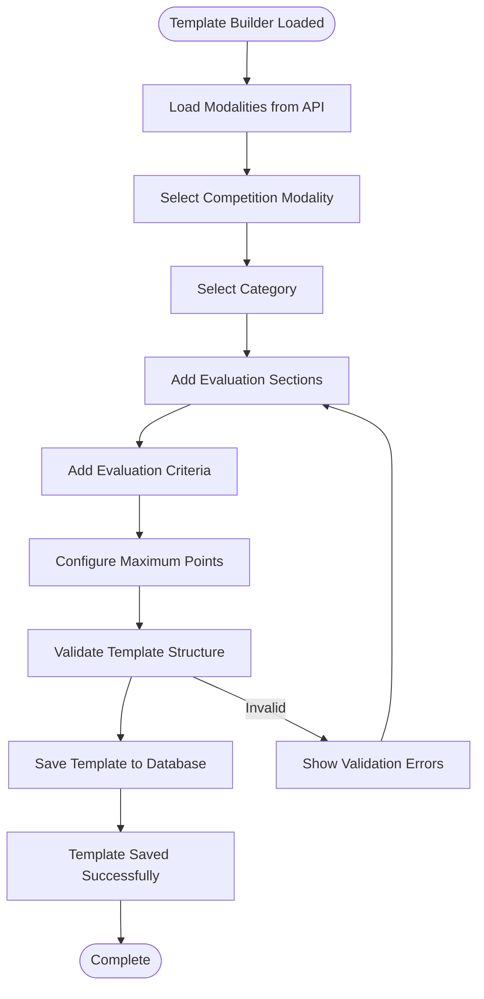
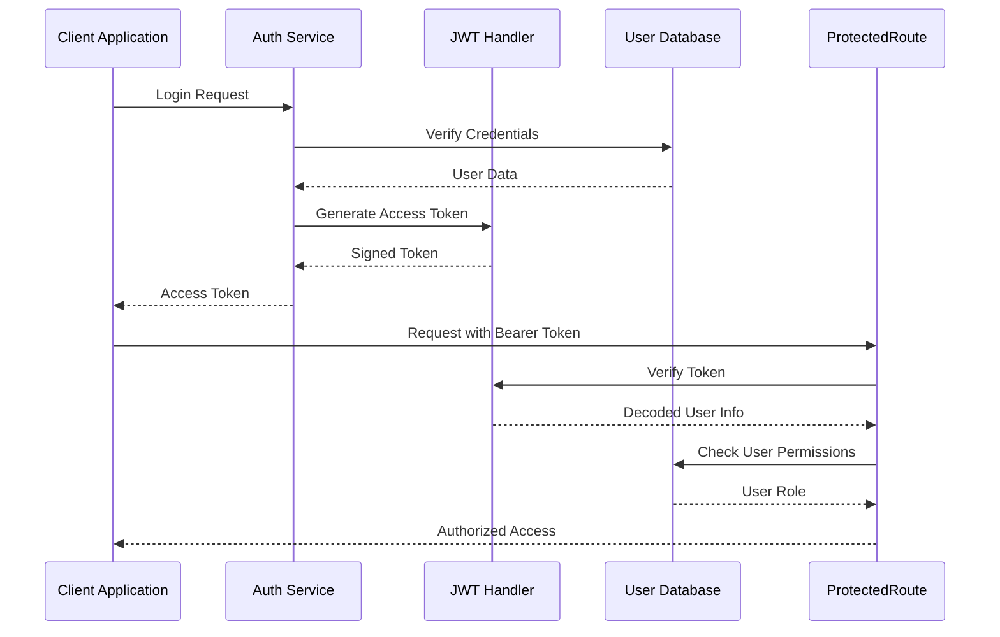
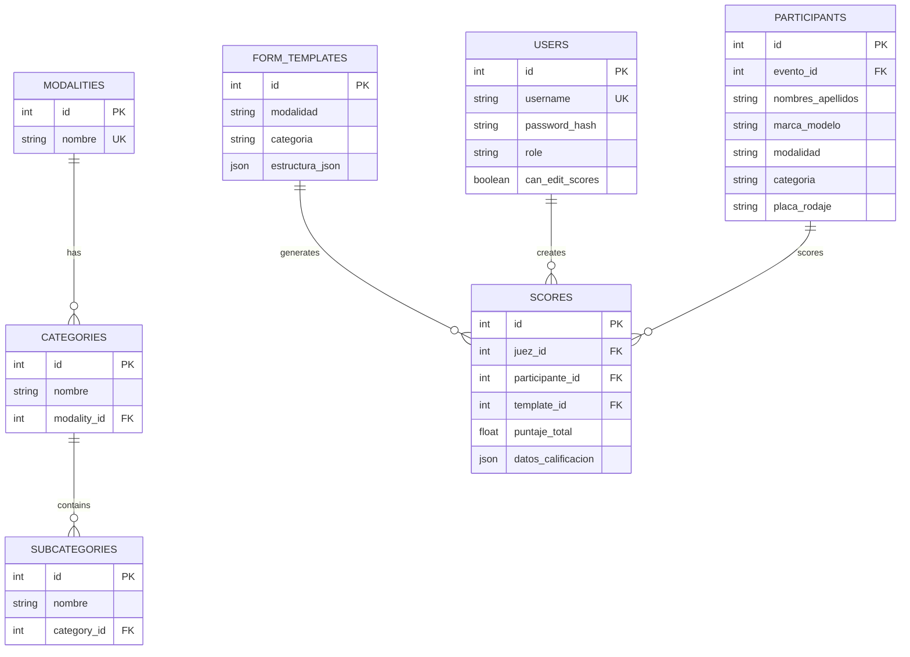

# Modality Management

<cite>
**Referenced Files in This Document**
- [routes/modalities.py](file://routes/modalities.py)
- [models.py](file://models.py)
- [schemas.py](file://schemas.py)
- [frontend/src/pages/admin/Categorias.tsx](file://frontend/src/pages/admin/Categorias.tsx)
- [frontend/src/pages/admin/TemplateBuilder.tsx](file://frontend/src/pages/admin/TemplateBuilder.tsx)
- [frontend/src/lib/api.ts](file://frontend/src/lib/api.ts)
- [utils/dependencies.py](file://utils/dependencies.py)
- [database.py](file://database.py)
- [main.py](file://main.py)
- [routes/templates.py](file://routes/templates.py)
- [init_db.py](file://init_db.py)
</cite>

## Table of Contents
1. [Introduction](#introduction)
2. [System Architecture](#system-architecture)
3. [Core Data Model](#core-data-model)
4. [API Endpoints](#api-endpoints)
5. [Frontend Implementation](#frontend-implementation)
6. [Template Management](#template-management)
7. [Security and Authentication](#security-and-authentication)
8. [Database Schema](#database-schema)
9. [Error Handling](#error-handling)
10. [Usage Examples](#usage-examples)
11. [Troubleshooting Guide](#troubleshooting-guide)
12. [Conclusion](#conclusion)

## Introduction

The Modality Management system is a comprehensive tournament competition structure management solution built with FastAPI backend and React frontend. This system enables administrators to organize competitions through a hierarchical structure consisting of Modalities, Categories, and Subcategories, while providing template-based scoring systems for judges.

The system supports a three-tier hierarchy where:
- **Modalities** represent broad competition types (e.g., "Car Audio", "Tuning")
- **Categories** represent specific divisions within modalities (e.g., "Open Class", "Amateur")
- **Subcategories** represent detailed classifications (e.g., "Installation Quality", "Sound Performance")

Each level supports CRUD operations with proper validation and cascading deletions, ensuring data integrity throughout the competition structure.

## System Architecture

The Modality Management system follows a clean architecture pattern with clear separation of concerns:



**Diagram sources**
- [main.py:26-44](file://main.py#L26-L44)
- [routes/modalities.py:16](file://routes/modalities.py#L16)
- [models.py:113](file://models.py#L113)

The architecture ensures scalability and maintainability through:
- **Separation of Concerns**: Clear boundaries between frontend, backend, and data layers
- **Type Safety**: Pydantic schemas provide runtime validation and serialization
- **Database Abstraction**: SQLAlchemy ORM handles database operations
- **Authentication Middleware**: JWT-based security with role-based access control

## Core Data Model

The system implements a hierarchical data model with cascading relationships:



**Diagram sources**
- [models.py:113](file://models.py#L113)
- [models.py:125](file://models.py#L125)
- [models.py:142](file://models.py#L142)
- [models.py:72](file://models.py#L72)
- [models.py:86](file://models.py#L86)

**Section sources**
- [models.py:113](file://models.py#L113-L153)
- [schemas.py:165](file://schemas.py#L165-L202)

## API Endpoints

The system provides comprehensive RESTful APIs for managing the competition hierarchy:

### Modality Management Endpoints

| Endpoint | Method | Description | Authentication |
|----------|--------|-------------|----------------|
| `/api/modalities` | GET | List all modalities with nested categories and subcategories | User |
| `/api/modalities` | POST | Create a new modality | Admin |
| `/api/modalities/{modality_id}` | DELETE | Delete a modality and all its categories/subcategories | Admin |

### Category Management Endpoints

| Endpoint | Method | Description | Authentication |
|----------|--------|-------------|----------------|
| `/api/modalities/{modality_id}/categories` | POST | Create a new category within a modality | Admin |
| `/api/modalities/categories/{category_id}/subcategories` | POST | Create a new subcategory within a category | Admin |
| `/api/modalities/categories/{category_id}` | DELETE | Delete a category and all its subcategories | Admin |

### Subcategory Management Endpoints

| Endpoint | Method | Description | Authentication |
|----------|--------|-------------|----------------|
| `/api/modalities/subcategories/{subcategory_id}` | DELETE | Delete a subcategory | Admin |

**Section sources**
- [routes/modalities.py:19](file://routes/modalities.py#L19-L192)

## Frontend Implementation

The frontend provides intuitive administrative interfaces for managing the competition structure:

### Category Management Page

The main interface allows administrators to manage the complete competition hierarchy:



**Diagram sources**
- [frontend/src/pages/admin/Categorias.tsx:38](file://frontend/src/pages/admin/Categorias.tsx#L38-L51)
- [routes/modalities.py:137](file://routes/modalities.py#L137-L153)

**Section sources**
- [frontend/src/pages/admin/Categorias.tsx:25](file://frontend/src/pages/admin/Categorias.tsx#L25-L337)

### Template Builder Interface

The template builder provides advanced functionality for creating evaluation forms:



**Diagram sources**
- [frontend/src/pages/admin/TemplateBuilder.tsx:54](file://frontend/src/pages/admin/TemplateBuilder.tsx#L54-L71)
- [frontend/src/pages/admin/TemplateBuilder.tsx:208](file://frontend/src/pages/admin/TemplateBuilder.tsx#L208-L277)

**Section sources**
- [frontend/src/pages/admin/TemplateBuilder.tsx:30](file://frontend/src/pages/admin/TemplateBuilder.tsx#L30-L539)

## Template Management

Templates define the evaluation criteria for each modality-category combination:

### Template Structure

Each template consists of:
- **Modality**: Competition type (e.g., "Car Audio")
- **Category**: Specific division (e.g., "Open Class")
- **Structure**: Hierarchical evaluation criteria with maximum points

### Template Operations

| Operation | Endpoint | Description |
|-----------|----------|-------------|
| List Templates | GET `/api/templates` | Retrieve all templates |
| Create/Update Template | POST `/api/templates` | Upsert template by modality-category |
| Get Template | GET `/api/templates/{id}` | Retrieve specific template |
| Update Template | PUT `/api/templates/{id}` | Update existing template |
| Delete Template | DELETE `/api/templates/{id}` | Remove template |

**Section sources**
- [routes/templates.py:13](file://routes/templates.py#L13-L134)
- [schemas.py:120](file://schemas.py#L120-L133)

## Security and Authentication

The system implements role-based access control with JWT authentication:

### Authentication Flow



**Diagram sources**
- [utils/dependencies.py:16](file://utils/dependencies.py#L16-L38)
- [utils/dependencies.py:50](file://utils/dependencies.py#L50-L71)

### Role-Based Access Control

| Route | Required Role | Purpose |
|-------|---------------|---------|
| All Modality Routes | User | View competition structure |
| Modality Creation/Deletion | Admin | Manage competition hierarchy |
| Template Management | Admin | Create evaluation forms |

**Section sources**
- [utils/dependencies.py:32](file://utils/dependencies.py#L32-L47)
- [routes/modalities.py:38](file://routes/modalities.py#L38-L40)

## Database Schema

The database implements a normalized schema with proper foreign key relationships:



**Diagram sources**
- [models.py:113](file://models.py#L113-L153)
- [models.py:72](file://models.py#L72-L84)
- [models.py:86](file://models.py#L86-L102)

**Section sources**
- [database.py:12](file://database.py#L12)
- [init_db.py:23](file://init_db.py#L23-L27)

## Error Handling

The system implements comprehensive error handling with meaningful error messages:

### Common Error Scenarios

| Error Type | HTTP Status | Description | Resolution |
|------------|-------------|-------------|------------|
| Duplicate Name | 400 Bad Request | Attempt to create entity with existing name | Use unique name for entity |
| Entity Not Found | 404 Not Found | Reference to non-existent entity | Verify entity exists before operation |
| Forbidden Access | 403 Forbidden | Non-admin attempts admin operation | Authenticate as administrator |
| Validation Error | 422 Unprocessable Entity | Invalid request data | Correct data format and constraints |

### Error Response Format

All errors follow a consistent format:
```json
{
  "detail": "Descriptive error message"
}
```

**Section sources**
- [routes/modalities.py:43](file://routes/modalities.py#L43-L48)
- [routes/modalities.py:70](file://routes/modalities.py#L70-L74)

## Usage Examples

### Creating a Complete Competition Structure

1. **Create Modalities**: Define broad competition types
2. **Create Categories**: Define specific divisions within modalities
3. **Create Subcategories**: Define detailed evaluation areas
4. **Create Templates**: Define evaluation criteria for each modality-category combination

### API Usage Patterns

**Creating a new modality:**
```bash
curl -X POST "/api/modalities" \
  -H "Authorization: Bearer {token}" \
  -H "Content-Type: application/json" \
  -d '{"nombre": "New Competition Type"}'
```

**Adding categories to existing modality:**
```bash
curl -X POST "/api/modalities/{modality_id}/categories" \
  -H "Authorization: Bearer {token}" \
  -H "Content-Type: application/json" \
  -d '{"nombre": "Category Name"}'
```

**Template creation workflow:**
1. Load modalities: `GET /api/modalities`
2. Select modality and category
3. Build template structure
4. Save template: `POST /api/templates`

## Troubleshooting Guide

### Common Issues and Solutions

**Issue**: Cannot create duplicate entities
- **Cause**: Entity with same name already exists
- **Solution**: Use unique names or modify existing entity

**Issue**: 404 Not Found errors
- **Cause**: Referencing non-existent entities
- **Solution**: Verify entity IDs and existence before operations

**Issue**: Authentication failures
- **Cause**: Invalid or expired tokens
- **Solution**: Re-authenticate and obtain new token

**Issue**: Database migration problems
- **Cause**: Schema version conflicts
- **Solution**: Run database initialization script

### Debugging Tools

- **Frontend**: Browser developer tools for API inspection
- **Backend**: FastAPI debug mode for detailed error traces
- **Database**: SQLite browser for schema verification

**Section sources**
- [frontend/src/lib/api.ts:24-40](file://frontend/src/lib/api.ts#L24-L40)
- [main.py:50](file://main.py#L50-L53)

## Conclusion

The Modality Management system provides a robust foundation for organizing complex competition structures with comprehensive administrative capabilities. Its hierarchical design supports scalable tournament management while maintaining data integrity through proper relationships and validation.

Key strengths include:
- **Hierarchical Organization**: Natural representation of competition structures
- **Template-Based Evaluation**: Flexible scoring systems for diverse competitions
- **Role-Based Security**: Secure administration with proper access controls
- **Frontend Integration**: Intuitive administrative interfaces
- **Database Design**: Proper normalization with cascading relationships

The system is well-suited for car audio and tuning competitions but can be extended to support other types of competitive events through template customization and additional administrative features.