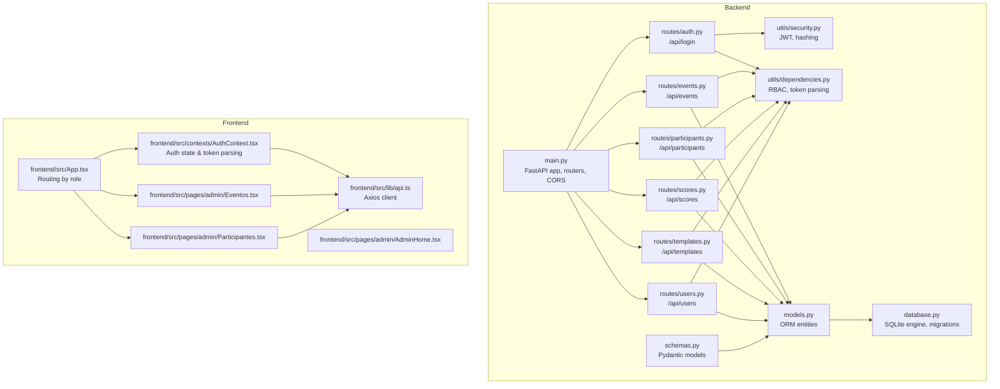
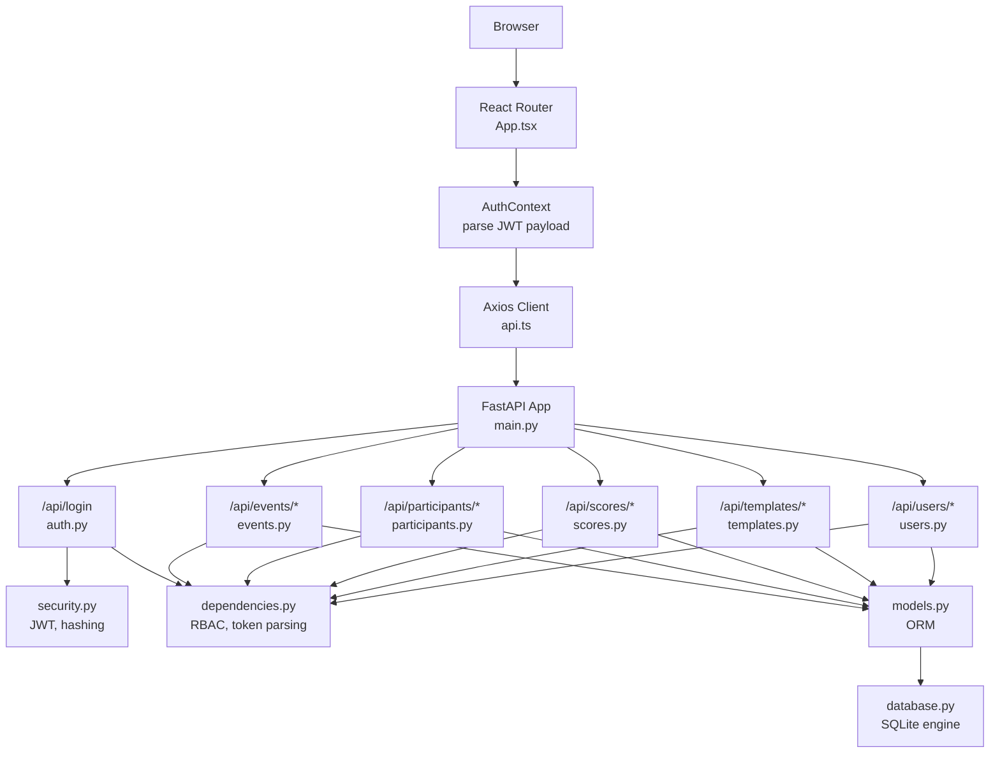
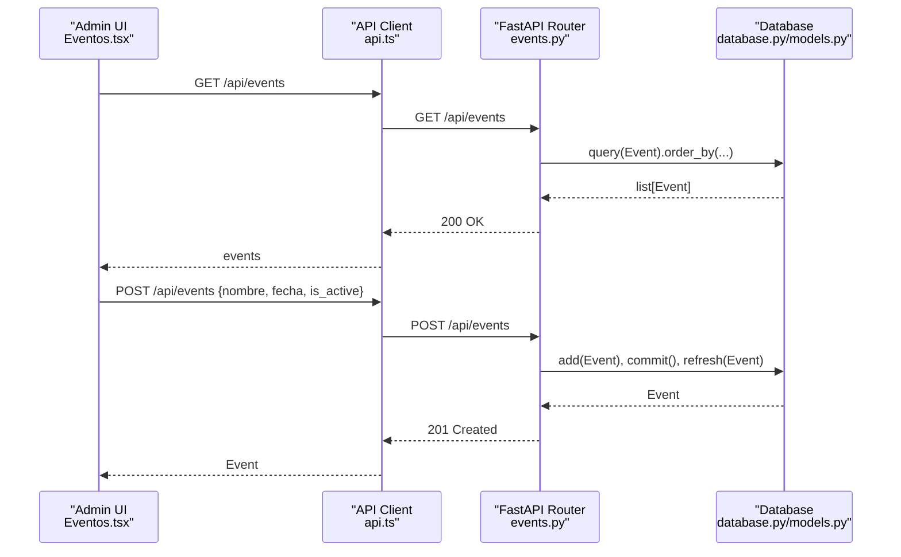
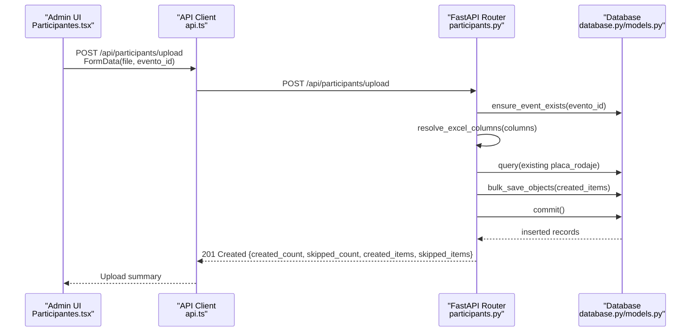
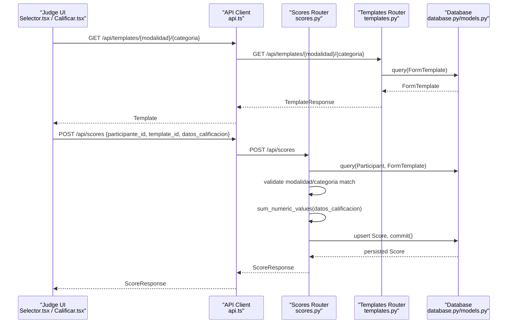
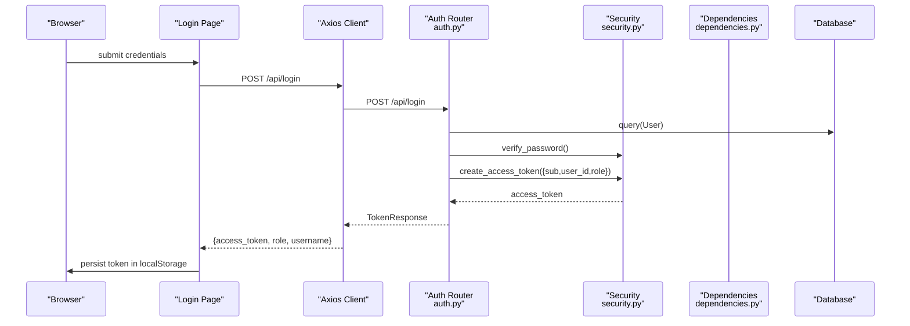
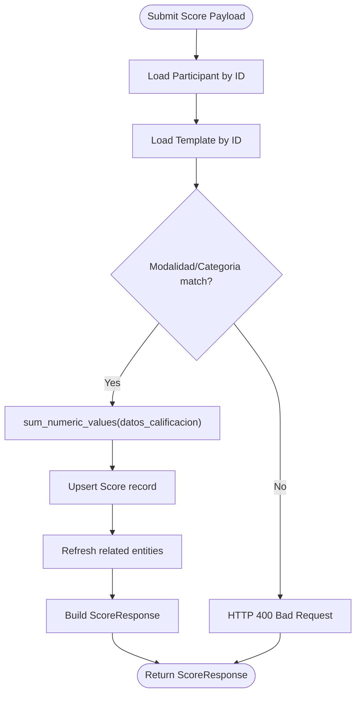
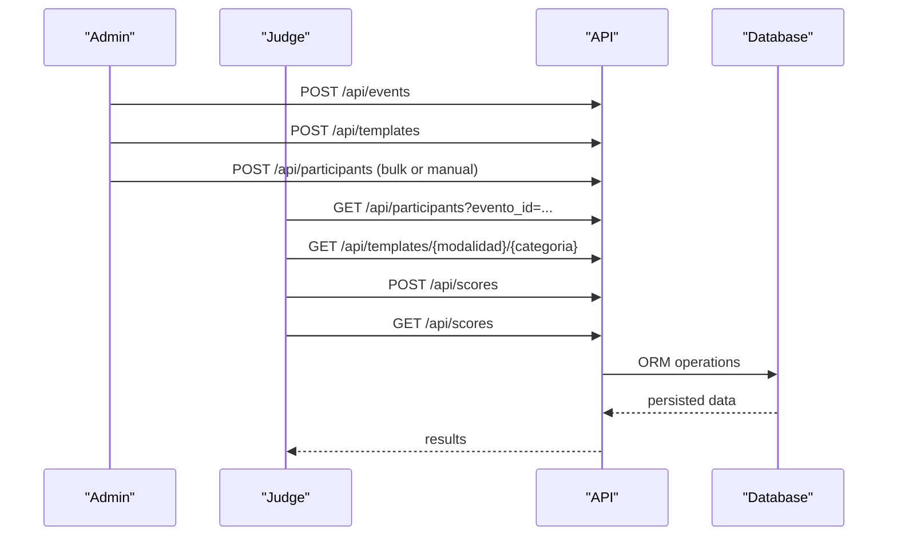
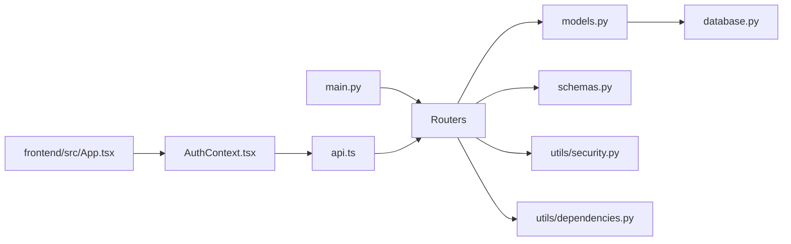
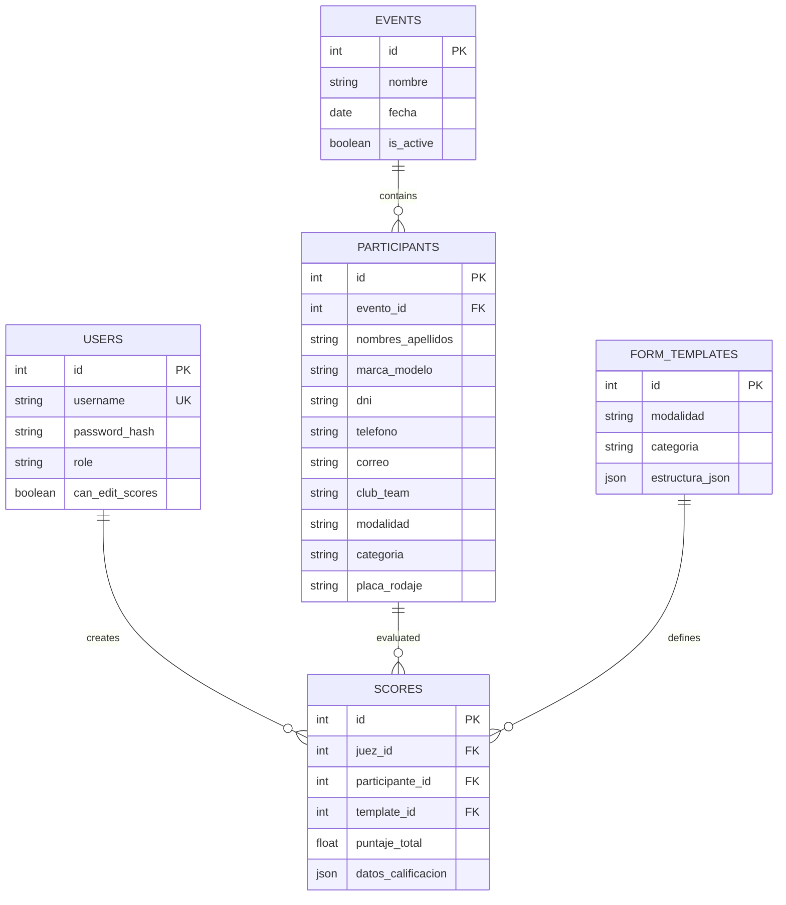

# Key Features

<cite>
**Referenced Files in This Document**
- [main.py](file://main.py)
- [models.py](file://models.py)
- [schemas.py](file://schemas.py)
- [database.py](file://database.py)
- [routes/auth.py](file://routes/auth.py)
- [routes/events.py](file://routes/events.py)
- [routes/participants.py](file://routes/participants.py)
- [routes/scores.py](file://routes/scores.py)
- [routes/templates.py](file://routes/templates.py)
- [routes/users.py](file://routes/users.py)
- [utils/security.py](file://utils/security.py)
- [utils/dependencies.py](file://utils/dependencies.py)
- [frontend/src/App.tsx](file://frontend/src/App.tsx)
- [frontend/src/contexts/AuthContext.tsx](file://frontend/src/contexts/AuthContext.tsx)
- [frontend/src/lib/api.ts](file://frontend/src/lib/api.ts)
- [frontend/src/pages/admin/AdminHome.tsx](file://frontend/src/pages/admin/AdminHome.tsx)
- [frontend/src/pages/admin/Eventos.tsx](file://frontend/src/pages/admin/Eventos.tsx)
- [frontend/src/pages/admin/Participantes.tsx](file://frontend/src/pages/admin/Participantes.tsx)
</cite>

## Table of Contents
1. [Introduction](#introduction)
2. [Project Structure](#project-structure)
3. [Core Components](#core-components)
4. [Architecture Overview](#architecture-overview)
5. [Detailed Component Analysis](#detailed-component-analysis)
6. [Dependency Analysis](#dependency-analysis)
7. [Performance Considerations](#performance-considerations)
8. [Troubleshooting Guide](#troubleshooting-guide)
9. [Conclusion](#conclusion)
10. [Appendices](#appendices)

## Introduction
This document explains the core features of the Juzgamiento system for managing car audio and tuning competitions. It covers:
- Administrator dashboard: user management, event lifecycle, template builder, and participant import via Excel
- Judge interface: participant selection, real-time scoring with dynamic templates, score submission, and evaluation history
- Underlying systems: JWT authentication, role-based access control, real-time score calculation, template validation, and data import/export
- Practical workflows: competition setup, participant registration, and evaluation processes

## Project Structure
The system is organized into a FastAPI backend with SQLAlchemy ORM and a React/TypeScript frontend. The backend exposes REST endpoints grouped by domain (auth, events, participants, scores, templates, users). The frontend routes users by role and integrates with the backend via an API client.

**Diagram sources**
- [main.py:1-38](file://main.py#L1-L38)
- [models.py:11-95](file://models.py#L11-L95)
- [schemas.py:1-152](file://schemas.py#L1-L152)
- [database.py:1-93](file://database.py#L1-L93)
- [routes/auth.py:1-36](file://routes/auth.py#L1-L36)
- [routes/events.py:1-74](file://routes/events.py#L1-L74)
- [routes/participants.py:1-400](file://routes/participants.py#L1-L400)
- [routes/scores.py:1-132](file://routes/scores.py#L1-L132)
- [routes/templates.py:1-64](file://routes/templates.py#L1-L64)
- [routes/users.py:1-192](file://routes/users.py#L1-L192)
- [utils/security.py:1-51](file://utils/security.py#L1-L51)
- [utils/dependencies.py:1-71](file://utils/dependencies.py#L1-L71)
- [frontend/src/App.tsx:1-119](file://frontend/src/App.tsx#L1-L119)
- [frontend/src/contexts/AuthContext.tsx:1-144](file://frontend/src/contexts/AuthContext.tsx#L1-L144)
- [frontend/src/lib/api.ts:1-33](file://frontend/src/lib/api.ts#L1-L33)
- [frontend/src/pages/admin/AdminHome.tsx:1-49](file://frontend/src/pages/admin/AdminHome.tsx#L1-L49)
- [frontend/src/pages/admin/Eventos.tsx:1-409](file://frontend/src/pages/admin/Eventos.tsx#L1-L409)
- [frontend/src/pages/admin/Participantes.tsx:1-693](file://frontend/src/pages/admin/Participantes.tsx#L1-L693)

**Section sources**
- [main.py:1-38](file://main.py#L1-L38)
- [frontend/src/App.tsx:1-119](file://frontend/src/App.tsx#L1-L119)

## Core Components
- Authentication and roles
  - JWT-based login endpoint returns access tokens with role claims
  - Frontend stores tokens and parses user_id from JWT payload
  - Backend enforces role-based access for protected routes
- Data model
  - Users, Events, Participants, FormTemplates, Scores
  - Unique constraints and foreign keys define relationships
- Import/export pipeline
  - Excel upload with flexible column normalization and validation
  - Bulk insert with conflict detection per event
- Scoring engine
  - Dynamic template validation against participant modalidad/categoría
  - Recursive numeric aggregation for totals

**Section sources**
- [routes/auth.py:13-36](file://routes/auth.py#L13-L36)
- [utils/security.py:29-39](file://utils/security.py#L29-L39)
- [frontend/src/contexts/AuthContext.tsx:43-63](file://frontend/src/contexts/AuthContext.tsx#L43-L63)
- [utils/dependencies.py:32-47](file://utils/dependencies.py#L32-L47)
- [models.py:11-95](file://models.py#L11-L95)
- [routes/participants.py:286-400](file://routes/participants.py#L286-L400)
- [routes/scores.py:43-132](file://routes/scores.py#L43-L132)

## Architecture Overview
The system follows a layered architecture:
- Presentation layer: React SPA with role-based routing
- Application layer: FastAPI routers implementing domain logic
- Domain services: Pydantic schemas for validation, SQLAlchemy ORM for persistence
- Infrastructure: SQLite engine and runtime migrations

**Diagram sources**
- [frontend/src/App.tsx:91-119](file://frontend/src/App.tsx#L91-L119)
- [frontend/src/contexts/AuthContext.tsx:66-132](file://frontend/src/contexts/AuthContext.tsx#L66-L132)
- [frontend/src/lib/api.ts:11-13](file://frontend/src/lib/api.ts#L11-L13)
- [main.py:17-38](file://main.py#L17-L38)
- [routes/auth.py:13-36](file://routes/auth.py#L13-L36)
- [routes/events.py:13-74](file://routes/events.py#L13-L74)
- [routes/participants.py:286-400](file://routes/participants.py#L286-L400)
- [routes/scores.py:43-132](file://routes/scores.py#L43-L132)
- [routes/templates.py:13-64](file://routes/templates.py#L13-L64)
- [routes/users.py:21-192](file://routes/users.py#L21-L192)
- [utils/security.py:17-50](file://utils/security.py#L17-L50)
- [utils/dependencies.py:16-71](file://utils/dependencies.py#L16-L71)
- [database.py:20-34](file://database.py#L20-L34)
- [models.py:11-95](file://models.py#L11-L95)

## Detailed Component Analysis

### Administrator Dashboard
- Event management
  - List, create, and toggle active state of events
  - Admin-only endpoints enforce role checks
- User management
  - Create users, assign roles, manage permissions (including edit-score capability)
  - First user must be admin; subsequent creations require admin role
- Template builder
  - Save or update form templates keyed by modalidad and categoria
  - Retrieve templates for a given modalidad/categoria pair
- Participant import via Excel
  - Upload .xlsx files with flexible column names
  - Normalize headers, validate required fields, detect duplicates per event, bulk insert created records

**Diagram sources**
- [frontend/src/pages/admin/Eventos.tsx:62-73](file://frontend/src/pages/admin/Eventos.tsx#L62-L73)
- [routes/events.py:13-36](file://routes/events.py#L13-L36)
- [database.py:28-34](file://database.py#L28-L34)
- [models.py:23-32](file://models.py#L23-L32)

**Diagram sources**
- [frontend/src/pages/admin/Participantes.tsx:169-187](file://frontend/src/pages/admin/Participantes.tsx#L169-L187)
- [routes/participants.py:286-400](file://routes/participants.py#L286-L400)
- [database.py:28-34](file://database.py#L28-L34)
- [models.py:34-63](file://models.py#L34-L63)

**Section sources**
- [routes/events.py:13-74](file://routes/events.py#L13-L74)
- [frontend/src/pages/admin/Eventos.tsx:28-196](file://frontend/src/pages/admin/Eventos.tsx#L28-L196)
- [routes/users.py:21-86](file://routes/users.py#L21-L86)
- [routes/templates.py:13-64](file://routes/templates.py#L13-L64)
- [routes/participants.py:286-400](file://routes/participants.py#L286-L400)
- [frontend/src/pages/admin/Participantes.tsx:142-187](file://frontend/src/pages/admin/Participantes.tsx#L142-L187)

### Judge Interface
- Participant selection
  - Judge views available participants filtered by active event
- Real-time scoring with dynamic templates
  - Fetch template matching participant’s modalidad and categoria
  - Submit score payload; backend validates template compatibility and computes numeric totals recursively
- Score submission and history
  - Create or update score; editors can modify existing submissions only if permitted
  - View all scores with optional filtering by judge

**Diagram sources**
- [routes/scores.py:43-115](file://routes/scores.py#L43-L115)
- [routes/templates.py:43-64](file://routes/templates.py#L43-L64)
- [database.py:28-34](file://database.py#L28-L34)
- [models.py:79-95](file://models.py#L79-L95)

**Section sources**
- [routes/scores.py:43-132](file://routes/scores.py#L43-L132)
- [routes/templates.py:13-64](file://routes/templates.py#L13-L64)
- [frontend/src/pages/admin/Participantes.tsx:120-140](file://frontend/src/pages/admin/Participantes.tsx#L120-L140)

### Authentication and Role-Based Access Control
- JWT authentication
  - Login endpoint verifies credentials and issues signed tokens with role and user_id claims
  - Token decoding extracts claims for downstream authorization
- RBAC enforcement
  - Guards for admin-only and judge-only endpoints
  - Optional current user retrieval for public endpoints
- Frontend integration
  - Stores token and user info in local storage
  - Parses user_id from JWT payload without external libraries

**Diagram sources**
- [routes/auth.py:13-36](file://routes/auth.py#L13-L36)
- [utils/security.py:17-39](file://utils/security.py#L17-L39)
- [utils/dependencies.py:50-71](file://utils/dependencies.py#L50-L71)
- [frontend/src/contexts/AuthContext.tsx:95-111](file://frontend/src/contexts/AuthContext.tsx#L95-L111)

**Section sources**
- [routes/auth.py:13-36](file://routes/auth.py#L13-L36)
- [utils/security.py:17-39](file://utils/security.py#L17-L39)
- [utils/dependencies.py:32-47](file://utils/dependencies.py#L32-L47)
- [frontend/src/contexts/AuthContext.tsx:66-111](file://frontend/src/contexts/AuthContext.tsx#L66-L111)

### Scoring System Architecture and Validation
- Template validation
  - Each score references a FormTemplate; backend ensures modalidad and categoria match the participant
- Real-time score calculation
  - Recursive numeric aggregation handles nested dicts/lists
- Edit permissions
  - Judges can edit existing scores only if granted explicit permission

**Diagram sources**
- [routes/scores.py:49-115](file://routes/scores.py#L49-L115)
- [routes/scores.py:16-26](file://routes/scores.py#L16-L26)
- [models.py:79-95](file://models.py#L79-L95)

**Section sources**
- [routes/scores.py:43-132](file://routes/scores.py#L43-L132)
- [models.py:65-77](file://models.py#L65-L77)

### Data Import/Export Capabilities
- Import
  - Excel upload endpoint normalizes headers, validates required fields, detects duplicates per event, and bulk inserts
- Export
  - Frontend lists participants and displays counts after upload; no dedicated export endpoint is present in the backend

**Section sources**
- [routes/participants.py:286-400](file://routes/participants.py#L286-L400)
- [frontend/src/pages/admin/Participantes.tsx:169-187](file://frontend/src/pages/admin/Participantes.tsx#L169-L187)

### Common Use Cases and Workflows
- Competition setup
  - Admin creates an event, sets active state, and configures templates per modalidad/categoria
- Participant registration
  - Admin imports participants via Excel or adds manually; assigns modalidad and categoria combinations
- Evaluation process
  - Judge selects a participant, loads the matching template, fills out criteria, submits score; history is visible

**Diagram sources**
- [routes/events.py:21-36](file://routes/events.py#L21-L36)
- [routes/templates.py:13-41](file://routes/templates.py#L13-L41)
- [routes/participants.py:181-231](file://routes/participants.py#L181-L231)
- [routes/scores.py:117-132](file://routes/scores.py#L117-L132)

## Dependency Analysis
- Backend dependencies
  - FastAPI app aggregates routers and middleware
  - SQLAlchemy models define relationships and constraints
  - Security utilities centralize JWT and password hashing
  - Dependencies module centralizes RBAC and token parsing
- Frontend dependencies
  - Routing depends on AuthContext for role-aware navigation
  - API client encapsulates base URL and error handling

**Diagram sources**
- [main.py:17-38](file://main.py#L17-L38)
- [models.py:11-95](file://models.py#L11-L95)
- [schemas.py:1-152](file://schemas.py#L1-152)
- [utils/security.py:17-50](file://utils/security.py#L17-L50)
- [utils/dependencies.py:16-71](file://utils/dependencies.py#L16-L71)
- [database.py:20-34](file://database.py#L20-L34)
- [frontend/src/App.tsx:91-119](file://frontend/src/App.tsx#L91-L119)
- [frontend/src/contexts/AuthContext.tsx:66-132](file://frontend/src/contexts/AuthContext.tsx#L66-L132)
- [frontend/src/lib/api.ts:11-13](file://frontend/src/lib/api.ts#L11-L13)

**Section sources**
- [main.py:17-38](file://main.py#L17-L38)
- [utils/dependencies.py:16-71](file://utils/dependencies.py#L16-L71)
- [frontend/src/App.tsx:91-119](file://frontend/src/App.tsx#L91-L119)

## Performance Considerations
- Database
  - SQLite engine configured for single-threaded reads/writes; consider connection pooling and indexing for scale
  - Migrations add columns and backfill legacy fields to maintain compatibility
- API
  - Bulk insert for participant uploads reduces round-trips
  - Joined loading for score responses avoids N+1 queries
- Frontend
  - Local storage caching of tokens avoids repeated logins
  - Debounce or batch updates for large participant lists

[No sources needed since this section provides general guidance]

## Troubleshooting Guide
- Authentication failures
  - Verify token presence and validity; check token expiration and secret key configuration
- Authorization errors
  - Ensure user role matches endpoint requirements; admin-only vs judge-only routes
- Import issues
  - Confirm Excel file format (.xlsx), required columns, and unique plate per event
- Score submission errors
  - Validate template modalidad/categoria match; ensure numeric-only values for aggregation

**Section sources**
- [routes/auth.py:13-36](file://routes/auth.py#L13-L36)
- [utils/dependencies.py:32-47](file://utils/dependencies.py#L32-L47)
- [routes/participants.py:295-321](file://routes/participants.py#L295-L321)
- [routes/scores.py:63-67](file://routes/scores.py#L63-L67)

## Conclusion
The Juzgamiento system provides a focused, role-aware platform for organizing car audio and tuning competitions. Its modular backend and React frontend enable efficient competition setup, robust participant import, and reliable real-time scoring with dynamic templates. The architecture supports future enhancements such as export endpoints, advanced reporting, and horizontal scaling.

[No sources needed since this section summarizes without analyzing specific files]

## Appendices
- Data model relationships

**Diagram sources**
- [models.py:11-95](file://models.py#L11-L95)