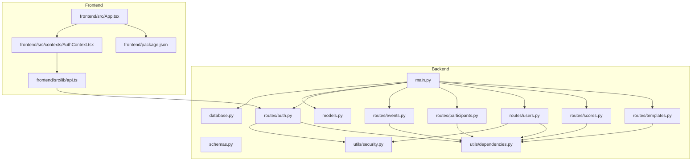
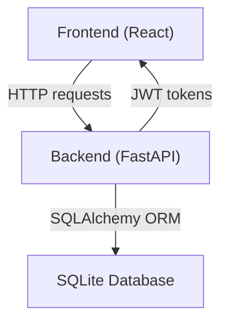
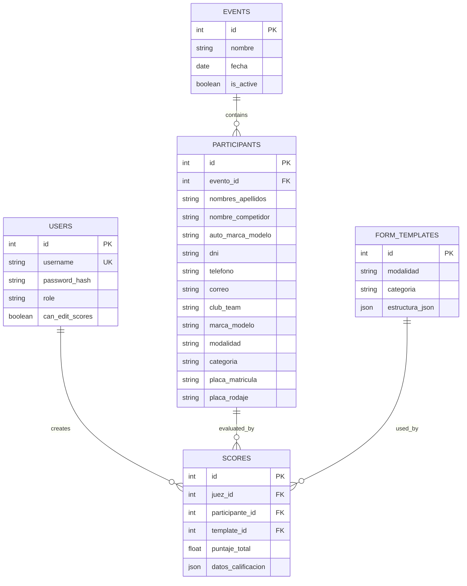
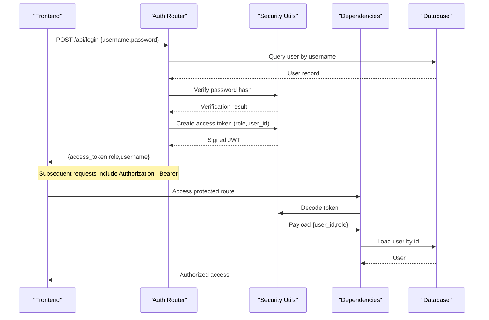
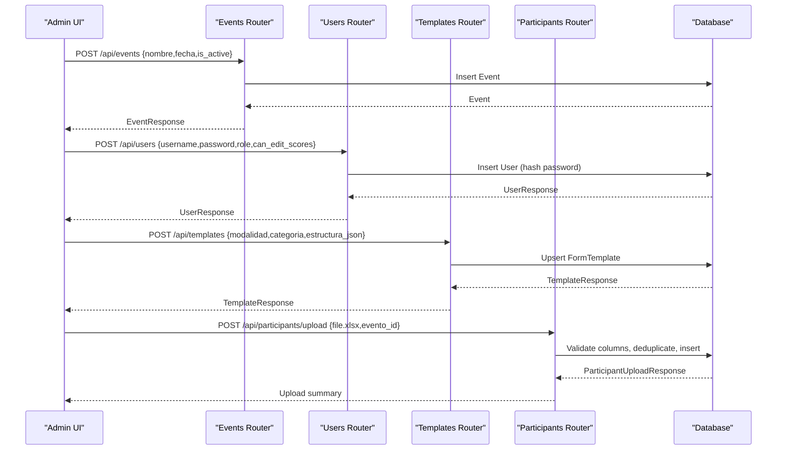
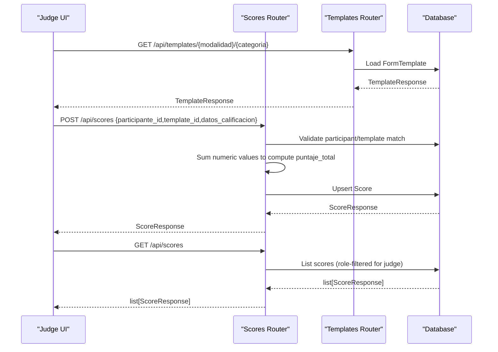
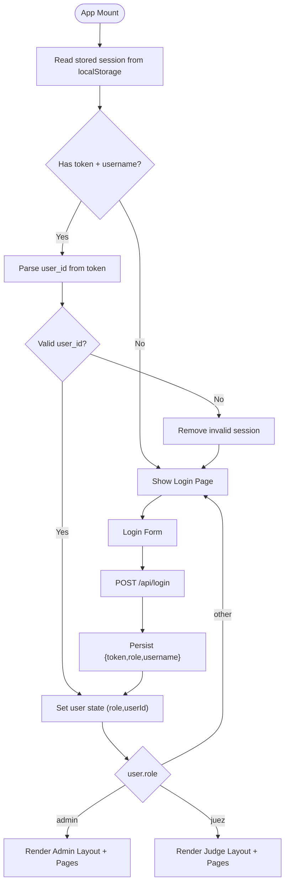
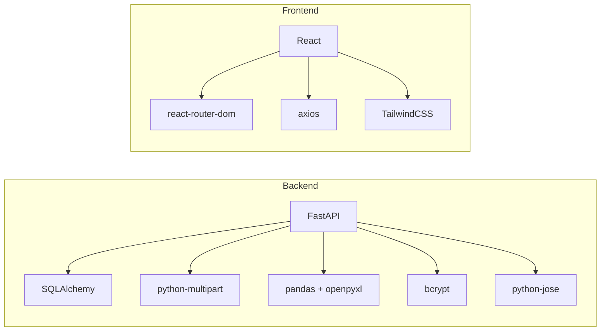

# Project Overview

<cite>
**Referenced Files in This Document**
- [main.py](file://main.py)
- [database.py](file://database.py)
- [models.py](file://models.py)
- [schemas.py](file://schemas.py)
- [routes/auth.py](file://routes/auth.py)
- [routes/events.py](file://routes/events.py)
- [routes/participants.py](file://routes/participants.py)
- [routes/users.py](file://routes/users.py)
- [routes/scores.py](file://routes/scores.py)
- [routes/templates.py](file://routes/templates.py)
- [utils/security.py](file://utils/security.py)
- [utils/dependencies.py](file://utils/dependencies.py)
- [frontend/src/App.tsx](file://frontend/src/App.tsx)
- [frontend/src/contexts/AuthContext.tsx](file://frontend/src/contexts/AuthContext.tsx)
- [frontend/src/lib/api.ts](file://frontend/src/lib/api.ts)
- [frontend/package.json](file://frontend/package.json)
- [start.sh](file://start.sh)
- [requirements.txt](file://requirements.txt)
</cite>

## Table of Contents
1. [Introduction](#introduction)
2. [Project Structure](#project-structure)
3. [Core Components](#core-components)
4. [Architecture Overview](#architecture-overview)
5. [Detailed Component Analysis](#detailed-component-analysis)
6. [Dependency Analysis](#dependency-analysis)
7. [Performance Considerations](#performance-considerations)
8. [Troubleshooting Guide](#troubleshooting-guide)
9. [Conclusion](#conclusion)
10. [Appendices](#appendices)

## Introduction
Juzgamiento Car Audio and Tuning Competition Management System is a full-stack web application designed to streamline the organization and evaluation of car audio and tuning competitions. It provides a centralized platform for administrators to manage events, participants, and users, and for judges to evaluate competitors using configurable scoring templates. The system ensures secure access via JWT-based authentication, maintains data integrity with a relational SQLite database, and offers a responsive React-based frontend for intuitive user experiences.

Key roles and capabilities:
- Administrator workflows: create and manage events, upload participants in bulk, configure scoring templates, and manage users.
- Judge evaluations: select participants, apply scoring templates, submit scores, and review submissions.
- Participant management: maintain accurate participant records, enforce uniqueness constraints per event, and support flexible data uploads.

## Project Structure
The repository is organized into a Python FastAPI backend and a React TypeScript frontend, with shared utilities and routing modules.

Backend highlights:
- Application entrypoint initializes the database, applies migrations, configures CORS, and registers routers.
- SQLAlchemy ORM models define the domain entities and relationships.
- Pydantic schemas validate and serialize request/response payloads.
- Route modules encapsulate REST endpoints grouped by resource.
- Utilities handle security (JWT, password hashing) and dependency injection for authentication and authorization.

Frontend highlights:
- React Router manages protected routes and navigation for admin and judge roles.
- Authentication context persists session state and integrates with the backend login endpoint.
- Axios client abstracts API base URL and error handling.

**Diagram sources**
- [main.py:1-38](file://main.py#L1-L38)
- [database.py:1-93](file://database.py#L1-L93)
- [models.py:1-95](file://models.py#L1-L95)
- [schemas.py:1-152](file://schemas.py#L1-L152)
- [routes/auth.py:1-36](file://routes/auth.py#L1-L36)
- [routes/events.py:1-74](file://routes/events.py#L1-L74)
- [routes/participants.py:1-400](file://routes/participants.py#L1-L400)
- [routes/users.py:1-192](file://routes/users.py#L1-L192)
- [routes/scores.py:1-132](file://routes/scores.py#L1-L132)
- [routes/templates.py:1-64](file://routes/templates.py#L1-L64)
- [utils/security.py:1-51](file://utils/security.py#L1-L51)
- [utils/dependencies.py:1-71](file://utils/dependencies.py#L1-L71)
- [frontend/src/App.tsx:1-119](file://frontend/src/App.tsx#L1-L119)
- [frontend/src/contexts/AuthContext.tsx:1-144](file://frontend/src/contexts/AuthContext.tsx#L1-L144)
- [frontend/src/lib/api.ts:1-33](file://frontend/src/lib/api.ts#L1-L33)
- [frontend/package.json:1-28](file://frontend/package.json#L1-L28)

**Section sources**
- [main.py:1-38](file://main.py#L1-L38)
- [database.py:1-93](file://database.py#L1-L93)
- [models.py:1-95](file://models.py#L1-L95)
- [schemas.py:1-152](file://schemas.py#L1-L152)
- [routes/auth.py:1-36](file://routes/auth.py#L1-L36)
- [routes/events.py:1-74](file://routes/events.py#L1-L74)
- [routes/participants.py:1-400](file://routes/participants.py#L1-L400)
- [routes/users.py:1-192](file://routes/users.py#L1-L192)
- [routes/scores.py:1-132](file://routes/scores.py#L1-L132)
- [routes/templates.py:1-64](file://routes/templates.py#L1-L64)
- [utils/security.py:1-51](file://utils/security.py#L1-L51)
- [utils/dependencies.py:1-71](file://utils/dependencies.py#L1-L71)
- [frontend/src/App.tsx:1-119](file://frontend/src/App.tsx#L1-L119)
- [frontend/src/contexts/AuthContext.tsx:1-144](file://frontend/src/contexts/AuthContext.tsx#L1-L144)
- [frontend/src/lib/api.ts:1-33](file://frontend/src/lib/api.ts#L1-L33)
- [frontend/package.json:1-28](file://frontend/package.json#L1-L28)
- [start.sh:1-16](file://start.sh#L1-L16)
- [requirements.txt:1-10](file://requirements.txt#L1-L10)

## Core Components
- Database and ORM: Defines entities (users, events, participants, form templates, scores) and relationships. Includes SQLite-specific migration logic to evolve the schema safely.
- Pydantic Schemas: Enforce input validation and define response shapes for all resources.
- Authentication and Authorization: JWT-based login, password hashing, and role-based access control for admin and judge roles.
- REST API Routers: Grouped by resource with CRUD operations, filtering, and specialized endpoints (e.g., participant bulk upload).
- Frontend Routing and Auth: Protected routes, role-aware navigation, and local storage-backed session persistence.

Practical examples:
- Administrator creates an event and uploads participants via Excel.
- Judge selects a participant, loads the matching template, submits scores, and reviews history.
- System enforces unique license plates per event and validates template compatibility.

**Section sources**
- [database.py:1-93](file://database.py#L1-L93)
- [models.py:1-95](file://models.py#L1-L95)
- [schemas.py:1-152](file://schemas.py#L1-L152)
- [utils/security.py:1-51](file://utils/security.py#L1-L51)
- [utils/dependencies.py:1-71](file://utils/dependencies.py#L1-L71)
- [routes/auth.py:1-36](file://routes/auth.py#L1-L36)
- [routes/events.py:1-74](file://routes/events.py#L1-L74)
- [routes/participants.py:1-400](file://routes/participants.py#L1-L400)
- [routes/users.py:1-192](file://routes/users.py#L1-L192)
- [routes/scores.py:1-132](file://routes/scores.py#L1-L132)
- [routes/templates.py:1-64](file://routes/templates.py#L1-L64)
- [frontend/src/App.tsx:1-119](file://frontend/src/App.tsx#L1-L119)
- [frontend/src/contexts/AuthContext.tsx:1-144](file://frontend/src/contexts/AuthContext.tsx#L1-L144)
- [frontend/src/lib/api.ts:1-33](file://frontend/src/lib/api.ts#L1-L33)

## Architecture Overview
The system follows a layered architecture:
- Presentation Layer (React): Handles UI, routing, and user interactions.
- Application Layer (FastAPI): Exposes REST endpoints, applies validation, orchestrates business logic, and enforces authorization.
- Persistence Layer (SQLite + SQLAlchemy): Stores entities and relationships, with schema migration support.

**Diagram sources**
- [frontend/src/App.tsx:1-119](file://frontend/src/App.tsx#L1-L119)
- [frontend/src/contexts/AuthContext.tsx:1-144](file://frontend/src/contexts/AuthContext.tsx#L1-L144)
- [frontend/src/lib/api.ts:1-33](file://frontend/src/lib/api.ts#L1-L33)
- [main.py:1-38](file://main.py#L1-L38)
- [database.py:1-93](file://database.py#L1-L93)

## Detailed Component Analysis

### Database and Models
The data model centers around Users, Events, Participants, Form Templates, and Scores. Relationships and constraints ensure referential integrity and uniqueness where required.

**Diagram sources**
- [models.py:11-95](file://models.py#L11-L95)

**Section sources**
- [models.py:1-95](file://models.py#L1-L95)
- [database.py:1-93](file://database.py#L1-L93)

### Authentication and Authorization
JWT-based authentication secures endpoints. Passwords are hashed using bcrypt. Role checks restrict access to administrative and judging actions.

**Diagram sources**
- [routes/auth.py:13-35](file://routes/auth.py#L13-L35)
- [utils/security.py:29-39](file://utils/security.py#L29-L39)
- [utils/dependencies.py:16-70](file://utils/dependencies.py#L16-L70)

**Section sources**
- [routes/auth.py:1-36](file://routes/auth.py#L1-L36)
- [utils/security.py:1-51](file://utils/security.py#L1-L51)
- [utils/dependencies.py:1-71](file://utils/dependencies.py#L1-L71)

### Administrator Workflows
Administrators manage events, users, and templates, and upload participants in bulk.

**Diagram sources**
- [routes/events.py:21-35](file://routes/events.py#L21-L35)
- [routes/users.py:29-65](file://routes/users.py#L29-L65)
- [routes/templates.py:13-40](file://routes/templates.py#L13-L40)
- [routes/participants.py:286-399](file://routes/participants.py#L286-L399)

**Section sources**
- [routes/events.py:1-74](file://routes/events.py#L1-L74)
- [routes/users.py:1-192](file://routes/users.py#L1-L192)
- [routes/templates.py:1-64](file://routes/templates.py#L1-L64)
- [routes/participants.py:1-400](file://routes/participants.py#L1-L400)

### Judge Evaluations
Judges evaluate participants using templates and manage their score submissions.

**Diagram sources**
- [routes/scores.py:43-114](file://routes/scores.py#L43-L114)
- [routes/scores.py:117-131](file://routes/scores.py#L117-L131)
- [routes/templates.py:43-63](file://routes/templates.py#L43-L63)

**Section sources**
- [routes/scores.py:1-132](file://routes/scores.py#L1-L132)
- [routes/templates.py:1-64](file://routes/templates.py#L1-L64)

### Frontend Routing and Authentication
The frontend enforces role-based routing and persists sessions locally.

**Diagram sources**
- [frontend/src/App.tsx:1-119](file://frontend/src/App.tsx#L1-L119)
- [frontend/src/contexts/AuthContext.tsx:66-132](file://frontend/src/contexts/AuthContext.tsx#L66-L132)
- [frontend/src/lib/api.ts:11-13](file://frontend/src/lib/api.ts#L11-L13)

**Section sources**
- [frontend/src/App.tsx:1-119](file://frontend/src/App.tsx#L1-L119)
- [frontend/src/contexts/AuthContext.tsx:1-144](file://frontend/src/contexts/AuthContext.tsx#L1-L144)
- [frontend/src/lib/api.ts:1-33](file://frontend/src/lib/api.ts#L1-L33)

## Dependency Analysis
Backend dependencies:
- FastAPI for routing and ASGI server.
- SQLAlchemy for ORM and database connectivity.
- Pandas and openpyxl for Excel parsing during participant uploads.
- bcrypt and python-jose for password hashing and JWT handling.
- python-multipart for multipart/form-data parsing.

Frontend dependencies:
- React and React Router for UI and routing.
- Axios for HTTP requests.
- TailwindCSS for styling.

**Diagram sources**
- [requirements.txt:1-10](file://requirements.txt#L1-L10)
- [frontend/package.json:11-26](file://frontend/package.json#L11-L26)

**Section sources**
- [requirements.txt:1-10](file://requirements.txt#L1-L10)
- [frontend/package.json:1-28](file://frontend/package.json#L1-L28)

## Performance Considerations
- Database indexing: Unique constraints and indexed fields (e.g., participant plate, event dates) improve lookup performance.
- Bulk operations: Participant uploads leverage bulk inserts to minimize round-trips.
- Pagination and filtering: Queries support filtering and ordering to reduce payload sizes.
- Caching: Consider adding lightweight caching for templates and static lists where appropriate.
- Asynchronous uploads: Keep file uploads asynchronous and stream large files when possible.

## Troubleshooting Guide
Common issues and resolutions:
- Authentication failures: Verify credentials and ensure the token is included in Authorization headers.
- Permission errors: Confirm user role and required permissions (e.g., can_edit_scores).
- Validation errors: Review request payloads against Pydantic schemas and ensure required fields are present.
- Excel upload problems: Ensure the file is a valid .xlsx and contains required columns; check for duplicates and empty rows.
- Database migration: Schema changes are applied automatically for SQLite; verify migrations ran after updates.

**Section sources**
- [routes/auth.py:13-35](file://routes/auth.py#L13-L35)
- [utils/dependencies.py:32-47](file://utils/dependencies.py#L32-L47)
- [routes/participants.py:286-321](file://routes/participants.py#L286-L321)
- [database.py:36-93](file://database.py#L36-L93)

## Conclusion
Juzgamiento provides a robust, role-aware platform for managing car audio and tuning competitions. Administrators can efficiently orchestrate events and participants, while judges can quickly evaluate entries using customizable templates. The system’s modular design, clear separation of concerns, and secure authentication make it suitable for both small-scale and larger deployments.

## Appendices

### Quick Start
- Backend: Install dependencies and run the development server script.
- Frontend: Install dependencies and start the Vite dev server.

**Section sources**
- [start.sh:1-16](file://start.sh#L1-L16)
- [requirements.txt:1-10](file://requirements.txt#L1-L10)
- [frontend/package.json:6-9](file://frontend/package.json#L6-L9)