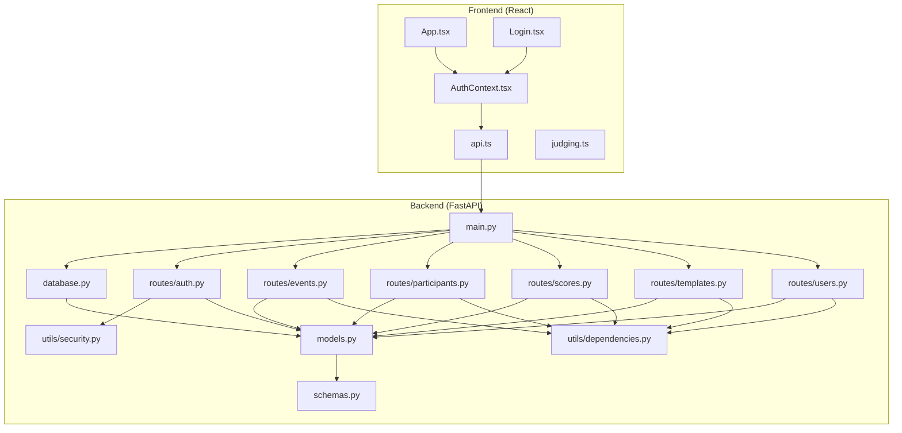
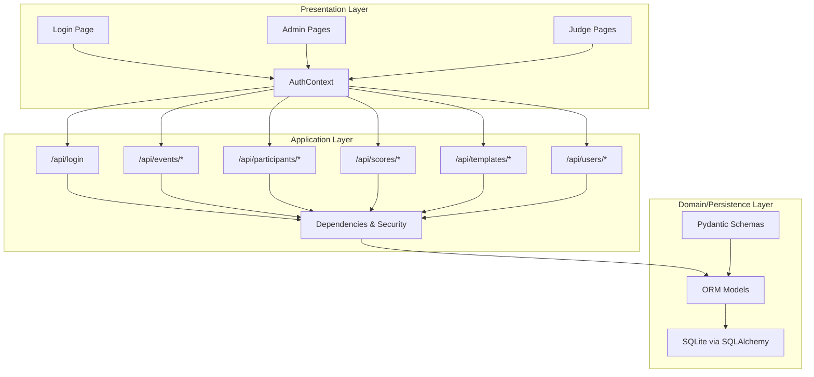
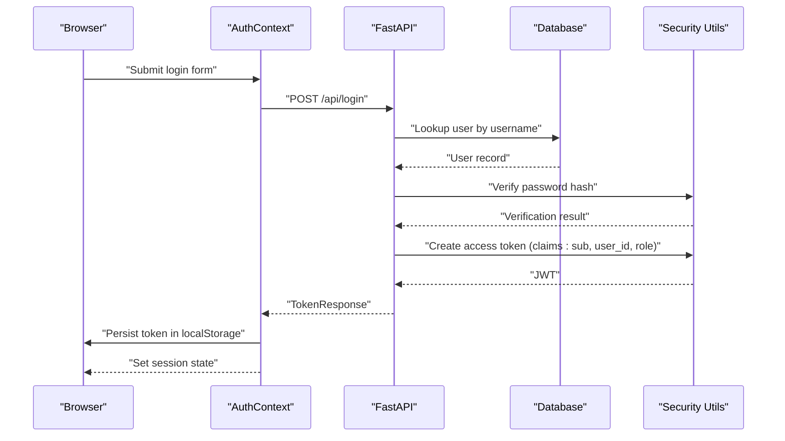
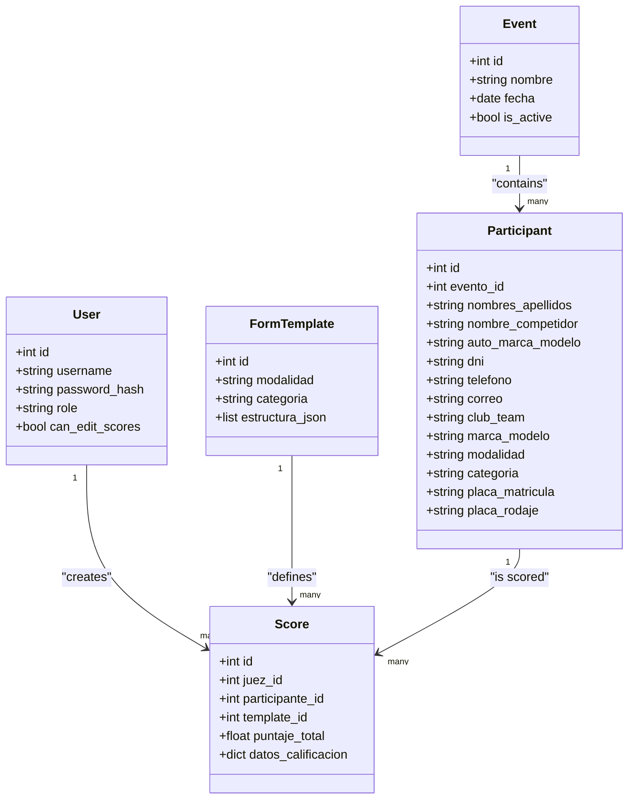
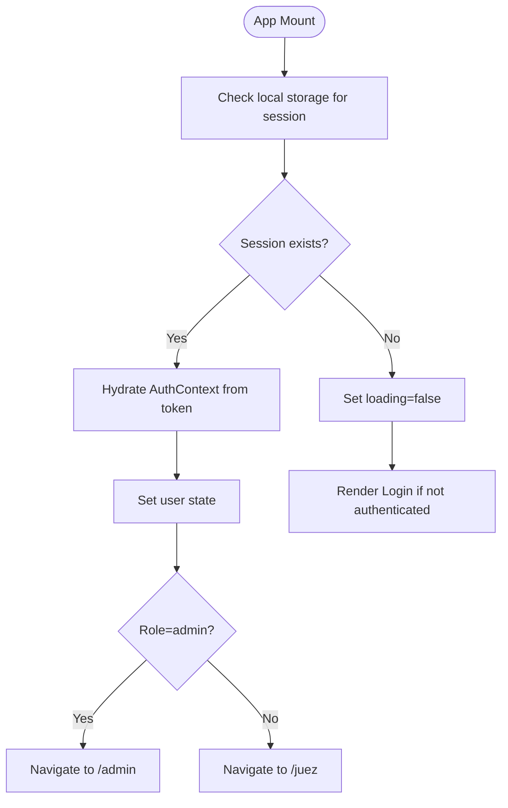
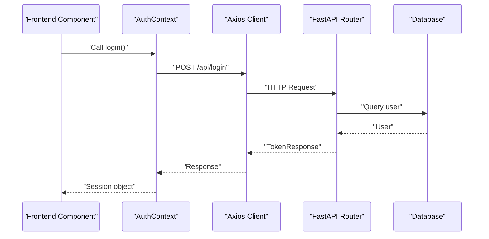
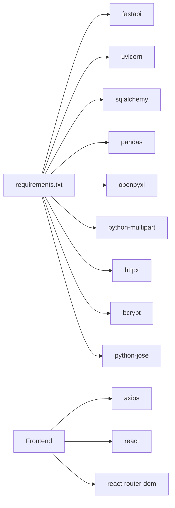

# System Architecture

<cite>
**Referenced Files in This Document**
- [main.py](file://main.py)
- [database.py](file://database.py)
- [models.py](file://models.py)
- [schemas.py](file://schemas.py)
- [routes/auth.py](file://routes/auth.py)
- [routes/events.py](file://routes/events.py)
- [routes/participants.py](file://routes/participants.py)
- [routes/scores.py](file://routes/scores.py)
- [routes/templates.py](file://routes/templates.py)
- [routes/users.py](file://routes/users.py)
- [utils/dependencies.py](file://utils/dependencies.py)
- [utils/security.py](file://utils/security.py)
- [frontend/src/contexts/AuthContext.tsx](file://frontend/src/contexts/AuthContext.tsx)
- [frontend/src/lib/api.ts](file://frontend/src/lib/api.ts)
- [frontend/src/lib/judging.ts](file://frontend/src/lib/judging.ts)
- [frontend/src/pages/Login.tsx](file://frontend/src/pages/Login.tsx)
- [frontend/src/App.tsx](file://frontend/src/App.tsx)
- [requirements.txt](file://requirements.txt)
</cite>

## Table of Contents
1. [Introduction](#introduction)
2. [Project Structure](#project-structure)
3. [Core Components](#core-components)
4. [Architecture Overview](#architecture-overview)
5. [Detailed Component Analysis](#detailed-component-analysis)
6. [Dependency Analysis](#dependency-analysis)
7. [Performance Considerations](#performance-considerations)
8. [Troubleshooting Guide](#troubleshooting-guide)
9. [Conclusion](#conclusion)
10. [Appendices](#appendices)

## Introduction
This document describes the architecture of the Juzgamiento system, a web application for managing car audio and tuning competitions. The system follows a clear separation between a React-based frontend and a FastAPI backend. It implements layered architecture with distinct concerns for frontend contexts, API routes, database models, and utility modules. The backend uses SQLAlchemy ORM with a local SQLite database, JWT-based authentication, and role-based access control. The frontend manages authentication state via a React context and communicates with the backend through typed API utilities.

## Project Structure
The repository is organized into:
- Backend: FastAPI application with routers under routes/, database and models definitions, Pydantic schemas, and shared utilities.
- Frontend: React application using Vite, organized into contexts, pages, and libraries for API and domain types.

**Diagram sources**
- [main.py:17-32](file://main.py#L17-L32)
- [database.py:15-34](file://database.py#L15-L34)
- [models.py:11-95](file://models.py#L11-L95)
- [schemas.py:10-152](file://schemas.py#L10-L152)
- [routes/auth.py:10-35](file://routes/auth.py#L10-L35)
- [routes/events.py:10-73](file://routes/events.py#L10-L73)
- [routes/participants.py:21-399](file://routes/participants.py#L21-L399)
- [routes/scores.py:13-131](file://routes/scores.py#L13-L131)
- [routes/templates.py:10-63](file://routes/templates.py#L10-L63)
- [routes/users.py:18-191](file://routes/users.py#L18-L191)
- [utils/dependencies.py:12-70](file://utils/dependencies.py#L12-L70)
- [utils/security.py:9-50](file://utils/security.py#L9-L50)
- [frontend/src/App.tsx:91-118](file://frontend/src/App.tsx#L91-L118)
- [frontend/src/pages/Login.tsx:15-61](file://frontend/src/pages/Login.tsx#L15-L61)
- [frontend/src/contexts/AuthContext.tsx:66-131](file://frontend/src/contexts/AuthContext.tsx#L66-L131)
- [frontend/src/lib/api.ts:4-32](file://frontend/src/lib/api.ts#L4-L32)
- [frontend/src/lib/judging.ts:1-64](file://frontend/src/lib/judging.ts#L1-L64)

**Section sources**
- [main.py:17-32](file://main.py#L17-L32)
- [frontend/src/App.tsx:91-118](file://frontend/src/App.tsx#L91-L118)

## Core Components
- Backend entrypoint and routing:
  - Application initialization, CORS middleware, database bootstrap, and router registration.
- Database and models:
  - SQLAlchemy declarative base, engine, session factory, and migration helper; ORM models for users, events, participants, form templates, and scores.
- Schemas:
  - Pydantic models for request/response validation and typed role definitions.
- Authentication and authorization:
  - JWT utilities for hashing, verification, token creation/decoding; dependency injectors for current user, roles, and optional auth.
- API routes:
  - Auth, Events, Participants (including Excel upload), Scores, Templates, and Users with role-gated endpoints.
- Frontend:
  - Authentication context with token parsing and persistence; API client with error handling; typed domain models; routing with protected/admin/judge guards.

**Section sources**
- [main.py:14-37](file://main.py#L14-L37)
- [database.py:15-93](file://database.py#L15-L93)
- [models.py:11-95](file://models.py#L11-L95)
- [schemas.py:7-152](file://schemas.py#L7-L152)
- [utils/security.py:9-50](file://utils/security.py#L9-L50)
- [utils/dependencies.py:12-70](file://utils/dependencies.py#L12-L70)
- [routes/auth.py:13-35](file://routes/auth.py#L13-L35)
- [routes/events.py:13-73](file://routes/events.py#L13-L73)
- [routes/participants.py:181-399](file://routes/participants.py#L181-L399)
- [routes/scores.py:43-131](file://routes/scores.py#L43-L131)
- [routes/templates.py:13-63](file://routes/templates.py#L13-L63)
- [routes/users.py:29-191](file://routes/users.py#L29-L191)
- [frontend/src/contexts/AuthContext.tsx:66-131](file://frontend/src/contexts/AuthContext.tsx#L66-L131)
- [frontend/src/lib/api.ts:4-32](file://frontend/src/lib/api.ts#L4-L32)
- [frontend/src/lib/judging.ts:1-64](file://frontend/src/lib/judging.ts#L1-L64)
- [frontend/src/pages/Login.tsx:15-61](file://frontend/src/pages/Login.tsx#L15-L61)
- [frontend/src/App.tsx:52-88](file://frontend/src/App.tsx#L52-L88)

## Architecture Overview
The system follows a layered architecture:
- Presentation Layer (Frontend): React components, routing, and state via context.
- Application Layer (Backend): FastAPI routers exposing REST endpoints.
- Domain and Persistence Layers (Backend): Pydantic schemas, SQLAlchemy models, and database sessions.

**Diagram sources**
- [frontend/src/App.tsx:91-118](file://frontend/src/App.tsx#L91-L118)
- [frontend/src/pages/Login.tsx:15-61](file://frontend/src/pages/Login.tsx#L15-L61)
- [frontend/src/contexts/AuthContext.tsx:66-131](file://frontend/src/contexts/AuthContext.tsx#L66-L131)
- [routes/auth.py:13-35](file://routes/auth.py#L13-L35)
- [routes/events.py:13-73](file://routes/events.py#L13-L73)
- [routes/participants.py:181-399](file://routes/participants.py#L181-L399)
- [routes/scores.py:43-131](file://routes/scores.py#L43-L131)
- [routes/templates.py:13-63](file://routes/templates.py#L13-L63)
- [routes/users.py:29-191](file://routes/users.py#L29-L191)
- [utils/dependencies.py:12-70](file://utils/dependencies.py#L12-L70)
- [database.py:15-34](file://database.py#L15-L34)
- [models.py:11-95](file://models.py#L11-L95)
- [schemas.py:10-152](file://schemas.py#L10-L152)

## Detailed Component Analysis

### Authentication and Authorization Flow
The system uses JWT for stateless authentication. The frontend stores a token in local storage and sends it with each request. The backend validates tokens and enforces role-based access.

**Diagram sources**
- [frontend/src/contexts/AuthContext.tsx:95-111](file://frontend/src/contexts/AuthContext.tsx#L95-L111)
- [routes/auth.py:13-35](file://routes/auth.py#L13-L35)
- [utils/security.py:29-39](file://utils/security.py#L29-L39)
- [utils/dependencies.py:50-70](file://utils/dependencies.py#L50-L70)

**Section sources**
- [routes/auth.py:13-35](file://routes/auth.py#L13-L35)
- [utils/security.py:9-50](file://utils/security.py#L9-L50)
- [utils/dependencies.py:12-70](file://utils/dependencies.py#L12-L70)
- [frontend/src/contexts/AuthContext.tsx:66-131](file://frontend/src/contexts/AuthContext.tsx#L66-L131)

### Data Model Layer
The backend defines core entities and relationships using SQLAlchemy ORM. The schema module provides Pydantic models for validation and serialization.

**Diagram sources**
- [models.py:11-95](file://models.py#L11-L95)
- [schemas.py:10-152](file://schemas.py#L10-L152)

**Section sources**
- [models.py:11-95](file://models.py#L11-L95)
- [schemas.py:10-152](file://schemas.py#L10-L152)

### Frontend State Management and Routing
The frontend uses a React context to manage authentication state and persists it in local storage. Routing enforces role-based access and redirects based on user roles.

**Diagram sources**
- [frontend/src/contexts/AuthContext.tsx:70-93](file://frontend/src/contexts/AuthContext.tsx#L70-L93)
- [frontend/src/App.tsx:32-88](file://frontend/src/App.tsx#L32-L88)
- [frontend/src/pages/Login.tsx:25-36](file://frontend/src/pages/Login.tsx#L25-L36)

**Section sources**
- [frontend/src/contexts/AuthContext.tsx:66-131](file://frontend/src/contexts/AuthContext.tsx#L66-L131)
- [frontend/src/App.tsx:52-88](file://frontend/src/App.tsx#L52-L88)
- [frontend/src/pages/Login.tsx:15-61](file://frontend/src/pages/Login.tsx#L15-L61)

### Client-Server Communication Patterns
The frontend communicates with the backend using an Axios client configured with a base URL derived from environment or browser context. Error messages are normalized for user feedback.

**Diagram sources**
- [frontend/src/contexts/AuthContext.tsx:95-111](file://frontend/src/contexts/AuthContext.tsx#L95-L111)
- [frontend/src/lib/api.ts:4-32](file://frontend/src/lib/api.ts#L4-L32)
- [routes/auth.py:13-35](file://routes/auth.py#L13-L35)

**Section sources**
- [frontend/src/lib/api.ts:4-32](file://frontend/src/lib/api.ts#L4-L32)
- [frontend/src/contexts/AuthContext.tsx:66-131](file://frontend/src/contexts/AuthContext.tsx#L66-L131)
- [routes/auth.py:13-35](file://routes/auth.py#L13-L35)

### Clean Architecture and MVC Alignment
- Clean Architecture principles:
  - Entities (models) encapsulate business rules.
  - Use cases (routers) orchestrate application-specific business rules.
  - Interfaces (schemas) define data contracts.
  - External concerns (database, security) are injected via dependencies.
- MVC alignment:
  - Views: React pages and layouts.
  - Controllers: FastAPI routers.
  - Models: SQLAlchemy ORM and Pydantic schemas.

**Section sources**
- [models.py:11-95](file://models.py#L11-L95)
- [schemas.py:10-152](file://schemas.py#L10-L152)
- [routes/auth.py:13-35](file://routes/auth.py#L13-L35)
- [frontend/src/App.tsx:91-118](file://frontend/src/App.tsx#L91-L118)

### Dependency Injection Mechanisms
- FastAPI dependency injection:
  - Database session provider yields a scoped session per request.
  - OAuth2 password bearer scheme extracts and validates tokens.
  - Role-based dependency providers enforce permissions.
- Frontend dependency injection:
  - React context provides authentication state and actions to components.

**Section sources**
- [database.py:28-33](file://database.py#L28-L33)
- [utils/dependencies.py:12-70](file://utils/dependencies.py#L12-L70)
- [frontend/src/contexts/AuthContext.tsx:66-131](file://frontend/src/contexts/AuthContext.tsx#L66-L131)

### Concurrent Users, Sessions, and Real-Time Evaluation
- Concurrency:
  - SQLite is used locally; concurrent writes may require careful handling. Consider database locks and transaction boundaries.
- Sessions:
  - Stateless JWT tokens stored in local storage; token expiration is enforced server-side.
- Real-time evaluation:
  - No WebSocket or real-time updates are present in the current codebase. Scores are submitted via REST endpoints.

**Section sources**
- [database.py:20-23](file://database.py#L20-L23)
- [utils/security.py:9-14](file://utils/security.py#L9-L14)
- [routes/scores.py:43-131](file://routes/scores.py#L43-L131)

## Dependency Analysis
The backend depends on FastAPI, SQLAlchemy, Pydantic, bcrypt, and python-jose for cryptography. The frontend uses React, React Router, and Axios.

**Diagram sources**
- [requirements.txt:1-10](file://requirements.txt#L1-L10)
- [frontend/src/lib/api.ts:1](file://frontend/src/lib/api.ts#L1)

**Section sources**
- [requirements.txt:1-10](file://requirements.txt#L1-L10)
- [frontend/src/lib/api.ts:1](file://frontend/src/lib/api.ts#L1)

## Performance Considerations
- Database:
  - SQLite is suitable for small to medium workloads. For higher concurrency, consider a relational database with connection pooling.
  - Indexes exist on foreign keys and frequently queried columns; ensure migrations are applied consistently.
- API:
  - Use pagination for large lists (e.g., participants, scores).
  - Consider caching for read-heavy endpoints where appropriate.
- Frontend:
  - Avoid unnecessary re-renders by using memoization and stable callbacks.
  - Debounce heavy operations like Excel uploads.

## Troubleshooting Guide
- Authentication failures:
  - Verify JWT secret and algorithm configuration; ensure clients send the token in the expected format.
- Database migration errors:
  - Confirm migration steps are executed; check for missing columns and indexes.
- Excel upload issues:
  - Validate column names against supported aliases; ensure required fields are present and plates are unique.
- Role-based access errors:
  - Confirm token claims include the correct role; verify user permissions.

**Section sources**
- [utils/security.py:9-14](file://utils/security.py#L9-L14)
- [database.py:36-93](file://database.py#L36-L93)
- [routes/participants.py:286-399](file://routes/participants.py#L286-L399)
- [utils/dependencies.py:32-47](file://utils/dependencies.py#L32-L47)

## Conclusion
The Juzgamiento system demonstrates a clear separation of concerns between the React frontend and FastAPI backend, with well-defined layers for models, schemas, routes, and utilities. JWT-based authentication and role-based access control provide secure access patterns. While the current implementation focuses on REST-based interactions, the architecture supports future enhancements such as database scaling and optional real-time capabilities.

## Appendices
- Technology Stack Integration Points:
  - Backend: FastAPI, SQLAlchemy, Pydantic, bcrypt, python-jose.
  - Frontend: React, React Router, Axios.

**Section sources**
- [requirements.txt:1-10](file://requirements.txt#L1-L10)
- [frontend/src/lib/api.ts:1](file://frontend/src/lib/api.ts#L1)