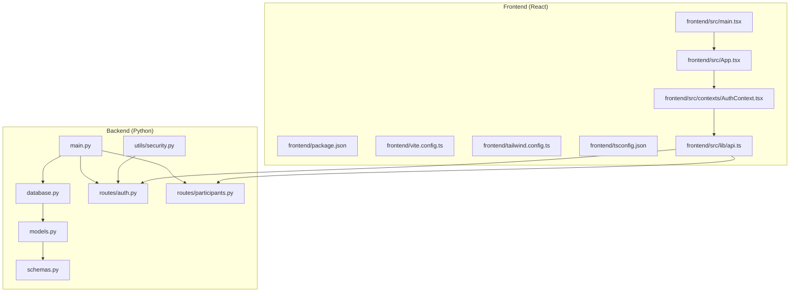
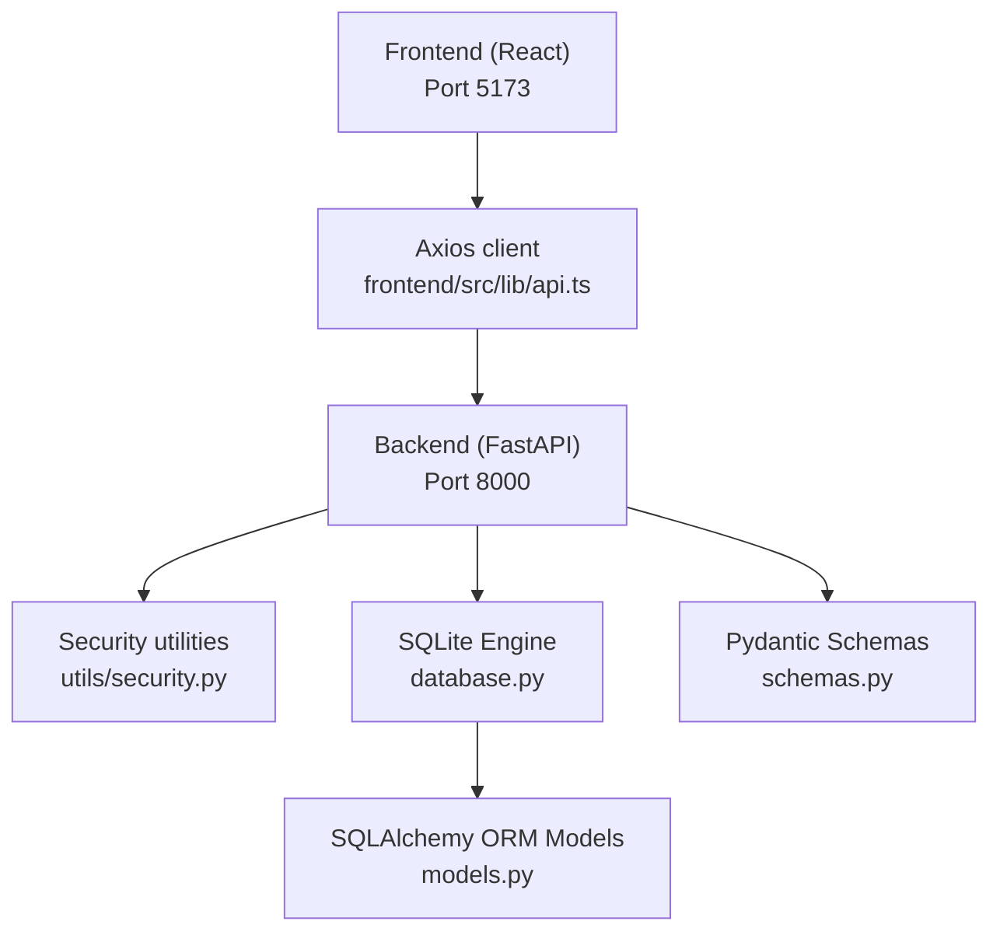
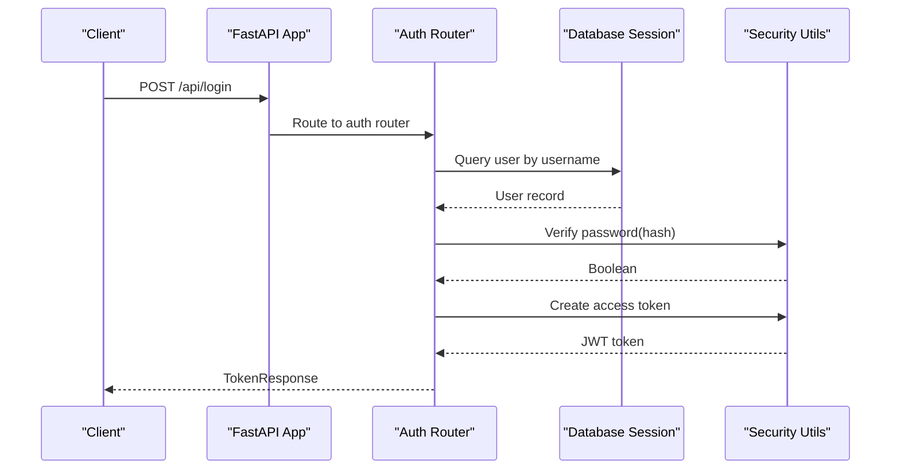
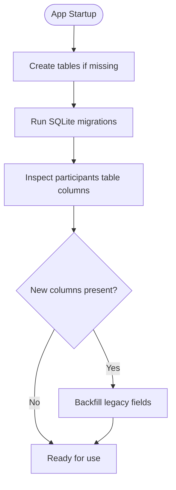
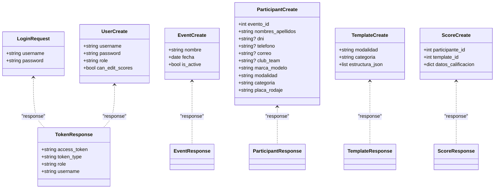
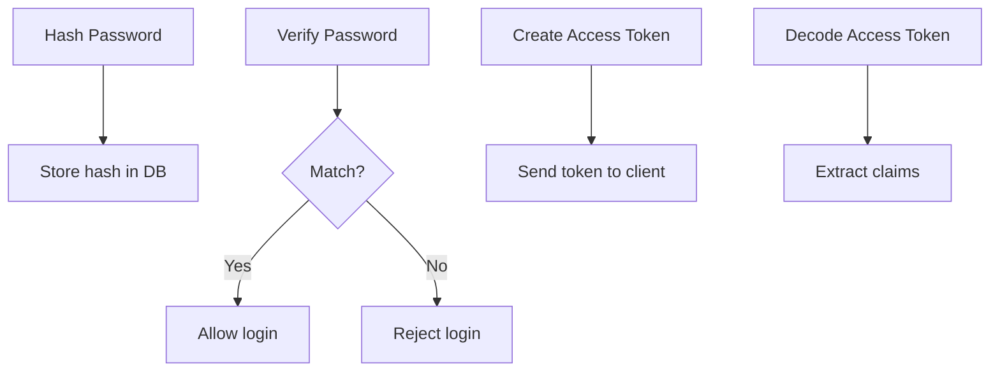
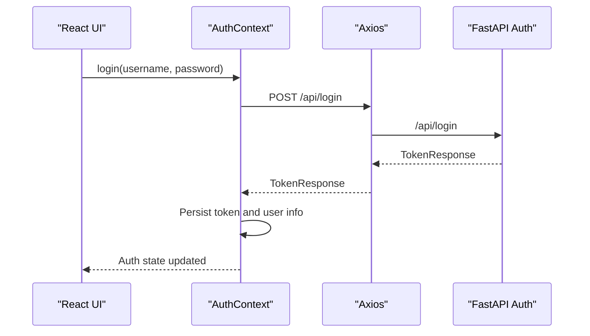
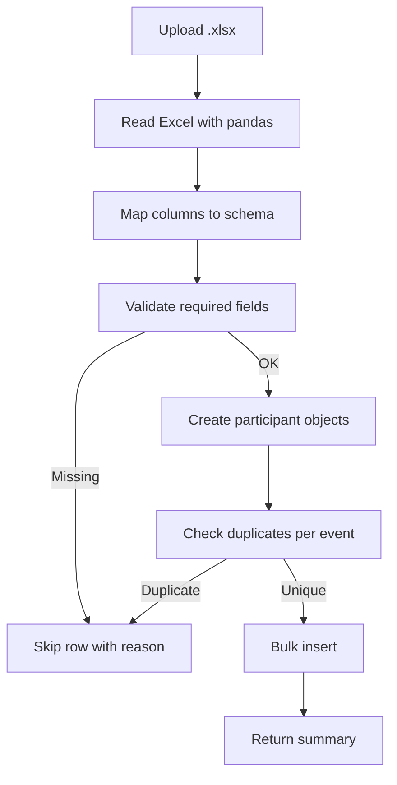
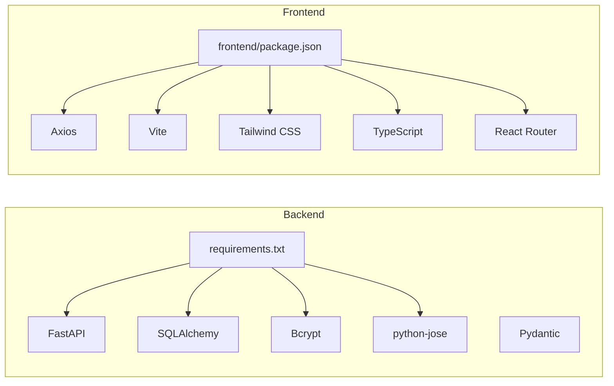

# Technology Stack

<cite>
**Referenced Files in This Document**
- [requirements.txt](file://requirements.txt)
- [main.py](file://main.py)
- [database.py](file://database.py)
- [models.py](file://models.py)
- [schemas.py](file://schemas.py)
- [utils/security.py](file://utils/security.py)
- [routes/auth.py](file://routes/auth.py)
- [routes/participants.py](file://routes/participants.py)
- [frontend/package.json](file://frontend/package.json)
- [frontend/vite.config.ts](file://frontend/vite.config.ts)
- [frontend/tailwind.config.ts](file://frontend/tailwind.config.ts)
- [frontend/tsconfig.json](file://frontend/tsconfig.json)
- [frontend/src/lib/api.ts](file://frontend/src/lib/api.ts)
- [frontend/src/contexts/AuthContext.tsx](file://frontend/src/contexts/AuthContext.tsx)
- [frontend/src/App.tsx](file://frontend/src/App.tsx)
- [frontend/src/main.tsx](file://frontend/src/main.tsx)
- [start.sh](file://start.sh)
</cite>

## Table of Contents
1. [Introduction](#introduction)
2. [Project Structure](#project-structure)
3. [Core Components](#core-components)
4. [Architecture Overview](#architecture-overview)
5. [Detailed Component Analysis](#detailed-component-analysis)
6. [Dependency Analysis](#dependency-analysis)
7. [Performance Considerations](#performance-considerations)
8. [Troubleshooting Guide](#troubleshooting-guide)
9. [Conclusion](#conclusion)

## Introduction
This document describes the technology stack of the Juzgamiento project, focusing on backend and frontend choices, database design, and development workflow. The backend is built with Python and FastAPI, using SQLAlchemy for ORM and Pydantic for data validation. Password hashing and JWT authentication are handled by Bcrypt and python-jose respectively. The frontend is a React application with TypeScript, styled via Tailwind CSS, built with Vite, and communicates with the backend using Axios. The database is SQLite with runtime migrations to evolve the schema safely. Development is streamlined with a shell script that launches both backend and frontend concurrently.

## Project Structure
The repository is organized into two primary areas:
- Backend: Python application under the repository root, including routing, models, schemas, utilities, and database configuration.
- Frontend: A React application under the frontend/ directory with TypeScript, Vite, and Tailwind CSS.

**Diagram sources**
- [main.py:1-38](file://main.py#L1-L38)
- [database.py:1-93](file://database.py#L1-L93)
- [models.py:1-95](file://models.py#L1-L95)
- [schemas.py:1-152](file://schemas.py#L1-L152)
- [utils/security.py:1-51](file://utils/security.py#L1-L51)
- [routes/auth.py:1-36](file://routes/auth.py#L1-L36)
- [routes/participants.py:1-400](file://routes/participants.py#L1-L400)
- [frontend/package.json:1-28](file://frontend/package.json#L1-L28)
- [frontend/vite.config.ts:1-8](file://frontend/vite.config.ts#L1-L8)
- [frontend/tailwind.config.ts:1-32](file://frontend/tailwind.config.ts#L1-L32)
- [frontend/tsconfig.json:1-22](file://frontend/tsconfig.json#L1-L22)
- [frontend/src/lib/api.ts:1-33](file://frontend/src/lib/api.ts#L1-L33)
- [frontend/src/contexts/AuthContext.tsx:1-144](file://frontend/src/contexts/AuthContext.tsx#L1-L144)
- [frontend/src/App.tsx:1-119](file://frontend/src/App.tsx#L1-L119)
- [frontend/src/main.tsx:1-19](file://frontend/src/main.tsx#L1-L19)

**Section sources**
- [main.py:1-38](file://main.py#L1-L38)
- [database.py:1-93](file://database.py#L1-L93)
- [frontend/package.json:1-28](file://frontend/package.json#L1-L28)

## Core Components
- Backend framework: FastAPI powers the REST API, CORS middleware is enabled, and routers are mounted for authentication, events, participants, scores, templates, and users.
- Database: SQLAlchemy ORM with a declarative base; SQLite engine configured with a fixed path; runtime migrations adjust the schema for evolving requirements.
- Data validation: Pydantic models define request/response schemas with constraints and serialization behavior.
- Security: Bcrypt hashes passwords; JWT tokens issued via python-jose; token verification and password verification utilities.
- Frontend framework: React with TypeScript; Vite for build tooling; Tailwind CSS for styling; Axios for HTTP requests.

Key implementation references:
- Backend app initialization and router mounting: [main.py:17-32](file://main.py#L17-L32)
- Database engine and migrations: [database.py:20-34](file://database.py#L20-L34), [database.py:36-93](file://database.py#L36-L93)
- ORM models: [models.py:11-95](file://models.py#L11-L95)
- Pydantic schemas: [schemas.py:10-152](file://schemas.py#L10-L152)
- Security utilities: [utils/security.py:17-39](file://utils/security.py#L17-L39)
- Authentication route: [routes/auth.py:13-35](file://routes/auth.py#L13-L35)
- Frontend dependencies and scripts: [frontend/package.json:6-26](file://frontend/package.json#L6-L26)
- Vite config: [frontend/vite.config.ts:5-7](file://frontend/vite.config.ts#L5-L7)
- Tailwind config: [frontend/tailwind.config.ts:4-31](file://frontend/tailwind.config.ts#L4-L31)
- TypeScript compiler options: [frontend/tsconfig.json:2-18](file://frontend/tsconfig.json#L2-L18)

**Section sources**
- [main.py:17-32](file://main.py#L17-L32)
- [database.py:20-34](file://database.py#L20-L34)
- [database.py:36-93](file://database.py#L36-L93)
- [models.py:11-95](file://models.py#L11-L95)
- [schemas.py:10-152](file://schemas.py#L10-L152)
- [utils/security.py:17-39](file://utils/security.py#L17-L39)
- [routes/auth.py:13-35](file://routes/auth.py#L13-L35)
- [frontend/package.json:6-26](file://frontend/package.json#L6-L26)
- [frontend/vite.config.ts:5-7](file://frontend/vite.config.ts#L5-L7)
- [frontend/tailwind.config.ts:4-31](file://frontend/tailwind.config.ts#L4-L31)
- [frontend/tsconfig.json:2-18](file://frontend/tsconfig.json#L2-L18)

## Architecture Overview
The system follows a classic client-server architecture:
- The React frontend runs on port 5173 and communicates with the backend API on port 8000.
- The backend exposes REST endpoints grouped by domain (authentication, participants, etc.), backed by SQLAlchemy ORM models.
- Data validation is enforced by Pydantic models at request boundaries.
- Authentication uses JWT tokens; passwords are hashed with Bcrypt.

**Diagram sources**
- [frontend/src/lib/api.ts:11-13](file://frontend/src/lib/api.ts#L11-L13)
- [main.py:17-32](file://main.py#L17-L32)
- [utils/security.py:17-39](file://utils/security.py#L17-L39)
- [database.py:20-34](file://database.py#L20-L34)
- [models.py:11-95](file://models.py#L11-L95)
- [schemas.py:10-152](file://schemas.py#L10-L152)

## Detailed Component Analysis

### Backend: FastAPI Application
- Initializes CORS for broad compatibility during development.
- Includes routers for authentication, events, participants, scores, templates, and users.
- Health check endpoint exposed at /health.

**Diagram sources**
- [routes/auth.py:13-35](file://routes/auth.py#L13-L35)
- [utils/security.py:22-39](file://utils/security.py#L22-L39)
- [database.py:28-33](file://database.py#L28-L33)

**Section sources**
- [main.py:19-32](file://main.py#L19-L32)
- [routes/auth.py:13-35](file://routes/auth.py#L13-L35)
- [utils/security.py:17-39](file://utils/security.py#L17-L39)

### Database Layer: SQLAlchemy ORM and SQLite
- SQLite engine configured with an absolute path to avoid environment-related issues.
- Session factory and dependency injection via a generator.
- Runtime migrations adjust the participants table to add new columns and backfill legacy data.

**Diagram sources**
- [main.py:14-15](file://main.py#L14-L15)
- [database.py:36-93](file://database.py#L36-L93)

**Section sources**
- [database.py:12-34](file://database.py#L12-L34)
- [database.py:36-93](file://database.py#L36-L93)
- [main.py:14-15](file://main.py#L14-L15)

### Data Validation: Pydantic Models
- Strongly typed request/response models enforce constraints (length, optionality).
- Serialization behavior configured for ORM compatibility.

**Diagram sources**
- [schemas.py:10-152](file://schemas.py#L10-L152)

**Section sources**
- [schemas.py:10-152](file://schemas.py#L10-L152)

### Security Utilities: Bcrypt and JWT
- Password hashing and verification using Bcrypt.
- JWT token creation and decoding with HS256 algorithm and configurable expiration.

**Diagram sources**
- [utils/security.py:17-39](file://utils/security.py#L17-L39)

**Section sources**
- [utils/security.py:17-39](file://utils/security.py#L17-L39)

### Frontend: React, TypeScript, Vite, Tailwind CSS, Axios
- React application bootstrapped with React Router for navigation and a global AuthContext for session management.
- Axios client configured with dynamic base URL and centralized error handling.
- Vite handles development server and builds; Tailwind CSS provides utility-first styling.

**Diagram sources**
- [frontend/src/contexts/AuthContext.tsx:95-111](file://frontend/src/contexts/AuthContext.tsx#L95-L111)
- [frontend/src/lib/api.ts:11-13](file://frontend/src/lib/api.ts#L11-L13)
- [routes/auth.py:13-35](file://routes/auth.py#L13-L35)

**Section sources**
- [frontend/src/main.tsx:10-18](file://frontend/src/main.tsx#L10-L18)
- [frontend/src/App.tsx:91-118](file://frontend/src/App.tsx#L91-L118)
- [frontend/src/contexts/AuthContext.tsx:66-131](file://frontend/src/contexts/AuthContext.tsx#L66-L131)
- [frontend/src/lib/api.ts:4-32](file://frontend/src/lib/api.ts#L4-L32)
- [frontend/package.json:6-26](file://frontend/package.json#L6-L26)
- [frontend/vite.config.ts:5-7](file://frontend/vite.config.ts#L5-L7)
- [frontend/tailwind.config.ts:4-31](file://frontend/tailwind.config.ts#L4-L31)
- [frontend/tsconfig.json:2-18](file://frontend/tsconfig.json#L2-L18)

### Data Import Pipeline: Excel Upload to Participants
- Validates uploaded Excel files, normalizes headers, and bulk inserts records while enforcing uniqueness and constraints.

**Diagram sources**
- [routes/participants.py:286-399](file://routes/participants.py#L286-L399)

**Section sources**
- [routes/participants.py:286-399](file://routes/participants.py#L286-L399)

## Dependency Analysis
- Backend dependencies are declared in requirements.txt, including FastAPI, Uvicorn, SQLAlchemy, Pydantic-compatible libraries, Bcrypt, and JWT utilities.
- Frontend dependencies include React, React Router DOM, Axios, Vite, Tailwind CSS, and TypeScript.

**Diagram sources**
- [requirements.txt:1-10](file://requirements.txt#L1-L10)
- [frontend/package.json:11-26](file://frontend/package.json#L11-L26)

**Section sources**
- [requirements.txt:1-10](file://requirements.txt#L1-L10)
- [frontend/package.json:11-26](file://frontend/package.json#L11-L26)

## Performance Considerations
- SQLite is lightweight and suitable for small to medium workloads; consider read replicas or migration to PostgreSQL for high concurrency.
- Bulk inserts are used for Excel uploads to reduce round-trips.
- CORS is permissive during development; tighten origins in production.
- JWT token expiration is configurable; keep reasonable TTLs to balance UX and security.
- Use database indexes on frequently filtered columns (e.g., event_id) as seen in migrations.

[No sources needed since this section provides general guidance]

## Troubleshooting Guide
- Backend startup errors: Ensure the virtual environment is activated and Uvicorn is installed; confirm the database path resolves correctly.
- Frontend build issues: Verify Vite and TypeScript configurations; ensure NODE_OPTIONS is not blocking ES modules.
- Authentication failures: Confirm JWT secret and algorithm configuration; verify password hashing and token decoding.
- Excel upload errors: Validate required columns and file format; check for duplicate plates and missing data.

**Section sources**
- [start.sh:10-15](file://start.sh#L10-L15)
- [frontend/package.json:6-9](file://frontend/package.json#L6-L9)
- [utils/security.py:9-14](file://utils/security.py#L9-L14)
- [routes/participants.py:295-320](file://routes/participants.py#L295-L320)

## Conclusion
The Juzgamiento project combines a modern Python backend with a responsive React frontend, delivering a maintainable and scalable solution for competition scoring. FastAPI and SQLAlchemy provide robust APIs and ORM capabilities, while Pydantic ensures strict data validation. Bcrypt and JWT secure authentication, and SQLite with runtime migrations supports iterative schema evolution. Vite and Tailwind streamline development and styling. These choices collectively emphasize simplicity, developer productivity, and clear separation of concerns.