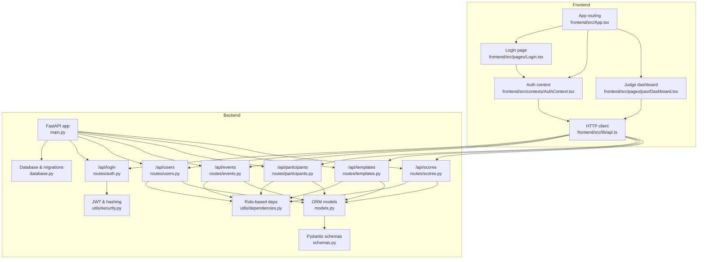
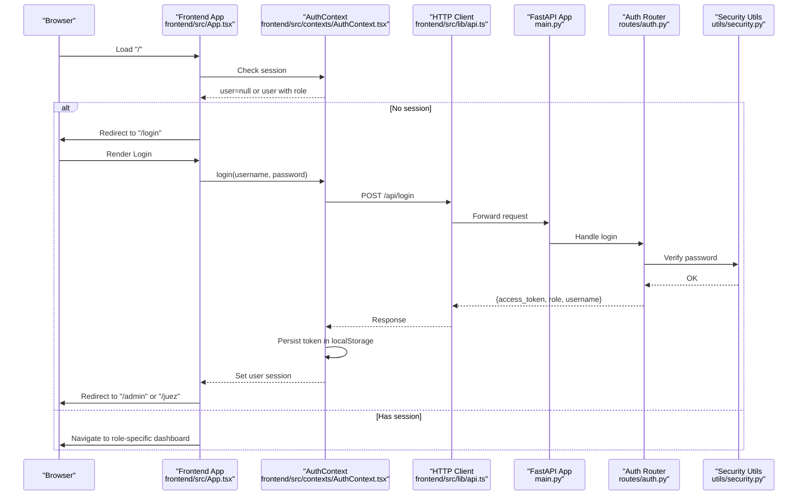
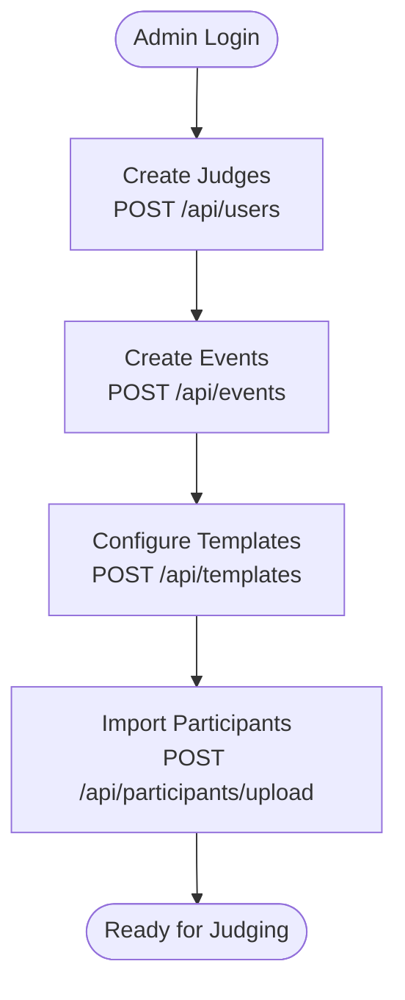
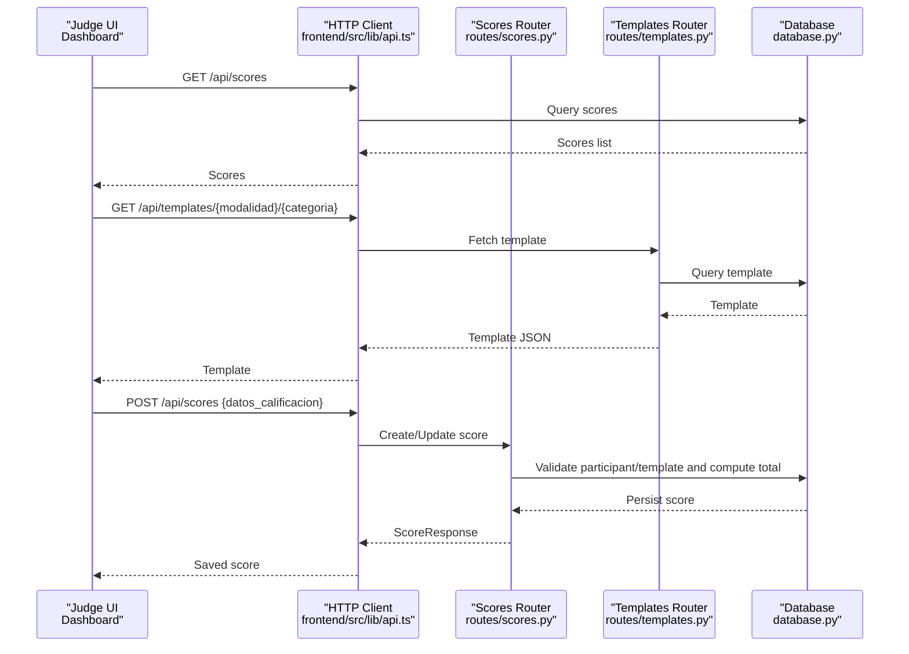
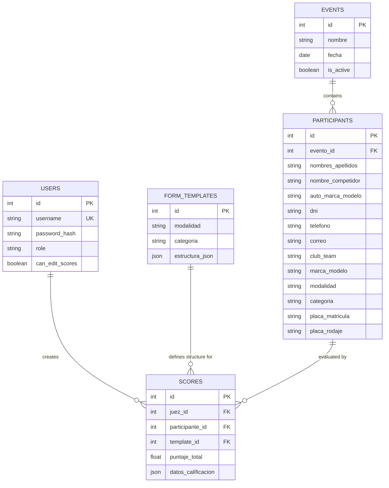
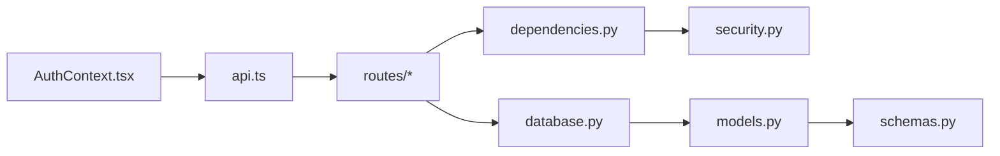

# User Workflows

<cite>
**Referenced Files in This Document**
- [main.py](file://main.py)
- [models.py](file://models.py)
- [schemas.py](file://schemas.py)
- [database.py](file://database.py)
- [utils/security.py](file://utils/security.py)
- [utils/dependencies.py](file://utils/dependencies.py)
- [routes/auth.py](file://routes/auth.py)
- [routes/users.py](file://routes/users.py)
- [routes/events.py](file://routes/events.py)
- [routes/participants.py](file://routes/participants.py)
- [routes/templates.py](file://routes/templates.py)
- [routes/scores.py](file://routes/scores.py)
- [frontend/src/App.tsx](file://frontend/src/App.tsx)
- [frontend/src/contexts/AuthContext.tsx](file://frontend/src/contexts/AuthContext.tsx)
- [frontend/src/lib/api.ts](file://frontend/src/lib/api.ts)
- [frontend/src/pages/Login.tsx](file://frontend/src/pages/Login.tsx)
- [frontend/src/pages/juez/Dashboard.tsx](file://frontend/src/pages/juez/Dashboard.tsx)
</cite>

## Table of Contents
1. [Introduction](#introduction)
2. [Project Structure](#project-structure)
3. [Core Components](#core-components)
4. [Architecture Overview](#architecture-overview)
5. [Detailed Component Analysis](#detailed-component-analysis)
6. [Dependency Analysis](#dependency-analysis)
7. [Performance Considerations](#performance-considerations)
8. [Troubleshooting Guide](#troubleshooting-guide)
9. [Conclusion](#conclusion)
10. [Appendices](#appendices)

## Introduction
This document explains the end-to-end user workflows for the Juzgamiento system, focusing on two primary roles: Administrator and Judge. It covers:
- Administrator workflow: login, competition/event management, user creation, template configuration, and participant import.
- Judge workflow: participant selection, template loading, real-time scoring, and evaluation submission.
It also documents authentication flows, session management, role-based access control, common scenarios, error handling, and best practices.

## Project Structure
The system is a FastAPI backend with a React/TypeScript frontend. Authentication is JWT-based, with role checks enforced via dependency injectors. Data is persisted in a local SQLite database with SQLAlchemy ORM models.

**Diagram sources**
- [main.py:1-38](file://main.py#L1-L38)
- [database.py:1-93](file://database.py#L1-L93)
- [utils/security.py:1-51](file://utils/security.py#L1-L51)
- [utils/dependencies.py:1-71](file://utils/dependencies.py#L1-L71)
- [routes/auth.py:1-36](file://routes/auth.py#L1-L36)
- [routes/users.py:1-192](file://routes/users.py#L1-L192)
- [routes/events.py:1-74](file://routes/events.py#L1-L74)
- [routes/participants.py:1-400](file://routes/participants.py#L1-L400)
- [routes/templates.py:1-64](file://routes/templates.py#L1-L64)
- [routes/scores.py:1-132](file://routes/scores.py#L1-L132)
- [models.py:1-95](file://models.py#L1-L95)
- [schemas.py:1-152](file://schemas.py#L1-L152)
- [frontend/src/App.tsx:1-119](file://frontend/src/App.tsx#L1-L119)
- [frontend/src/contexts/AuthContext.tsx:1-144](file://frontend/src/contexts/AuthContext.tsx#L1-L144)
- [frontend/src/lib/api.ts:1-33](file://frontend/src/lib/api.ts#L1-L33)
- [frontend/src/pages/Login.tsx:1-124](file://frontend/src/pages/Login.tsx#L1-L124)
- [frontend/src/pages/juez/Dashboard.tsx:1-271](file://frontend/src/pages/juez/Dashboard.tsx#L1-L271)

**Section sources**
- [main.py:1-38](file://main.py#L1-L38)
- [database.py:1-93](file://database.py#L1-L93)
- [frontend/src/App.tsx:1-119](file://frontend/src/App.tsx#L1-L119)

## Core Components
- Authentication and session management:
  - Backend generates JWT tokens with role and user metadata.
  - Frontend stores tokens in localStorage and attaches Authorization headers.
  - Role guards enforce access per route.
- Data models:
  - Users, Events, Participants, FormTemplates, Scores define the domain.
- Schemas:
  - Pydantic models validate requests/responses across endpoints.
- Routing:
  - REST endpoints for auth, users, events, participants, templates, and scores.

Key implementation references:
- JWT and token helpers: [utils/security.py:1-51](file://utils/security.py#L1-L51)
- Role-based dependencies: [utils/dependencies.py:1-71](file://utils/dependencies.py#L1-L71)
- Models: [models.py:11-95](file://models.py#L11-L95)
- Schemas: [schemas.py:7-152](file://schemas.py#L7-L152)
- Auth endpoint: [routes/auth.py:13-36](file://routes/auth.py#L13-L36)
- Users CRUD: [routes/users.py:21-192](file://routes/users.py#L21-L192)
- Events CRUD: [routes/events.py:13-74](file://routes/events.py#L13-L74)
- Participants CRUD and Excel import: [routes/participants.py:181-400](file://routes/participants.py#L181-L400)
- Templates CRUD: [routes/templates.py:13-64](file://routes/templates.py#L13-L64)
- Scores CRUD: [routes/scores.py:43-132](file://routes/scores.py#L43-L132)

**Section sources**
- [utils/security.py:1-51](file://utils/security.py#L1-L51)
- [utils/dependencies.py:1-71](file://utils/dependencies.py#L1-L71)
- [models.py:11-95](file://models.py#L11-L95)
- [schemas.py:7-152](file://schemas.py#L7-L152)
- [routes/auth.py:13-36](file://routes/auth.py#L13-L36)
- [routes/users.py:21-192](file://routes/users.py#L21-L192)
- [routes/events.py:13-74](file://routes/events.py#L13-L74)
- [routes/participants.py:181-400](file://routes/participants.py#L181-L400)
- [routes/templates.py:13-64](file://routes/templates.py#L13-L64)
- [routes/scores.py:43-132](file://routes/scores.py#L43-L132)

## Architecture Overview
High-level authentication and navigation flow:

**Diagram sources**
- [frontend/src/App.tsx:91-119](file://frontend/src/App.tsx#L91-L119)
- [frontend/src/contexts/AuthContext.tsx:66-132](file://frontend/src/contexts/AuthContext.tsx#L66-L132)
- [frontend/src/lib/api.ts:9-13](file://frontend/src/lib/api.ts#L9-L13)
- [main.py:17-32](file://main.py#L17-L32)
- [routes/auth.py:13-36](file://routes/auth.py#L13-L36)
- [utils/security.py:29-39](file://utils/security.py#L29-L39)

## Detailed Component Analysis

### Administrator Workflow: From Login to Competition Management
Administrator tasks include logging in, managing users, events, templates, and importing participants.

#### Step 1: Administrator Login
- Frontend renders the login form and calls the backend login endpoint.
- Backend verifies credentials and returns a JWT with role and user metadata.
- Frontend persists the token and redirects to the admin dashboard.

References:
- Login UI: [frontend/src/pages/Login.tsx:15-124](file://frontend/src/pages/Login.tsx#L15-L124)
- Auth context storage and redirect: [frontend/src/contexts/AuthContext.tsx:95-116](file://frontend/src/contexts/AuthContext.tsx#L95-L116)
- Auth endpoint: [routes/auth.py:13-36](file://routes/auth.py#L13-L36)
- Security helpers: [utils/security.py:17-39](file://utils/security.py#L17-L39)

#### Step 2: Manage Users (Create Judge Accounts)
- Admin creates judges with username, password, and role.
- First user must be admin; subsequent creations require admin role.
- Passwords are hashed before storage.

References:
- Users endpoint: [routes/users.py:29-66](file://routes/users.py#L29-L66)
- Hashing: [utils/security.py:17-26](file://utils/security.py#L17-L26)
- Role guard: [utils/dependencies.py:32-38](file://utils/dependencies.py#L32-L38)

#### Step 3: Create/Edit Events
- Admin creates events with name, date, and active flag.
- Events are listed for judge selection later.

References:
- Events endpoint: [routes/events.py:21-35](file://routes/events.py#L21-L35)
- List events: [routes/events.py:13-18](file://routes/events.py#L13-L18)

#### Step 4: Configure Evaluation Templates
- Admin saves templates per modalidad and categoria.
- Templates store the JSON structure used by judges.

References:
- Save template: [routes/templates.py:13-41](file://routes/templates.py#L13-L41)
- Retrieve template: [routes/templates.py:43-63](file://routes/templates.py#L43-L63)

#### Step 5: Import Participants via Excel
- Admin uploads an Excel file (.xlsx) containing participant records.
- Columns are normalized and mapped to required and optional fields.
- Duplicates by license plate within an event are detected and skipped.
- Bulk insert is used for performance.

References:
- Excel upload and parsing: [routes/participants.py:286-400](file://routes/participants.py#L286-L400)
- Column normalization and mapping: [routes/participants.py:64-106](file://routes/participants.py#L64-L106)
- Unique plate check: [routes/participants.py:160-179](file://routes/participants.py#L160-L179)

#### Step 6: Manual Participant Management (Optional)
- Admin can create/update participants individually.
- Name updates and uniqueness validations apply.

References:
- Create participant: [routes/participants.py:181-199](file://routes/participants.py#L181-L199)
- Update participant: [routes/participants.py:202-230](file://routes/participants.py#L202-L230)
- Update name: [routes/participants.py:233-256](file://routes/participants.py#L233-L256)

#### Step 7: View Scores (Optional)
- Admin can list scores for auditing.

References:
- List scores: [routes/scores.py:117-132](file://routes/scores.py#L117-L132)

**Diagram sources**
- [routes/users.py:29-66](file://routes/users.py#L29-L66)
- [routes/events.py:21-35](file://routes/events.py#L21-L35)
- [routes/templates.py:13-41](file://routes/templates.py#L13-L41)
- [routes/participants.py:286-400](file://routes/participants.py#L286-L400)

**Section sources**
- [frontend/src/pages/Login.tsx:15-124](file://frontend/src/pages/Login.tsx#L15-L124)
- [frontend/src/contexts/AuthContext.tsx:95-116](file://frontend/src/contexts/AuthContext.tsx#L95-L116)
- [routes/auth.py:13-36](file://routes/auth.py#L13-L36)
- [utils/security.py:17-39](file://utils/security.py#L17-L39)
- [routes/users.py:29-66](file://routes/users.py#L29-L66)
- [routes/events.py:21-35](file://routes/events.py#L21-L35)
- [routes/templates.py:13-41](file://routes/templates.py#L13-L41)
- [routes/participants.py:286-400](file://routes/participants.py#L286-L400)

### Judge Workflow: From Selection to Submission
Judge tasks include selecting a competition, filtering participants, loading templates, scoring, and submitting evaluations.

#### Step 1: Judge Login and Navigation
- Judge logs in and is redirected to the judge dashboard.

References:
- Login and redirect: [frontend/src/pages/Login.tsx:38-61](file://frontend/src/pages/Login.tsx#L38-L61)
- Judge routes: [frontend/src/App.tsx:107-113](file://frontend/src/App.tsx#L107-L113)

#### Step 2: Select Event, Modalidad, and Categoria
- Judge chooses an active event and filters by modalidad and categoria.

References:
- Judge dashboard fetches events and participants: [frontend/src/pages/juez/Dashboard.tsx:39-95](file://frontend/src/pages/juez/Dashboard.tsx#L39-L95)

#### Step 3: View Filtered Participants
- Judge sees a list of filtered participants and completion status.

References:
- Dashboard rendering and completion tracking: [frontend/src/pages/juez/Dashboard.tsx:109-271](file://frontend/src/pages/juez/Dashboard.tsx#L109-L271)

#### Step 4: Load Template and Open Evaluation
- Judge opens a participant’s evaluation page and loads the matching template.

References:
- Template retrieval by modalidad/categoria: [routes/templates.py:43-63](file://routes/templates.py#L43-L63)

#### Step 5: Real-Time Scoring and Submission
- Judge submits scores; backend validates template compatibility and computes totals.
- If a score exists and the judge lacks edit permission, submission is blocked.

References:
- Create or update score: [routes/scores.py:43-115](file://routes/scores.py#L43-L115)
- Summation logic: [routes/scores.py:16-26](file://routes/scores.py#L16-L26)

**Diagram sources**
- [frontend/src/pages/juez/Dashboard.tsx:39-95](file://frontend/src/pages/juez/Dashboard.tsx#L39-L95)
- [routes/scores.py:43-115](file://routes/scores.py#L43-L115)
- [routes/templates.py:43-63](file://routes/templates.py#L43-L63)
- [database.py:28-34](file://database.py#L28-L34)

**Section sources**
- [frontend/src/pages/Login.tsx:38-61](file://frontend/src/pages/Login.tsx#L38-L61)
- [frontend/src/App.tsx:107-113](file://frontend/src/App.tsx#L107-L113)
- [frontend/src/pages/juez/Dashboard.tsx:39-95](file://frontend/src/pages/juez/Dashboard.tsx#L39-L95)
- [routes/scores.py:43-115](file://routes/scores.py#L43-L115)
- [routes/templates.py:43-63](file://routes/templates.py#L43-L63)

### Role-Based Access Patterns
- Admin-only endpoints:
  - Create users: [routes/users.py:29-66](file://routes/users.py#L29-L66)
  - Create events: [routes/events.py:21-35](file://routes/events.py#L21-L35)
  - Save templates: [routes/templates.py:13-41](file://routes/templates.py#L13-L41)
  - Upload participants: [routes/participants.py:286-400](file://routes/participants.py#L286-L400)
- Judge-only endpoints:
  - Submit scores: [routes/scores.py:43-115](file://routes/scores.py#L43-L115)
- Shared endpoints:
  - List events, participants, scores (with role-aware filtering): [routes/events.py:13-18](file://routes/events.py#L13-L18), [routes/participants.py:259-284](file://routes/participants.py#L259-L284), [routes/scores.py:117-132](file://routes/scores.py#L117-L132)

Role enforcement:
- Admin guard: [utils/dependencies.py:32-38](file://utils/dependencies.py#L32-L38)
- Judge guard: [utils/dependencies.py:41-47](file://utils/dependencies.py#L41-L47)
- Current user extraction: [utils/dependencies.py:16-71](file://utils/dependencies.py#L16-L71)

**Section sources**
- [routes/users.py:29-66](file://routes/users.py#L29-L66)
- [routes/events.py:21-35](file://routes/events.py#L21-L35)
- [routes/templates.py:13-41](file://routes/templates.py#L13-L41)
- [routes/participants.py:286-400](file://routes/participants.py#L286-L400)
- [routes/scores.py:43-115](file://routes/scores.py#L43-L115)
- [routes/events.py:13-18](file://routes/events.py#L13-L18)
- [routes/participants.py:259-284](file://routes/participants.py#L259-L284)
- [routes/scores.py:117-132](file://routes/scores.py#L117-L132)
- [utils/dependencies.py:32-47](file://utils/dependencies.py#L32-L47)
- [utils/dependencies.py:16-71](file://utils/dependencies.py#L16-L71)

### Data Model Overview

**Diagram sources**
- [models.py:11-95](file://models.py#L11-L95)

**Section sources**
- [models.py:11-95](file://models.py#L11-L95)

## Dependency Analysis
- Frontend depends on:
  - AuthContext for session state and token persistence.
  - API client for HTTP calls with Authorization headers.
  - Route guards via App routing to enforce role-based navigation.
- Backend depends on:
  - Security utilities for hashing and JWT.
  - Dependency injectors for role checks.
  - SQLAlchemy for ORM and migrations.

**Diagram sources**
- [frontend/src/contexts/AuthContext.tsx:66-132](file://frontend/src/contexts/AuthContext.tsx#L66-L132)
- [frontend/src/lib/api.ts:9-13](file://frontend/src/lib/api.ts#L9-L13)
- [routes/auth.py:13-36](file://routes/auth.py#L13-L36)
- [utils/dependencies.py:16-71](file://utils/dependencies.py#L16-L71)
- [utils/security.py:17-39](file://utils/security.py#L17-L39)
- [database.py:28-34](file://database.py#L28-L34)
- [models.py:11-95](file://models.py#L11-L95)
- [schemas.py:7-152](file://schemas.py#L7-L152)

**Section sources**
- [frontend/src/contexts/AuthContext.tsx:66-132](file://frontend/src/contexts/AuthContext.tsx#L66-L132)
- [frontend/src/lib/api.ts:9-13](file://frontend/src/lib/api.ts#L9-L13)
- [utils/dependencies.py:16-71](file://utils/dependencies.py#L16-L71)
- [utils/security.py:17-39](file://utils/security.py#L17-L39)
- [database.py:28-34](file://database.py#L28-L34)
- [models.py:11-95](file://models.py#L11-L95)
- [schemas.py:7-152](file://schemas.py#L7-L152)

## Performance Considerations
- Bulk inserts for participant imports reduce round-trips during Excel uploads.
- Unique constraints and pre-checks prevent unnecessary writes and conflicts.
- Pagination and filtering on participant and score listings improve responsiveness.
- JWT token reuse avoids redundant logins; consider token refresh strategies for long sessions.

[No sources needed since this section provides general guidance]

## Troubleshooting Guide
Common issues and recovery steps:
- Invalid credentials on login:
  - Symptom: Unauthorized error on POST /api/login.
  - Action: Verify username/password; ensure account exists and is not locked.
  - Reference: [routes/auth.py:17-21](file://routes/auth.py#L17-L21)
- Missing Authorization header:
  - Symptom: 401 Unauthorized on protected endpoints.
  - Action: Ensure frontend stores token and sends Authorization: Bearer header.
  - References: [frontend/src/lib/api.ts:11-13](file://frontend/src/lib/api.ts#L11-L13), [utils/dependencies.py:50-70](file://utils/dependencies.py#L50-L70)
- Admin-only actions by non-admin:
  - Symptom: 403 Forbidden when creating users or uploading participants.
  - Action: Log in as admin or verify role assignment.
  - References: [utils/dependencies.py:32-38](file://utils/dependencies.py#L32-L38), [routes/users.py:43-47](file://routes/users.py#L43-L47)
- Duplicate participant plate:
  - Symptom: 409 Conflict on create/update or Excel upload skip.
  - Action: Change plate or remove duplicates in the same event.
  - References: [routes/participants.py:175-178](file://routes/participants.py#L175-L178), [routes/participants.py:374-373](file://routes/participants.py#L374-L373)
- Template mismatch:
  - Symptom: 400 Bad Request when submitting scores.
  - Action: Ensure template matches participant modalidad and categoria.
  - Reference: [routes/scores.py:63-67](file://routes/scores.py#L63-L67)
- Judge cannot edit existing score:
  - Symptom: 403 Forbidden when updating an existing score.
  - Action: Enable can_edit_scores for the judge or avoid edits.
  - Reference: [routes/scores.py:90-94](file://routes/scores.py#L90-L94)

**Section sources**
- [routes/auth.py:17-21](file://routes/auth.py#L17-L21)
- [frontend/src/lib/api.ts:11-13](file://frontend/src/lib/api.ts#L11-L13)
- [utils/dependencies.py:32-38](file://utils/dependencies.py#L32-L38)
- [routes/participants.py:175-178](file://routes/participants.py#L175-L178)
- [routes/participants.py:374-373](file://routes/participants.py#L374-L373)
- [routes/scores.py:63-67](file://routes/scores.py#L63-L67)
- [routes/scores.py:90-94](file://routes/scores.py#L90-L94)

## Conclusion
The Juzgamiento system provides a clear separation of duties between administrators and judges, with robust role-based access control and secure JWT-based authentication. Administrators can efficiently manage users, events, templates, and participant lists, while judges can quickly filter participants, load templates, and submit real-time scores. Following the best practices and troubleshooting steps outlined here will help ensure smooth operation and reliable outcomes.

[No sources needed since this section summarizes without analyzing specific files]

## Appendices

### Best Practices
- Administrators:
  - Always configure templates before enabling judging.
  - Validate Excel column names and ensure uniqueness of plates per event.
  - Limit judge permissions by default; enable editing only when necessary.
- Judges:
  - Confirm template alignment with participant modalidad and categoria before scoring.
  - Review previous scores before editing to avoid accidental overwrites.
  - Use the dashboard completion indicator to track progress.

[No sources needed since this section provides general guidance]