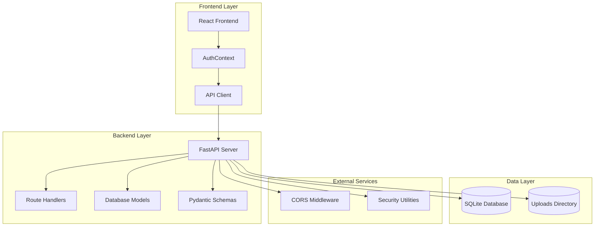
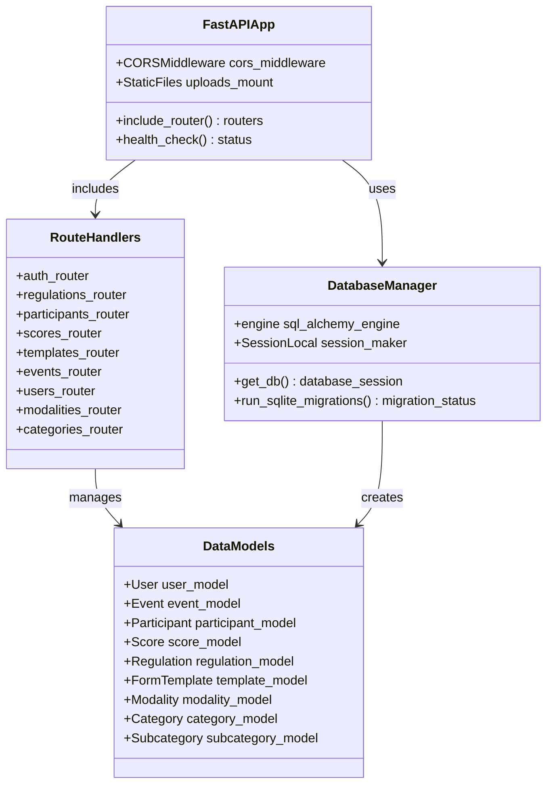
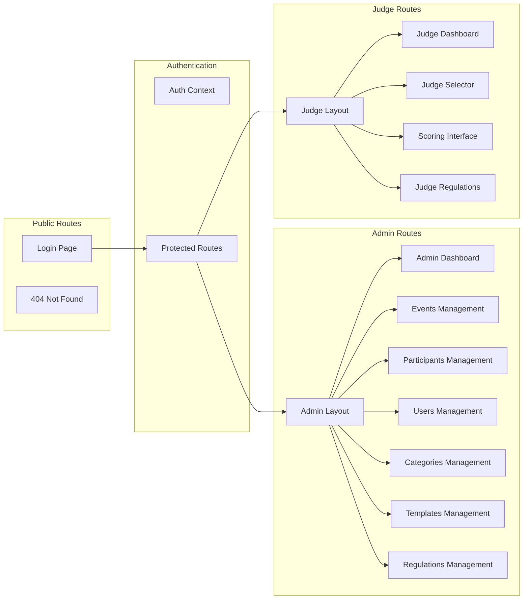
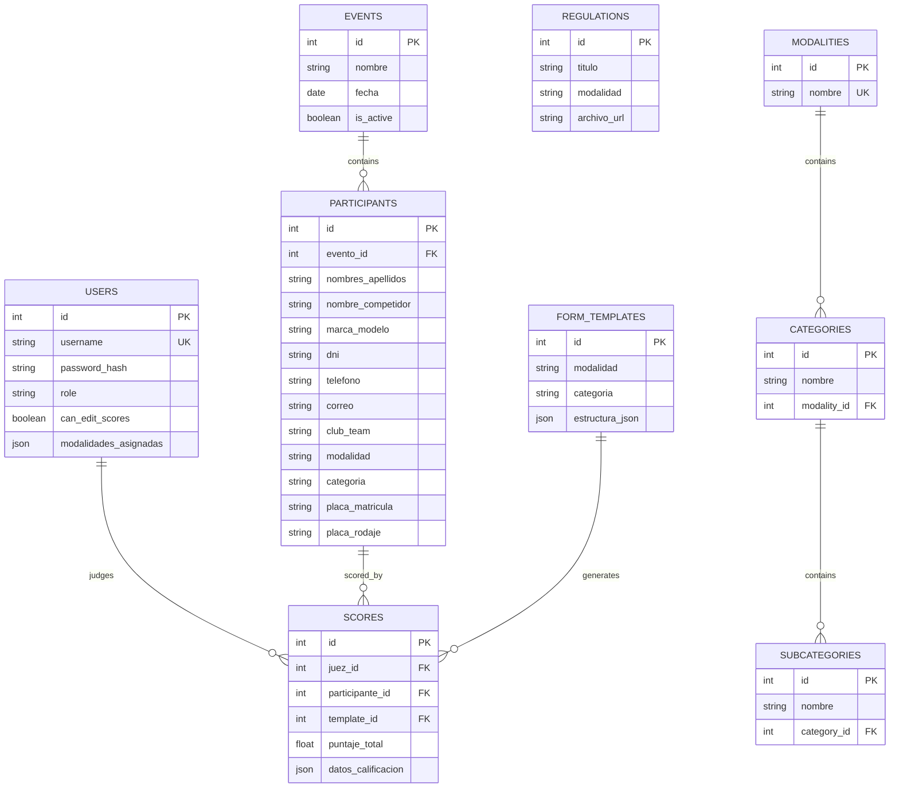
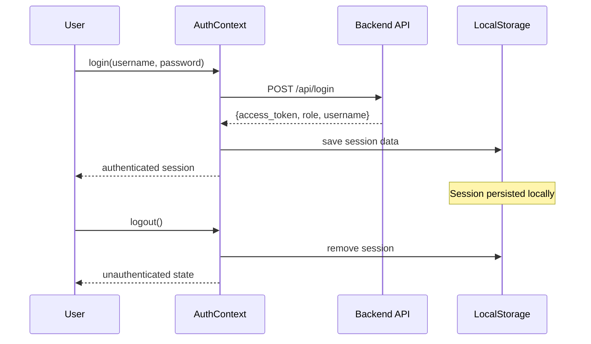
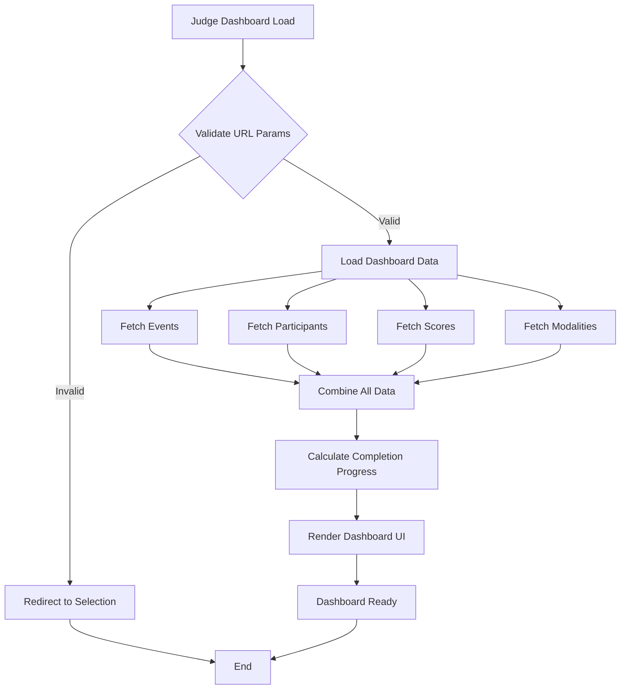
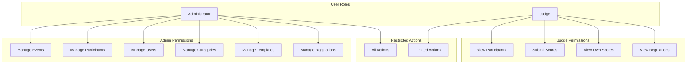
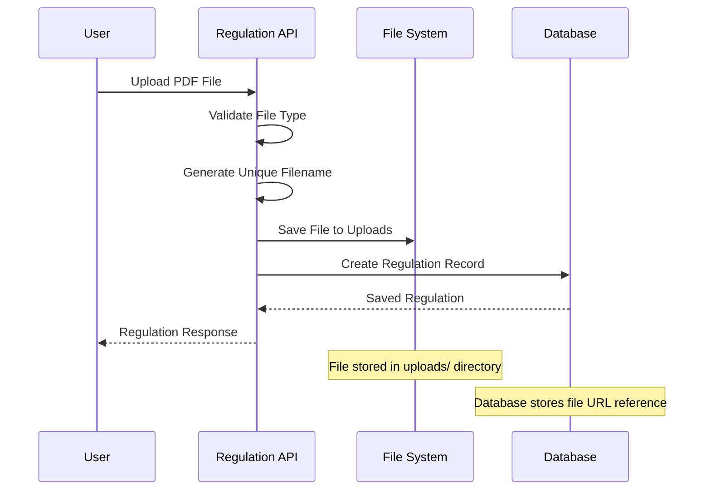
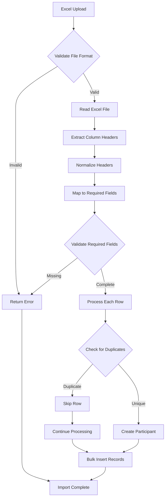
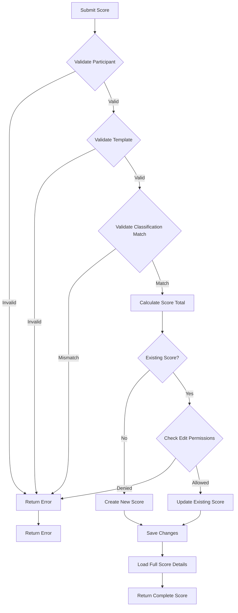

# Regulation Management System

<cite>
**Referenced Files in This Document**
- [main.py](file://main.py)
- [models.py](file://models.py)
- [schemas.py](file://schemas.py)
- [database.py](file://database.py)
- [init_db.py](file://init_db.py)
- [routes/regulations.py](file://routes/regulations.py)
- [routes/templates.py](file://routes/templates.py)
- [routes/participants.py](file://routes/participants.py)
- [routes/scores.py](file://routes/scores.py)
- [routes/events.py](file://routes/events.py)
- [frontend/src/App.tsx](file://frontend/src/App.tsx)
- [frontend/src/contexts/AuthContext.tsx](file://frontend/src/contexts/AuthContext.tsx)
- [frontend/src/lib/api.ts](file://frontend/src/lib/api.ts)
- [frontend/src/pages/juez/Dashboard.tsx](file://frontend/src/pages/juez/Dashboard.tsx)
</cite>

## Table of Contents
1. [Introduction](#introduction)
2. [System Architecture](#system-architecture)
3. [Core Components](#core-components)
4. [Database Design](#database-design)
5. [API Endpoints](#api-endpoints)
6. [Frontend Implementation](#frontend-implementation)
7. [Security Model](#security-model)
8. [File Management](#file-management)
9. [Excel Import System](#excel-import-system)
10. [Scoring System](#scoring-system)
11. [Troubleshooting Guide](#troubleshooting-guide)
12. [Conclusion](#conclusion)

## Introduction

The Regulation Management System is a comprehensive web application designed for managing automotive competition regulations, participants, scoring, and administrative workflows. Built with FastAPI for the backend and React for the frontend, this system provides a complete solution for organizing car audio and tuning competitions with features including regulation document management, participant registration, scoring workflows, and administrative oversight.

The system supports two primary user roles: administrators who have full access to manage all aspects of the competition, and judges who can only access specific scoring functionalities. The application includes sophisticated data validation, file upload capabilities, and automated Excel import systems for efficient participant management.

## System Architecture

The Regulation Management System follows a modern full-stack architecture with clear separation of concerns between the frontend and backend components.

**Diagram sources**
- [main.py:26-47](file://main.py#L26-L47)
- [frontend/src/App.tsx:95-127](file://frontend/src/App.tsx#L95-L127)

The architecture consists of three main layers:

1. **Frontend Layer**: React-based single-page application with protected routing and authentication
2. **Backend Layer**: FastAPI server with modular route handlers and comprehensive data validation
3. **Data Layer**: SQLite database with file storage for uploaded documents

**Section sources**
- [main.py:1-53](file://main.py#L1-L53)
- [frontend/src/App.tsx:1-128](file://frontend/src/App.tsx#L1-L128)

## Core Components

### Backend Application Structure

The backend application is built around a modular FastAPI architecture with clear separation of concerns:

**Diagram sources**
- [main.py:26-47](file://main.py#L26-L47)
- [database.py:15-34](file://database.py#L15-L34)
- [models.py:11-153](file://models.py#L11-L153)

### Frontend Application Structure

The frontend implements a sophisticated routing system with role-based access control:

**Diagram sources**
- [frontend/src/App.tsx:95-127](file://frontend/src/App.tsx#L95-L127)
- [frontend/src/contexts/AuthContext.tsx:66-132](file://frontend/src/contexts/AuthContext.tsx#L66-L132)

**Section sources**
- [main.py:1-53](file://main.py#L1-L53)
- [frontend/src/App.tsx:1-128](file://frontend/src/App.tsx#L1-L128)
- [frontend/src/contexts/AuthContext.tsx:1-144](file://frontend/src/contexts/AuthContext.tsx#L1-L144)

## Database Design

The system uses SQLAlchemy ORM with a comprehensive relational database design optimized for competition management:

**Diagram sources**
- [models.py:11-153](file://models.py#L11-L153)

The database design includes several key features:

- **Unique Constraints**: Prevents duplicate entries for critical fields like usernames, event participant plates, and classification combinations
- **Cascade Operations**: Automatic cleanup of related records when parent records are deleted
- **Index Optimization**: Strategic indexing on frequently queried fields for performance
- **Legacy Support**: Backward compatibility with existing database schema during migrations

**Section sources**
- [models.py:1-153](file://models.py#L1-L153)
- [database.py:36-93](file://database.py#L36-L93)

## API Endpoints

The system provides a comprehensive REST API organized into logical endpoint groups:

### Authentication Endpoints
- `POST /api/login` - User authentication and token generation
- `GET /api/logout` - User logout (client-side only)

### Administration Endpoints
- `GET /api/events` - List all events
- `POST /api/events` - Create new event
- `PATCH /api/events/{id}` - Partially update event
- `PUT /api/events/{id}` - Fully update event
- `DELETE /api/events/{id}` - Delete event with cascade

- `GET /api/participants` - List participants with filtering
- `POST /api/participants` - Create participant
- `PUT /api/participants/{id}` - Update participant
- `PATCH /api/participants/{id}/nombre` - Update participant name
- `DELETE /api/participants/{id}` - Delete participant
- `POST /api/participants/upload` - Bulk upload via Excel

- `GET /api/templates` - List all scoring templates
- `POST /api/templates` - Create/update template
- `GET /api/templates/{id}` - Get template by ID
- `PUT /api/templates/{id}` - Update template
- `DELETE /api/templates/{id}` - Delete template
- `GET /api/templates/{modalidad}/{categoria}` - Get template by classification

- `GET /api/regulations` - List regulations with optional filtering
- `POST /api/regulations` - Upload regulation document
- `DELETE /api/regulations/{id}` - Delete regulation

### Judge Endpoints
- `GET /api/scores` - List scores with role-based filtering
- `POST /api/scores` - Create or update score
- `GET /api/modalities` - List modalities with categories

### Security Endpoints
- `GET /health` - Health check endpoint

**Section sources**
- [routes/events.py:13-116](file://routes/events.py#L13-L116)
- [routes/participants.py:181-430](file://routes/participants.py#L181-L430)
- [routes/templates.py:13-134](file://routes/templates.py#L13-L134)
- [routes/regulations.py:20-110](file://routes/regulations.py#L20-L110)
- [routes/scores.py:43-132](file://routes/scores.py#L43-L132)

## Frontend Implementation

The frontend is built with React and implements a sophisticated authentication and routing system:

### Authentication System

**Diagram sources**
- [frontend/src/contexts/AuthContext.tsx:95-116](file://frontend/src/contexts/AuthContext.tsx#L95-L116)
- [frontend/src/lib/api.ts:11-22](file://frontend/src/lib/api.ts#L11-L22)

### Protected Routing System

The frontend implements role-based routing with automatic redirection and permission checking:

- **Admin Route Protection**: Only accessible to users with admin role
- **Judge Route Protection**: Only accessible to users with judge role  
- **Automatic Redirection**: Unauthenticated users are redirected to login
- **Role-Based Navigation**: Different navigation menus based on user role

### Judge Dashboard Features

The judge dashboard provides a comprehensive interface for competition management:

**Diagram sources**
- [frontend/src/pages/juez/Dashboard.tsx:51-119](file://frontend/src/pages/juez/Dashboard.tsx#L51-L119)

**Section sources**
- [frontend/src/App.tsx:1-128](file://frontend/src/App.tsx#L1-L128)
- [frontend/src/contexts/AuthContext.tsx:1-144](file://frontend/src/contexts/AuthContext.tsx#L1-L144)
- [frontend/src/pages/juez/Dashboard.tsx:1-416](file://frontend/src/pages/juez/Dashboard.tsx#L1-L416)

## Security Model

The system implements a multi-layered security approach:

### Role-Based Access Control

### Authentication Flow

The authentication system uses JWT tokens with automatic session persistence:

1. **Token Storage**: Secure local storage of authentication tokens
2. **Automatic Token Parsing**: Extract user ID from JWT payload
3. **Session Persistence**: Automatic rehydration on application startup
4. **Token Validation**: Automatic token verification on each request

### File Upload Security

The system implements comprehensive security measures for file uploads:

- **File Type Validation**: Strict PDF validation for regulations
- **Unique Filename Generation**: UUID-based filenames to prevent conflicts
- **Directory Restriction**: Controlled upload directory access
- **File Cleanup**: Automatic removal of files when records are deleted

**Section sources**
- [frontend/src/contexts/AuthContext.tsx:43-63](file://frontend/src/contexts/AuthContext.tsx#L43-L63)
- [routes/regulations.py:29-34](file://routes/regulations.py#L29-L34)

## File Management

The system provides robust file management capabilities for regulation documents:

### Upload Workflow

**Diagram sources**
- [routes/regulations.py:20-64](file://routes/regulations.py#L20-L64)

### File Organization

- **Upload Directory**: Centralized storage in `uploads/` directory
- **URL References**: Database stores relative URLs for file access
- **Static File Serving**: FastAPI serves uploaded files statically
- **Cleanup Management**: Automatic file removal when regulations are deleted

**Section sources**
- [routes/regulations.py:17-110](file://routes/regulations.py#L17-L110)
- [main.py:46-47](file://main.py#L46-L47)

## Excel Import System

The system provides advanced Excel import capabilities for bulk participant management:

### Column Mapping System

**Diagram sources**
- [routes/participants.py:316-430](file://routes/participants.py#L316-L430)

### Advanced Features

- **Flexible Column Names**: Supports multiple aliases for required fields
- **Automatic Data Cleaning**: Strips whitespace and normalizes text
- **Duplicate Detection**: Prevents duplicate participant registrations
- **Batch Processing**: Efficient bulk insert operations
- **Import Reporting**: Detailed feedback on created and skipped records

**Section sources**
- [routes/participants.py:23-106](file://routes/participants.py#L23-L106)
- [routes/participants.py:316-430](file://routes/participants.py#L316-L430)

## Scoring System

The scoring system provides a flexible framework for competition evaluation:

### Score Calculation Engine

**Diagram sources**
- [routes/scores.py:43-114](file://routes/scores.py#L43-L114)

### Advanced Features

- **Recursive Score Calculation**: Handles nested arrays and objects in scoring data
- **Classification Validation**: Ensures templates match participant classifications
- **Permission Control**: Restricts editing of existing scores based on user permissions
- **Rich Response Data**: Includes judge and participant details in API responses
- **Performance Optimization**: Uses joined loading for efficient data retrieval

**Section sources**
- [routes/scores.py:16-41](file://routes/scores.py#L16-L41)
- [routes/scores.py:43-132](file://routes/scores.py#L43-L132)

## Troubleshooting Guide

### Common Issues and Solutions

#### Database Migration Issues
- **Problem**: Schema inconsistencies after updates
- **Solution**: Run initialization script or check migration logs
- **Prevention**: Always backup database before updates

#### Authentication Problems
- **Problem**: Users unable to login or session timeouts
- **Solution**: Clear browser cache, check token validity, verify server connectivity
- **Prevention**: Implement proper error handling and user feedback

#### File Upload Failures
- **Problem**: PDF upload errors or corrupted files
- **Solution**: Verify file format, check server permissions, review upload logs
- **Prevention**: Implement client-side validation and progress indicators

#### Excel Import Errors
- **Problem**: Import failures or data inconsistencies
- **Solution**: Validate Excel format, check required columns, review error messages
- **Prevention**: Test with sample data before bulk imports

#### Performance Issues
- **Problem**: Slow response times or memory usage
- **Solution**: Optimize queries, implement pagination, monitor resource usage
- **Prevention**: Regular performance monitoring and optimization

**Section sources**
- [database.py:36-93](file://database.py#L36-L93)
- [routes/participants.py:325-350](file://routes/participants.py#L325-L350)

## Conclusion

The Regulation Management System provides a comprehensive solution for organizing automotive competitions with its robust backend architecture, sophisticated frontend interface, and comprehensive feature set. The system successfully balances functionality with security, performance with usability, and flexibility with maintainability.

Key strengths of the system include:

- **Modular Architecture**: Clean separation of concerns enabling easy maintenance and extension
- **Advanced Security**: Multi-layered protection with role-based access control
- **Flexible Data Management**: Comprehensive support for various data formats and validation
- **User-Friendly Interface**: Intuitive dashboards tailored to different user roles
- **Robust File Handling**: Secure and efficient document management capabilities
- **Performance Optimization**: Carefully designed database schema and API endpoints

The system is well-positioned for future enhancements, including additional scoring criteria, real-time collaboration features, and expanded reporting capabilities. Its solid foundation provides excellent scalability for growing competition needs while maintaining the simplicity required for effective operation.