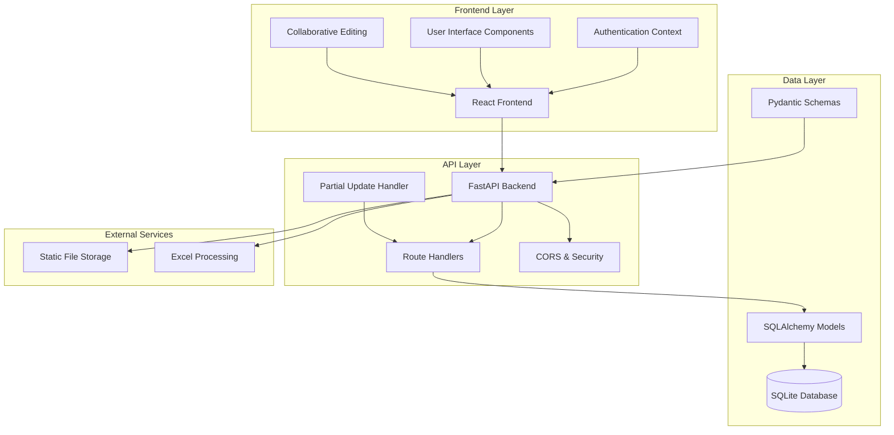
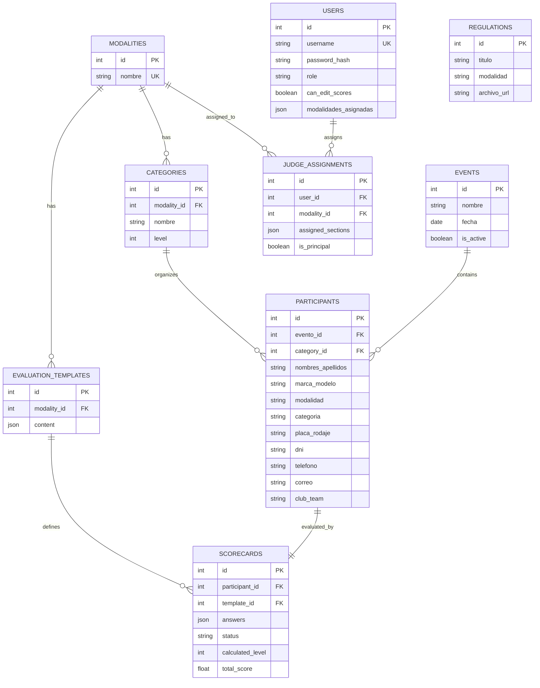
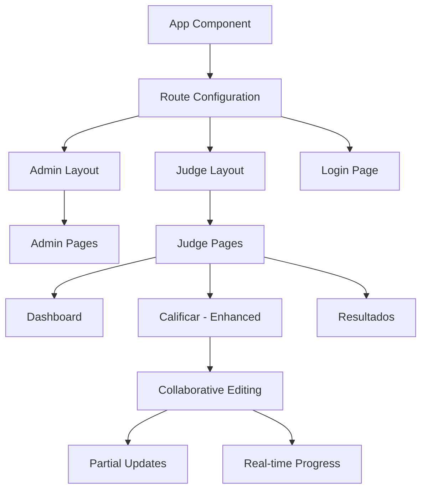
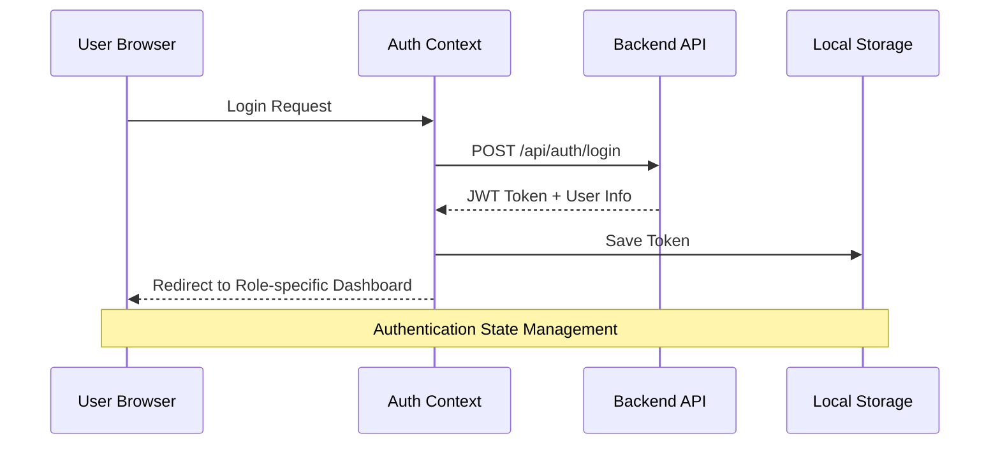
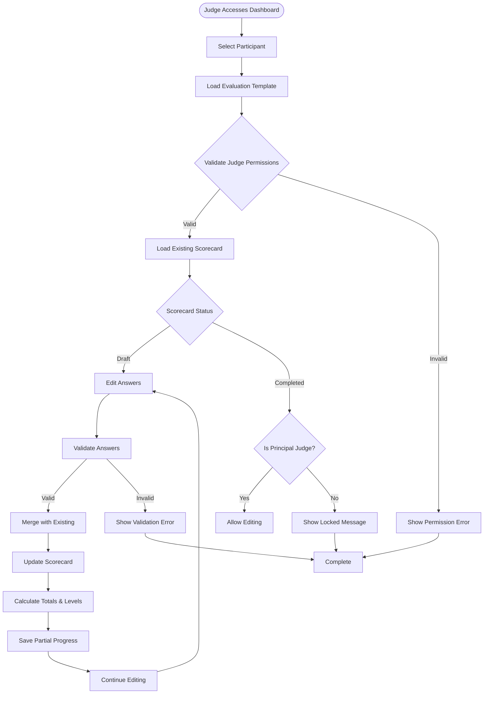
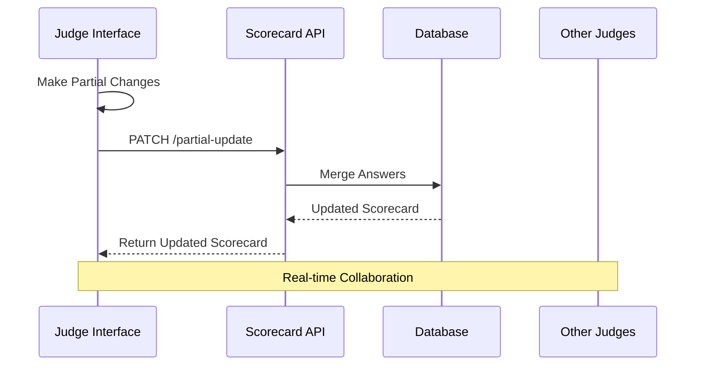
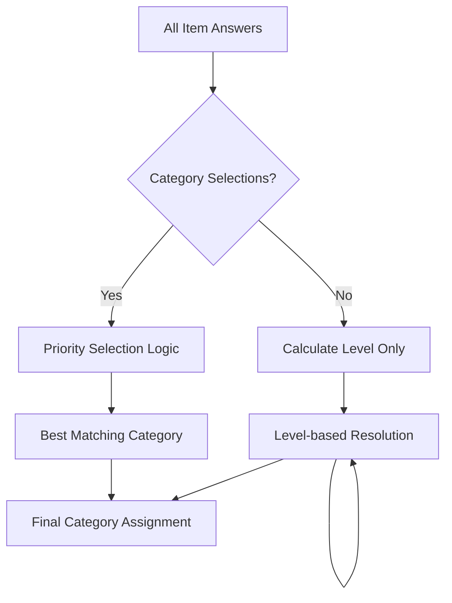

# Scorecard Management System

<cite>
**Referenced Files in This Document**
- [main.py](file://main.py)
- [models.py](file://models.py)
- [schemas.py](file://schemas.py)
- [database.py](file://database.py)
- [init_db.py](file://init_db.py)
- [scorecards.py](file://routes/scorecards.py)
- [participants.py](file://routes/participants.py)
- [users.py](file://routes/users.py)
- [events.py](file://routes/events.py)
- [evaluation_templates.py](file://routes/evaluation_templates.py)
- [App.tsx](file://frontend/src/App.tsx)
- [api.ts](file://frontend/src/lib/api.ts)
- [Login.tsx](file://frontend/src/pages/Login.tsx)
- [Dashboard.tsx](file://frontend/src/pages/juez/Dashboard.tsx)
- [Calificar.tsx](file://frontend/src/pages/juez/Calificar.tsx)
</cite>

## Update Summary
**Changes Made**
- Added new partial update capabilities for scorecards
- Enhanced scoring calculations with improved category assignment logic
- Updated frontend implementation with collaborative editing features
- Improved validation and permission checking systems

## Table of Contents
1. [Introduction](#introduction)
2. [System Architecture](#system-architecture)
3. [Core Components](#core-components)
4. [Database Schema](#database-schema)
5. [API Endpoints](#api-endpoints)
6. [Frontend Application](#frontend-application)
7. [Scorecard Management Workflow](#scorecard-management-workflow)
8. [Enhanced Partial Update System](#enhanced-partial-update-system)
9. [Improved Scoring Calculations](#improved-scoring-calculations)
10. [Security and Authentication](#security-and-authentication)
11. [Data Validation and Processing](#data-validation-and-processing)
12. [Results and Reporting](#results-and-reporting)
13. [Troubleshooting Guide](#troubleshooting-guide)
14. [Conclusion](#conclusion)

## Introduction

The Scorecard Management System is a comprehensive web application designed for car audio and tuning competitions. It provides a complete solution for managing participants, scoring systems, and competition results. The system supports multiple modalities (categories of competition) and allows judges to evaluate participants through structured scorecards.

**Updated** The system now features enhanced scorecard management with collaborative editing capabilities, allowing judges to work together on evaluations with real-time progress saving and improved scoring calculations.

The application consists of a FastAPI backend service with a PostgreSQL database and a React-based frontend interface. It features role-based access control, automated scoring calculations, real-time result tracking, and collaborative editing workflows.

## System Architecture

The system follows a modern three-tier architecture pattern with clear separation of concerns:

**Diagram sources**
- [main.py:26-47](file://main.py#L26-L47)
- [database.py:15-34](file://database.py#L15-L34)
- [App.tsx:96-131](file://frontend/src/App.tsx#L96-L131)
- [Calificar.tsx:472-507](file://frontend/src/pages/juez/Calificar.tsx#L472-L507)

The architecture ensures scalability, maintainability, and clear separation between presentation, business logic, and data persistence layers, with enhanced support for collaborative editing workflows.

## Core Components

### Backend Foundation

The backend is built on FastAPI, providing automatic API documentation and type safety:

**Application Initialization**
- Central application factory with CORS configuration
- Database initialization and migration handling
- Static file serving for uploaded documents
- Health check endpoint for monitoring

**Database Management**
- SQLAlchemy ORM with declarative base class
- Automatic table creation and SQLite migrations
- Session management for database connections
- Support for complex queries and relationships

**Section sources**
- [main.py:1-53](file://main.py#L1-L53)
- [database.py:1-193](file://database.py#L1-L193)

### Data Models

The system uses a comprehensive entity-relationship model supporting:

**Core Entities**
- Users (Administrators and Judges)
- Events (Competition dates and locations)
- Participants (Competitors with vehicle information)
- Categories (Competition divisions)
- Scorecards (Evaluation forms with enhanced partial update support)
- Evaluation Templates (Scoring rubrics)

**Relationships**
- One-to-many relationships between events and participants
- Many-to-one relationships between participants and categories
- One-to-one relationships for scorecards and participants
- Many-to-many through judge assignments for users and modalities

**Section sources**
- [models.py:11-225](file://models.py#L11-L225)

### API Design Patterns

The backend follows RESTful principles with specialized endpoints:

**Resource-Based Routing**
- `/api/scorecards` - Scorecard management with partial updates
- `/api/participants` - Participant registration and updates
- `/api/users` - User account management
- `/api/events` - Competition event management
- `/api/evaluation-templates` - Scoring template administration

**Validation and Error Handling**
- Pydantic models for request/response validation
- Comprehensive HTTP status codes for different scenarios
- Detailed error messages for debugging and user feedback

**Section sources**
- [scorecards.py:20-725](file://routes/scorecards.py#L20-L725)
- [participants.py:22-447](file://routes/participants.py#L22-L447)
- [users.py:27-257](file://routes/users.py#L27-L257)

## Database Schema

The database schema is designed to support complex competition scoring with the following key tables:

**Diagram sources**
- [models.py:11-225](file://models.py#L11-L225)

**Key Constraints and Indexes**
- Unique constraints for preventing duplicate registrations
- Foreign key relationships ensuring referential integrity
- Composite indexes for optimized query performance
- JSON fields for flexible data storage

**Section sources**
- [models.py:42-225](file://models.py#L42-L225)
- [database.py:36-193](file://database.py#L36-L193)

## API Endpoints

### Scorecard Management

The scorecard system provides comprehensive evaluation capabilities with enhanced partial update support:

**Core Operations**
- Partial scorecard updates with validation and real-time merging
- Complete scorecard finalization
- Real-time scoring calculations
- Category assignment based on performance

**Enhanced Partial Update Features**
- Incremental updates to existing scorecards
- Automatic merge of new answers with existing data
- Real-time progress saving during collaborative editing
- Status-aware updates (draft vs completed)

**Validation Features**
- Item permission checking based on judge assignments
- Score range validation per evaluation type
- Category consistency verification
- Template completeness checks

**Section sources**
- [scorecards.py:445-607](file://routes/scorecards.py#L445-L607)
- [Calificar.tsx:472-507](file://frontend/src/pages/juez/Calificar.tsx#L472-L507)

### Participant Management

Comprehensive participant handling with Excel import capabilities:

**Operations**
- Individual participant CRUD operations
- Bulk Excel upload with intelligent field mapping
- Duplicate detection and prevention
- Legacy field compatibility

**Field Normalization**
- Automatic text normalization for consistent matching
- Flexible column naming for Excel imports
- Required and optional field validation

**Section sources**
- [participants.py:182-447](file://routes/participants.py#L182-L447)

### User Administration

Role-based user management:

**Features**
- Multi-role support (admin, judge)
- Permission-based access control
- Credential management
- Modalities assignment for judges

**Security**
- Password hashing with salt
- Token-based authentication
- Role validation middleware

**Section sources**
- [users.py:45-257](file://routes/users.py#L45-L257)

## Frontend Application

The React-based frontend provides a responsive interface for all user roles with enhanced collaborative editing capabilities:

### Application Structure

**Diagram sources**
- [App.tsx:96-131](file://frontend/src/App.tsx#L96-L131)
- [Calificar.tsx:472-507](file://frontend/src/pages/juez/Calificar.tsx#L472-L507)

### Authentication Flow

**Diagram sources**
- [Login.tsx:38-61](file://frontend/src/pages/Login.tsx#L38-L61)
- [api.ts:11-22](file://frontend/src/lib/api.ts#L11-L22)

### Judge Dashboard

The judge interface provides real-time competition monitoring with enhanced collaboration features:

**Features**
- Event and modality filtering
- Participant list with completion status
- Progress tracking and statistics
- Direct navigation to evaluation forms
- Collaborative editing indicators

**Real-time Updates**
- Concurrent API requests for efficiency
- Loading states and error handling
- Responsive design for various devices
- Partial update notifications

**Section sources**
- [Dashboard.tsx:28-84](file://frontend/src/pages/juez/Dashboard.tsx#L28-L84)

## Scorecard Management Workflow

The scorecard system implements a sophisticated evaluation process with enhanced collaborative editing:

**Diagram sources**
- [scorecards.py:445-607](file://routes/scorecards.py#L445-L607)
- [scorecards.py:318-420](file://routes/scorecards.py#L318-L420)
- [Calificar.tsx:472-507](file://frontend/src/pages/juez/Calificar.tsx#L472-L507)

### Template-Based Evaluation

The system uses configurable evaluation templates:

**Template Structure**
- Sections with weighted items
- Category-based scoring
- Bonification system for special achievements
- Flexible point ranges per evaluation type

**Enhanced Scoring Calculation**
- Automatic section totals
- Category level determination with priority selection
- Final score aggregation
- Level progression tracking
- Real-time progress updates

**Section sources**
- [scorecards.py:79-137](file://routes/scorecards.py#L79-L137)
- [scorecards.py:318-352](file://routes/scorecards.py#L318-L352)

## Enhanced Partial Update System

The system now supports collaborative editing with partial update capabilities:

### Partial Update Workflow

**Diagram sources**
- [Calificar.tsx:472-507](file://frontend/src/pages/juez/Calificar.tsx#L472-L507)
- [scorecards.py:445-503](file://routes/scorecards.py#L445-L503)

### Key Features

**Incremental Updates**
- Only sends changed answers to the server
- Automatically merges with existing scorecard data
- Preserves previously entered information
- Supports real-time collaborative editing

**Smart Merging Logic**
- Maintains existing answers for unchanged items
- Updates only specified item scores
- Preserves category selections and other metadata
- Handles concurrent edits gracefully

**Status Management**
- Draft mode for ongoing evaluations
- Completed mode for finalized scores
- Automatic status transitions based on actions
- Principal judge override for re-editing

**Section sources**
- [scorecards.py:445-503](file://routes/scorecards.py#L445-L503)
- [Calificar.tsx:472-507](file://frontend/src/pages/juez/Calificar.tsx#L472-L507)

## Improved Scoring Calculations

The scoring system has been enhanced with more sophisticated category assignment logic:

### Advanced Category Assignment

**Diagram sources**
- [scorecards.py:370-420](file://routes/scorecards.py#L370-L420)

### Enhanced Calculation Features

**Priority-Based Category Selection**
- Respects explicit category selections when provided
- Selects the highest level category among chosen options
- Falls back to level-based calculation when no selection
- Ensures logical consistency in category progression

**Improved Level Calculation**
- Considers only non-bonification items for level determination
- Uses maximum level across all applicable items
- Handles edge cases in level progression
- Provides deterministic results

**Robust Category Resolution**
- Validates category existence before assignment
- Handles missing categories gracefully
- Provides meaningful error messages
- Maintains referential integrity

**Section sources**
- [scorecards.py:341-420](file://routes/scorecards.py#L341-L420)

## Security and Authentication

The system implements robust security measures:

### Authentication Mechanisms

**Token-Based Authentication**
- JWT tokens for stateless authentication
- Role-based access control
- Automatic token refresh handling
- Secure cookie storage

**Password Security**
- bcrypt hashing with salt
- Password strength validation
- Secure credential updates

### Authorization Controls

**Role-Based Access**
- Admin privileges for full system management
- Judge permissions based on assignments
- Section-specific evaluation rights
- Category-level editing permissions

**Enhanced Data Validation**
- Input sanitization and validation
- SQL injection prevention
- Cross-site scripting protection
- CSRF protection through CORS policy
- Partial update permission validation

**Section sources**
- [users.py:45-82](file://routes/users.py#L45-L82)
- [main.py:28-34](file://main.py#L28-L34)

## Data Validation and Processing

### Input Validation Strategies

**Frontend Validation**
- Real-time form validation
- User-friendly error messaging
- Input sanitization
- Type checking and format validation

**Backend Validation**
- Pydantic model validation
- Database constraint enforcement
- Business logic validation
- Transaction rollback on errors

### Enhanced Data Processing Pipeline

**Diagram sources**
- [participants.py:65-158](file://routes/participants.py#L65-L158)
- [scorecards.py:207-316](file://routes/scorecards.py#L207-L316)
- [scorecards.py:464-503](file://routes/scorecards.py#L464-L503)

**Section sources**
- [schemas.py:10-265](file://schemas.py#L10-L265)
- [participants.py:133-158](file://routes/participants.py#L133-L158)

## Results and Reporting

### Real-Time Results System

The system provides comprehensive results tracking:

**Dynamic Grouping**
- Category-based participant grouping
- Level-based sorting within categories
- Score-based ranking within groups
- Section-wise performance breakdown

**Enhanced Export Capabilities**
- CSV export for external analysis
- PDF generation for official documentation
- Real-time updates without page refresh
- Collaborative editing indicators

### Administrative Reporting

**Competition Analytics**
- Judge productivity metrics
- Participation statistics
- Category performance trends
- Time-based progress tracking
- Collaborative editing statistics

**Results Presentation**
- Hierarchical category display
- Color-coded completion status
- Interactive filtering and sorting
- Downloadable result sets
- Real-time progress indicators

**Section sources**
- [scorecards.py:610-724](file://routes/scorecards.py#L610-L724)

## Troubleshooting Guide

### Common Issues and Solutions

**Database Migration Problems**
- Ensure proper database initialization
- Check SQLite file permissions
- Verify table constraints are met
- Review migration logs for errors

**Authentication Failures**
- Verify JWT token validity
- Check user role assignments
- Confirm password hashes are correct
- Validate CORS configuration

**Enhanced Scorecard Issues**
- Check template completeness
- Verify judge permissions
- Validate score ranges
- Confirm category consistency
- Review partial update conflicts

**Collaborative Editing Problems**
- Monitor concurrent edit conflicts
- Check network connectivity
- Verify permission assignments
- Review partial update merge logic

**Performance Optimization**
- Monitor database query performance
- Optimize index usage
- Implement pagination for large datasets
- Cache frequently accessed data

### Debugging Tools

**Backend Debugging**
- Health check endpoint for system status
- Detailed error messages with stack traces
- Database query logging
- Request/response inspection

**Frontend Debugging**
- React Developer Tools integration
- Network request monitoring
- State management debugging
- Console error reporting

**Section sources**
- [main.py:50-53](file://main.py#L50-L53)
- [database.py:36-193](file://database.py#L36-L193)

## Conclusion

The Scorecard Management System provides a comprehensive solution for competitive car audio and tuning events. Its modular architecture, robust validation systems, and intuitive user interfaces make it suitable for both small local competitions and larger regional events.

**Key Strengths**
- Flexible evaluation system with customizable templates
- Role-based access control with granular permissions
- Real-time scoring and results tracking
- Comprehensive administrative tools
- Scalable architecture supporting future enhancements
- **Enhanced collaborative editing with partial update capabilities**
- **Improved scoring calculations with priority-based category assignment**

**Recent Enhancements**
- **Partial update system enabling real-time collaborative editing**
- **Enhanced scoring algorithms with priority-based category selection**
- **Improved user experience with progress saving and status management**
- **Advanced validation and permission checking systems**

**Future Enhancement Opportunities**
- Mobile app development for on-site judging
- Integration with external scoring systems
- Advanced analytics and reporting capabilities
- Multi-language support for international events
- Automated result publication to websites

The system's solid foundation in modern web technologies ensures maintainability and extensibility for future competition needs, with enhanced collaborative editing capabilities positioning it as a leading solution for competitive scoring systems.