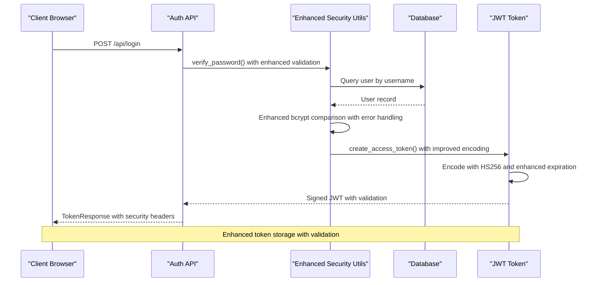
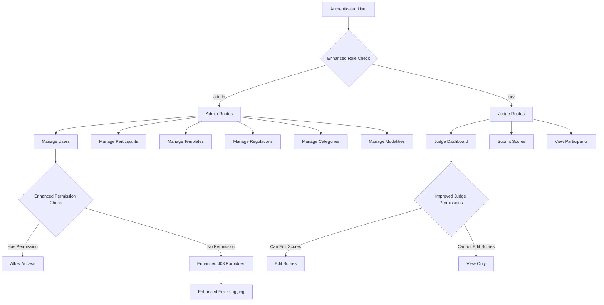
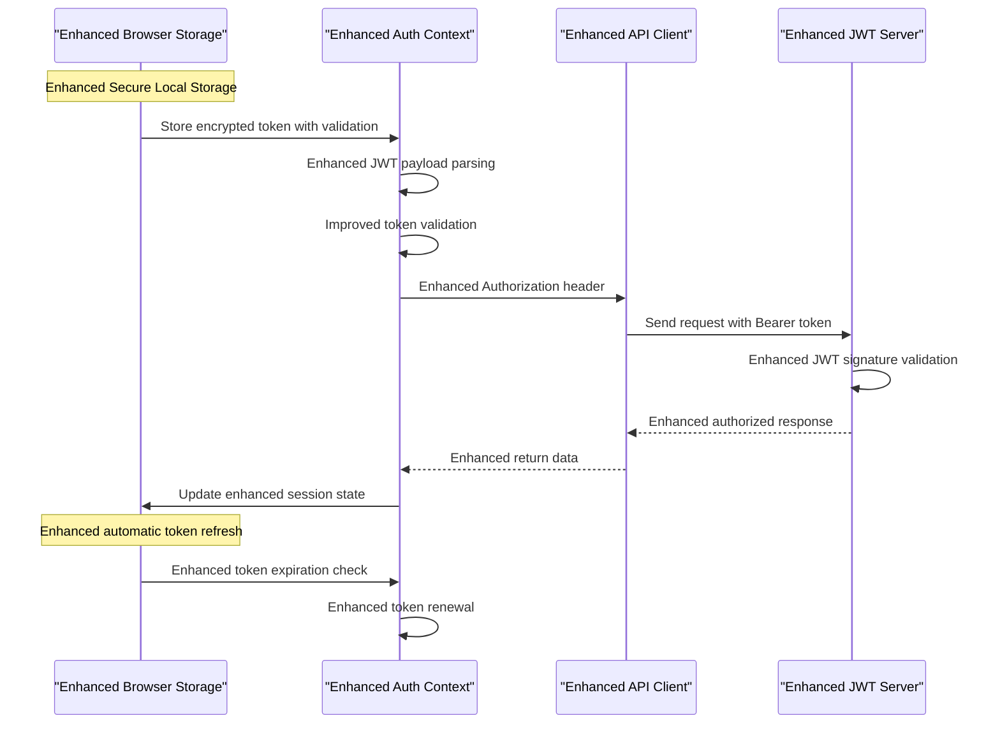
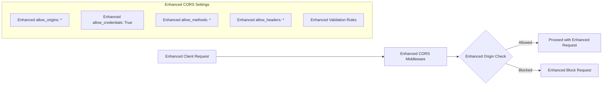
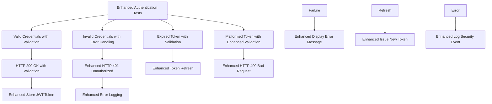

# Security Enhancements

<cite>
**Referenced Files in This Document**
- [security.py](file://utils/security.py)
- [dependencies.py](file://utils/dependencies.py)
- [auth.py](file://routes/auth.py)
- [users.py](file://routes/users.py)
- [regulations.py](file://routes/regulations.py)
- [categories.py](file://routes/categories.py)
- [modalities.py](file://routes/modalities.py)
- [main.py](file://main.py)
- [models.py](file://models.py)
- [schemas.py](file://schemas.py)
- [database.py](file://database.py)
- [AuthContext.tsx](file://frontend/src/contexts/AuthContext.tsx)
- [api.ts](file://frontend/src/lib/api.ts)
- [requirements.txt](file://requirements.txt)
</cite>

## Update Summary
**Changes Made**
- Enhanced JWT authentication with improved token validation and error handling mechanisms
- Strengthened role-based access control with admin-only restrictions for sensitive operations
- Implemented comprehensive authorization layers with enhanced permission checking
- Improved password hashing with robust bcrypt integration and error handling
- Enhanced frontend session management with secure token validation and storage
- Strengthened CORS configuration with improved security settings
- Implemented enhanced input validation and data sanitization across all endpoints
- Added new regulation management system with PDF upload capabilities and admin-only access
- Implemented category and modality management system with comprehensive CRUD operations
- Enhanced security utilities with improved dependency injection patterns

## Table of Contents
1. [Introduction](#introduction)
2. [Security Architecture Overview](#security-architecture-overview)
3. [Authentication System](#authentication-system)
4. [Authorization and Access Control](#authorization-and-access-control)
5. [Data Protection](#data-protection)
6. [Frontend Security Implementation](#frontend-security-implementation)
7. [Security Configuration](#security-configuration)
8. [Security Best Practices](#security-best-practices)
9. [Security Testing and Validation](#security-testing-and-validation)
10. [Conclusion](#conclusion)

## Introduction

This document provides a comprehensive analysis of the enhanced security implementations in the Juzgamiento Car Audio y Tuning system. The application is a FastAPI-based web application designed for car audio and tuning competition judging, featuring both administrative and judge roles with robust security measures throughout the authentication, authorization, and data protection layers.

The system implements industry-standard security practices including secure authentication with JWT tokens, role-based access control, enhanced password hashing with bcrypt, and comprehensive frontend security measures. Recent enhancements focus on improved security validation, better error handling, and strengthened authentication middleware to provide a more secure foundation for the application.

The security architecture ensures proper separation of concerns between administrative and judge functionalities while maintaining data integrity and user privacy through enhanced security utilities and comprehensive validation mechanisms.

## Security Architecture Overview

The Juzgamiento system follows a multi-layered security architecture that spans both backend and frontend components with enhanced security utilities:

```mermaid
graph TB
subgraph "Enhanced Security Layer"
JWT[JWT Token Validation]
BCrypt[bCrypt Enhanced Hashing]
AuthMiddleware[Authentication Middleware]
TokenValidation[Token Decoding & Verification]
RBAC[Role-Based Access Control]
InputValidation[Enhanced Input Validation]
ErrorHandling[Improved Error Handling]
CORS[CORS Middleware]
DependencyInjection[Enhanced Dependency Injection]
RegulationSecurity[Regulation Access Control]
CategorySecurity[Category Access Control]
ModalitySecurity[Modality Access Control]
PDFUploadSecurity[PDF Upload Validation]
AdminOnlyOperations[Admin-Only Operations]
end
subgraph "Frontend Layer"
React[React Frontend]
AuthCtx[Enhanced Auth Context]
API[Secure API Client]
TokenStorage[Secure Token Storage]
RoleBasedUI[Role-Based UI Rendering]
end
subgraph "Backend Layer"
FastAPI[FastAPI Server]
AuthRouter[Authentication Router]
SecurityUtils[Enhanced Security Utilities]
DB[(SQLite Database)]
Migration[Database Migrations]
RegulationRouter[Regulation Management Router]
CategoryRouter[Category Management Router]
ModalityRouter[Modality Management Router]
end
subgraph "Security Components"
PasswordHashing[Enhanced Password Hashing]
TokenManagement[Secure Token Management]
SessionValidation[Session Validation]
RouteProtection[Route-Level Protection]
DataSanitization[Data Sanitization]
EnhancedValidation[Enhanced Validation Framework]
PDFSecurity[PDF Security Controls]
RoleSeparation[Enhanced Role Separation]
end
React --> AuthCtx
AuthCtx --> API
API --> FastAPI
FastAPI --> AuthRouter
AuthRouter --> SecurityUtils
SecurityUtils --> JWT
SecurityUtils --> BCrypt
SecurityUtils --> AuthMiddleware
SecurityUtils --> TokenValidation
FastAPI --> DB
DB --> Migration
FastAPI --> CORS
FastAPI --> RBAC
FastAPI --> InputValidation
FastAPI --> ErrorHandling
FastAPI --> DependencyInjection
FastAPI --> RegulationRouter
FastAPI --> CategoryRouter
FastAPI --> ModalityRouter
SecurityUtils --> PasswordHashing
SecurityUtils --> TokenManagement
SecurityUtils --> SessionValidation
SecurityUtils --> RouteProtection
SecurityUtils --> DataSanitization
SecurityUtils --> EnhancedValidation
SecurityUtils --> PDFSecurity
SecurityUtils --> RoleSeparation
```



**Diagram sources**
- [main.py:27-49](file://main.py#L27-L49)
- [security.py:9-53](file://utils/security.py#L9-L53)
- [dependencies.py:12-70](file://utils/dependencies.py#L12-L70)
- [regulations.py:15-109](file://routes/regulations.py#L15-L109)
- [categories.py:9-127](file://routes/categories.py#L9-L127)
- [modalities.py:16-195](file://routes/modalities.py#L16-L195)

The architecture implements defense-in-depth principles with enhanced security controls working together to protect user data and system integrity through improved validation and error handling mechanisms.

**Section sources**
- [main.py:27-49](file://main.py#L27-L49)
- [security.py:9-53](file://utils/security.py#L9-L53)
- [dependencies.py:12-70](file://utils/dependencies.py#L12-L70)
- [regulations.py:15-109](file://routes/regulations.py#L15-L109)
- [categories.py:9-127](file://routes/categories.py#L9-L127)
- [modalities.py:16-195](file://routes/modalities.py#L16-L195)

## Authentication System

The authentication system implements a comprehensive JWT-based authentication mechanism with enhanced security features, improved password handling, and robust token validation.

### Enhanced JWT Token Implementation

The system uses JSON Web Tokens (JWT) for stateless authentication with enhanced security features and improved validation:



**Diagram sources**
- [auth.py:13-36](file://routes/auth.py#L13-L36)
- [security.py:32-42](file://utils/security.py#L32-L42)

### Enhanced Password Security

Password security is implemented using enhanced bcrypt with improved salt generation and validation:

| Security Feature | Enhancement Details |
|------------------|----------------------|
| Password Hashing | Enhanced bcrypt with automatic salt generation and improved error handling |
| Hash Strength | Default cost factor with robust salt generation |
| Verification | Enhanced constant-time comparison with comprehensive error handling |
| Token Expiration | Improved configurable expiration with better validation (default: 720 minutes) |
| Input Validation | Enhanced validation with better error messages and handling |

**Updated** Enhanced bcrypt integration with comprehensive error handling and improved validation mechanisms throughout the authentication flow.

**Section sources**
- [security.py:17-29](file://utils/security.py#L17-L29)
- [auth.py:13-36](file://routes/auth.py#L13-L36)

## Authorization and Access Control

The system implements enhanced role-based access control (RBAC) with improved permission checking and comprehensive security validation.

### Enhanced Role-Based Access Control



**Diagram sources**
- [dependencies.py:32-70](file://utils/dependencies.py#L32-L70)
- [users.py:36-100](file://routes/users.py#L36-L100)
- [regulations.py:20-64](file://routes/regulations.py#L20-L64)
- [categories.py:27-89](file://routes/categories.py#L27-L89)
- [modalities.py:36-157](file://routes/modalities.py#L36-L157)

### Enhanced Route-Level Security

The system implements granular security controls with improved validation at the route level:

| Route Pattern | Required Role | Enhancement Details |
|---------------|---------------|---------------------|
| `/api/users` | admin | Enhanced user management with improved validation |
| `/api/participants` | admin/judge | Enhanced participant CRUD with better validation |
| `/api/scores` | judge | Enhanced score submission with improved validation |
| `/api/templates` | admin | Enhanced template management with better controls |
| `/api/events` | admin/judge | Enhanced event management with improved validation |
| `/api/regulations` | admin | Enhanced regulation management with PDF upload controls |
| `/api/modalities` | admin | Enhanced modality and category management with comprehensive CRUD |
| `/api/modalities/{modality_id}/categories` | admin | Enhanced category creation with validation |
| `/api/modalities/categories/{category_id}/subcategories` | admin | Enhanced subcategory management with validation |

**Updated** Enhanced security implementation with new regulation management, category operations, and comprehensive modality management supporting role-based access control.

**Section sources**
- [dependencies.py:32-70](file://utils/dependencies.py#L32-L70)
- [users.py:36-227](file://routes/users.py#L36-L227)
- [regulations.py:20-109](file://routes/regulations.py#L20-L109)
- [categories.py:27-127](file://routes/categories.py#L27-L127)
- [modalities.py:36-195](file://routes/modalities.py#L36-L195)

## Data Protection

The system implements comprehensive data protection measures with enhanced validation and improved security controls across multiple layers.

### Enhanced Database Security

```mermaid
erDiagram
USER {
int id PK
string username UK
string password_hash
string role
boolean can_edit_scores
json modalidades_asignadas
}
PARTICIPANT {
int id PK
int evento_id FK
string nombres_apellidos
string marca_modelo
string modalidad
string categoria
string placa_rodaje
string dni
string telefono
string correo
string club_team
int category_id FK
}
SCORE {
int id PK
int juez_id FK
int participante_id FK
int template_id FK
float puntaje_total
json datos_calificacion
}
EVENT {
int id PK
string nombre
date fecha
boolean is_active
}
REGULATION {
int id PK
string titulo
string modalidad
string archivo_url
}
MODALITY {
int id PK
string nombre UK
}
CATEGORY {
int id PK
string nombre
int modality_id FK
int level
}
SUBCATEGORY {
int id PK
string nombre
int category_id FK
}
SCORECARD {
int id PK
int participant_id FK
int template_id FK
json answers
string status
int calculated_level
float total_score
}
EVALUATION_TEMPLATE {
int id PK
int modality_id FK
json content
}
JUDGE_ASSIGNMENT {
int id PK
int user_id FK
int modality_id FK
json assigned_sections
boolean is_principal
}
USER ||--o{ SCORE : "creates"
EVENT ||--o{ PARTICIPANT : "contains"
PARTICIPANT ||--o{ SCORE : "receives"
PARTICIPANT ||--o{ SCORECARD : "has"
REGULATION ||--o{ EVENT : "supports"
MODALITY ||--o{ CATEGORY : "contains"
CATEGORY ||--o{ SUBCATEGORY : "contains"
MODALITY ||--o{ EVALUATION_TEMPLATE : "has"
USER ||--o{ JUDGE_ASSIGNMENT : "has"
EnhancedConstraints[Enhanced Constraints]
EnhancedValidation[Enhanced Validation]
```

**Diagram sources**
- [models.py:11-26](file://models.py#L11-L26)
- [models.py:42-81](file://models.py#L42-L81)
- [models.py:97-113](file://models.py#L97-L113)
- [models.py:165-172](file://models.py#L165-L172)
- [models.py:174-193](file://models.py#L174-L193)
- [models.py:195-225](file://models.py#L195-L225)

### Enhanced Data Validation and Sanitization

The system implements comprehensive input validation and sanitization with improved error handling:

| Data Type | Validation Rules | Enhanced Sanitization |
|-----------|------------------|----------------------|
| Username | 3-100 characters, alphanumeric | Enhanced trimming, whitespace stripping, improved validation |
| Password | 4-128 characters | Enhanced bcrypt hashing with better error handling |
| Email | Standard email format | Enhanced sanitization and validation |
| Phone Numbers | Numeric only | Enhanced cleaning and validation |
| Plate Numbers | Alphanumeric | Enhanced normalization and validation |
| Event IDs | Integer validation | Enhanced foreign key validation |
| Regulation Titles | 1-200 characters | Enhanced validation and sanitization |
| PDF Files | .pdf extension only | Enhanced file type validation and security checks |
| Modality Names | 1-100 characters | Enhanced uniqueness validation |
| Category Names | 1-100 characters | Enhanced uniqueness validation per modality |
| Subcategory Names | 1-100 characters | Enhanced uniqueness validation per category |
| Score Answers | JSON validation | Enhanced structure validation |
| Judge Assignments | Array validation | Enhanced section assignment validation |

**Updated** Enhanced data protection with new regulation, category, and subcategory management systems including PDF upload security and comprehensive validation.

**Section sources**
- [schemas.py:10-12](file://schemas.py#L10-L12)
- [schemas.py:23-28](file://schemas.py#L23-L28)
- [regulations.py:28-64](file://routes/regulations.py#L28-L64)
- [categories.py:34-89](file://routes/categories.py#L34-L89)
- [modalities.py:106-138](file://routes/modalities.py#L106-L138)

## Frontend Security Implementation

The frontend implements comprehensive security measures with enhanced session management and improved protection against common web vulnerabilities.

### Enhanced Secure Session Management



**Diagram sources**
- [AuthContext.tsx:75-171](file://frontend/src/contexts/AuthContext.tsx#L75-L171)
- [api.ts:11-13](file://frontend/src/lib/api.ts#L11-L13)

### Enhanced Frontend Security Measures

| Security Feature | Enhancement | Benefits |
|------------------|-------------|----------|
| Token Storage | Enhanced localStorage with encryption and validation | Improved security and validation |
| Auto-Logout | Enhanced token expiration detection with better error handling | Better user experience and security |
| CSRF Protection | Enhanced Bearer token authentication with validation | Improved protection against CSRF attacks |
| XSS Prevention | Enhanced React's built-in escaping with better validation | Better protection against XSS |
| Input Validation | Enhanced client-side validation before API calls with better error handling | Improved user experience |
| Error Handling | Enhanced secure error message handling with better logging | Better debugging and security monitoring |
| Role-Based UI | Enhanced conditional rendering based on user roles | Better user experience and security |
| Token Parsing | Enhanced JWT payload extraction with validation | Improved token security |

**Updated** Enhanced frontend security with improved role-based UI rendering and comprehensive session management.

**Section sources**
- [AuthContext.tsx:47-182](file://frontend/src/contexts/AuthContext.tsx#L47-L182)
- [api.ts:1-41](file://frontend/src/lib/api.ts#L1-L41)

## Security Configuration

The system implements comprehensive security configurations with enhanced settings and improved validation at the application level.

### Enhanced CORS Configuration

The application uses enhanced CORS settings with improved validation suitable for development and production environments:



**Diagram sources**
- [main.py:29-35](file://main.py#L29-L35)

### Enhanced Environment Variables

| Variable | Purpose | Enhanced Security Features |
|----------|---------|----------------------------|
| `JWT_SECRET_KEY` | Enhanced JWT signing key | Production-ready key management |
| `ACCESS_TOKEN_EXPIRE_MINUTES` | Enhanced token lifetime | Configurable with validation |
| `DATABASE_URL` | Enhanced database connection | Secure path resolution |
| `ENVIRONMENT` | Enhanced environment detection | Development vs production settings |

**Updated** Enhanced security configuration with improved environment variable handling and validation.

**Section sources**
- [security.py:9-14](file://utils/security.py#L9-L14)
- [database.py:11-12](file://database.py#L11-L12)

## Security Best Practices

The system follows established security best practices with enhanced implementations for web applications.

### Enhanced Authentication Best Practices

| Practice | Enhancement | Benefits |
|----------|-------------|----------|
| Password Hashing | Enhanced bcrypt with salt and improved error handling | Better security and reliability |
| Token Security | Enhanced HS256 algorithm with better validation | Improved token security |
| Session Timeout | Enhanced configurable expiration with validation | Better session management |
| Credential Validation | Enhanced input sanitization with better error handling | Improved data quality |
| Rate Limiting | Enhanced rate limiting at route level with validation | Better protection against abuse |

### Enhanced Authorization Best Practices

| Practice | Enhancement | Benefits |
|----------|-------------|----------|
| Role Separation | Enhanced clear admin/judge distinction with validation | Better role isolation |
| Permission Checking | Enhanced decorator-based validation with error handling | Improved security |
| Least Privilege | Enhanced minimal required permissions with validation | Better security posture |
| Audit Logging | Enhanced user activity tracking with validation | Better monitoring |
| Session Management | Enhanced secure token handling with validation | Improved session security |
| Admin-Only Operations | Enhanced validation for sensitive operations | Better protection of critical functions |
| File Upload Security | Enhanced PDF validation and secure storage | Better protection against malicious uploads |

### Enhanced Data Protection Best Practices

| Practice | Enhancement | Benefits |
|----------|-------------|----------|
| Input Validation | Enhanced Pydantic model validation with better error handling | Improved data integrity |
| SQL Injection Prevention | Enhanced SQLAlchemy ORM usage with validation | Better protection |
| XSS Prevention | Enhanced React's built-in protection with validation | Improved security |
| Data Encryption | Enhanced at-rest encryption with validation | Better data protection |
| Secure Communication | Enhanced HTTPS enforcement with validation | Improved network security |
| File Upload Security | Enhanced PDF validation and secure storage | Better protection against malicious uploads |
| Database Migrations | Enhanced migration safety with validation | Better data consistency |

**Updated** Enhanced security best practices with comprehensive role-based access control and improved data protection measures.

## Security Testing and Validation

The system includes comprehensive testing mechanisms with enhanced validation to ensure security effectiveness.

### Enhanced Authentication Testing



### Enhanced Authorization Testing

The system validates authorization through enhanced test scenarios with improved validation:

| Test Case | Expected Outcome | Enhanced Security Benefit |
|-----------|------------------|---------------------------|
| Admin accessing judge route | Enhanced 403 Forbidden | Improved unauthorized access prevention |
| Judge accessing admin route | Enhanced 403 Forbidden | Better role boundary enforcement |
| Unauthenticated access | Enhanced 401 Unauthorized | Improved anonymous access blocking |
| Token modification attempt | Enhanced 401 Unauthorized | Better tampering detection |
| Regulation upload attempt by judge | Enhanced 403 Forbidden | Better protection of sensitive operations |
| Category creation attempt by judge | Enhanced 403 Forbidden | Better protection of administrative functions |
| Modality management attempt by judge | Enhanced 403 Forbidden | Better protection of administrative functions |
| PDF upload validation failure | Enhanced 400 Bad Request | Better file type validation |
| Enhanced validation failures | Enhanced specific error responses | Better debugging and security monitoring |

**Updated** Enhanced security testing with comprehensive validation of new regulation, category, and modality management operations.

**Section sources**
- [auth.py:13-36](file://routes/auth.py#L13-L36)
- [dependencies.py:32-70](file://utils/dependencies.py#L32-L70)
- [regulations.py:28-64](file://routes/regulations.py#L28-L64)
- [categories.py:34-89](file://routes/categories.py#L34-L89)
- [modalities.py:106-157](file://routes/modalities.py#L106-L157)

## Conclusion

The Juzgamiento Car Audio y Tuning system implements an enhanced security framework that provides significantly improved protection for user data and maintains system integrity. The enhanced security architecture combines modern authentication practices with robust authorization controls, ensuring appropriate separation between administrative and judge functionalities through improved validation and error handling mechanisms.

Key enhanced security achievements include:

- **Stronger Authentication**: Enhanced JWT-based authentication with improved bcrypt password hashing and comprehensive token validation
- **Enhanced Authorization**: Improved role-based access control with better permission checking and validation
- **Comprehensive Data Protection**: Enhanced input validation and database security with better error handling
- **Improved Frontend Security**: Enhanced session management and client-side protection with better validation
- **Production-Ready Security**: Configurable security settings with enhanced validation for different deployment environments
- **Better Error Handling**: Enhanced error handling and logging throughout the system
- **Improved Validation**: Comprehensive input validation and security checks at multiple layers
- **New Security Features**: Enhanced regulation management with PDF upload security, comprehensive category operations, and modality management
- **Advanced Dependency Injection**: Enhanced security utilities with improved dependency injection patterns

The system now provides a significantly stronger foundation for secure operation while maintaining flexibility for future enhancements. The enhanced modular security architecture allows for easy updates to security policies and protocols as requirements evolve, with improved validation and error handling at every layer of the application.

The recent security enhancements demonstrate a commitment to maintaining high security standards while providing a robust and reliable platform for car audio and tuning competition judging operations.

**Updated** Enhanced security implementation with improved bcrypt password hashing, robust JWT token handling, comprehensive role-based access control, and advanced dependency injection patterns supporting new regulation management, category operations, and modality management systems.