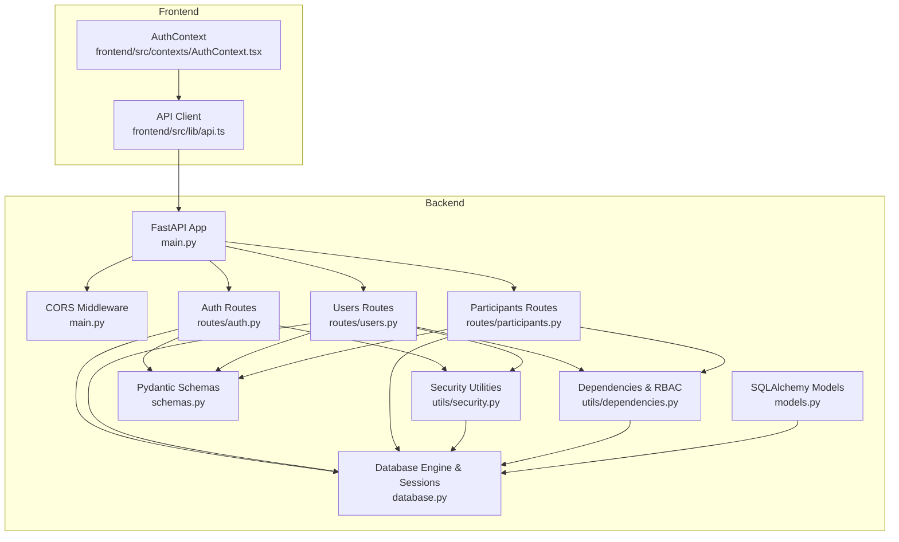
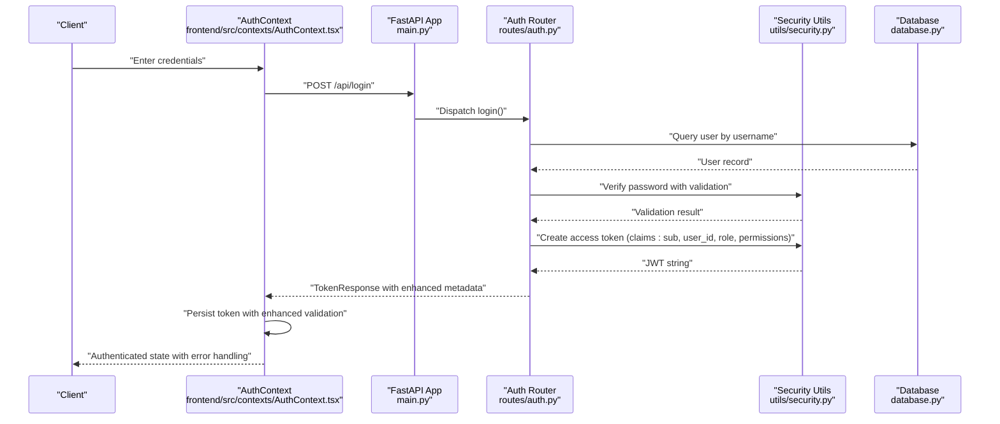
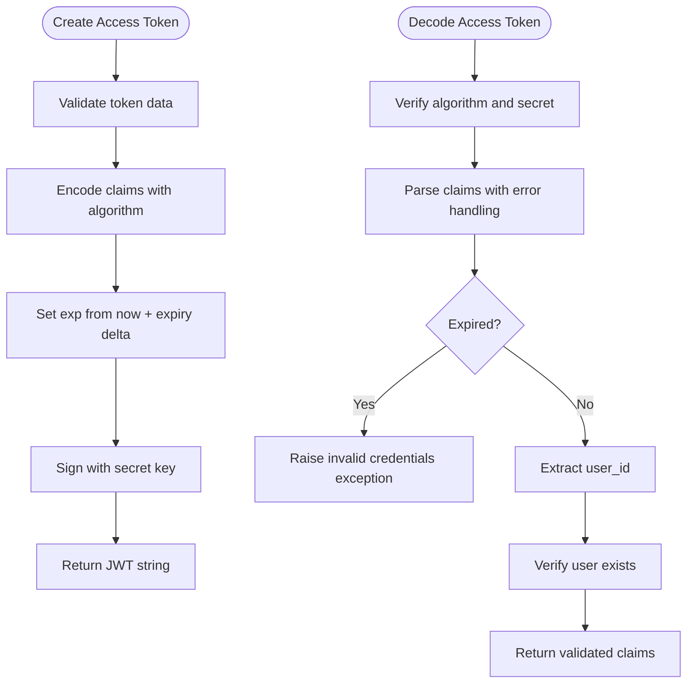
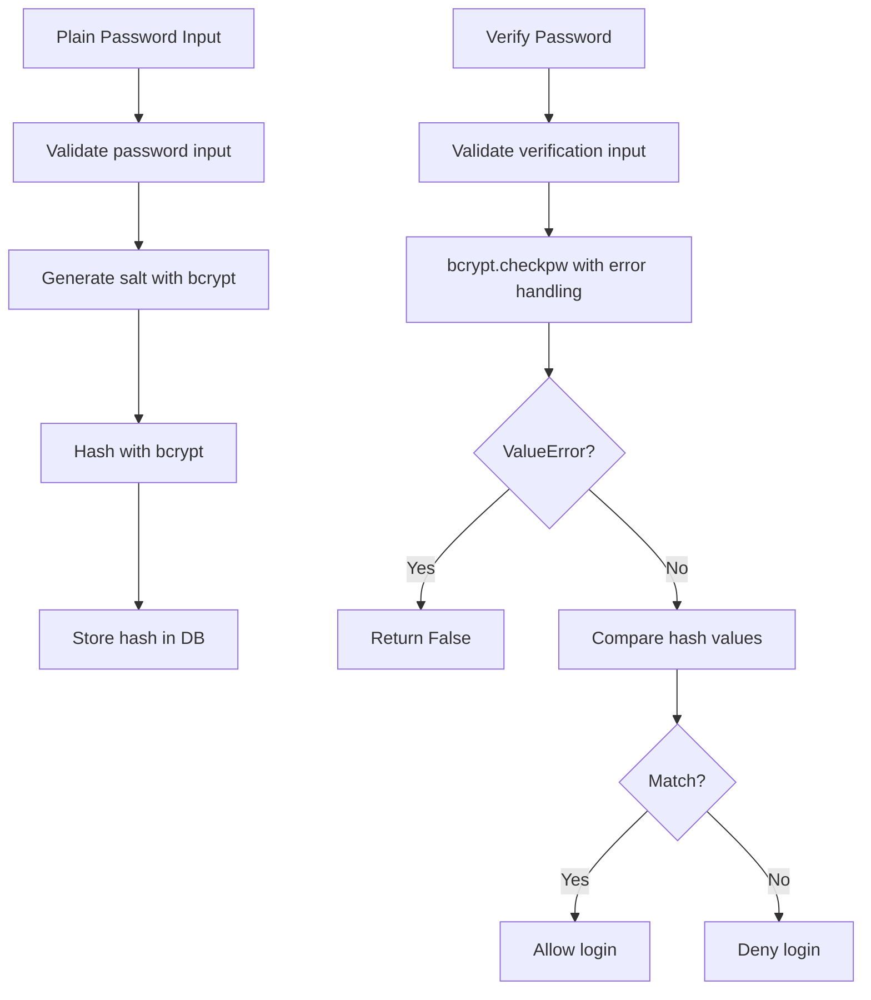
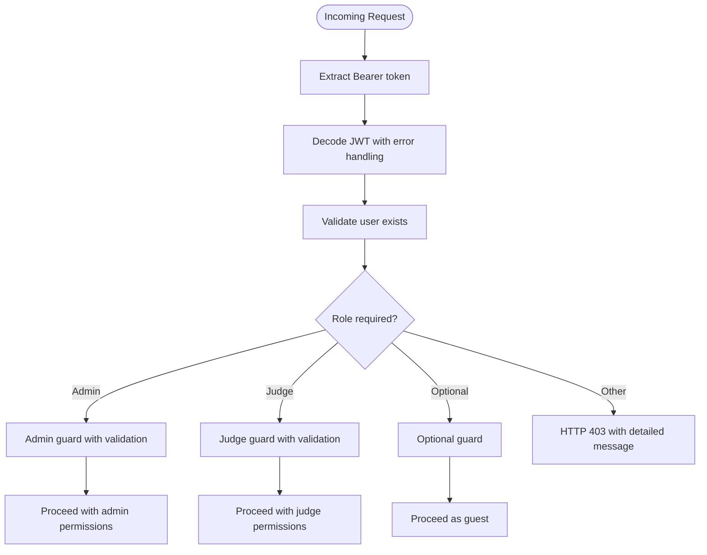
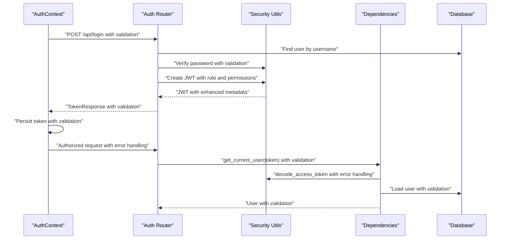
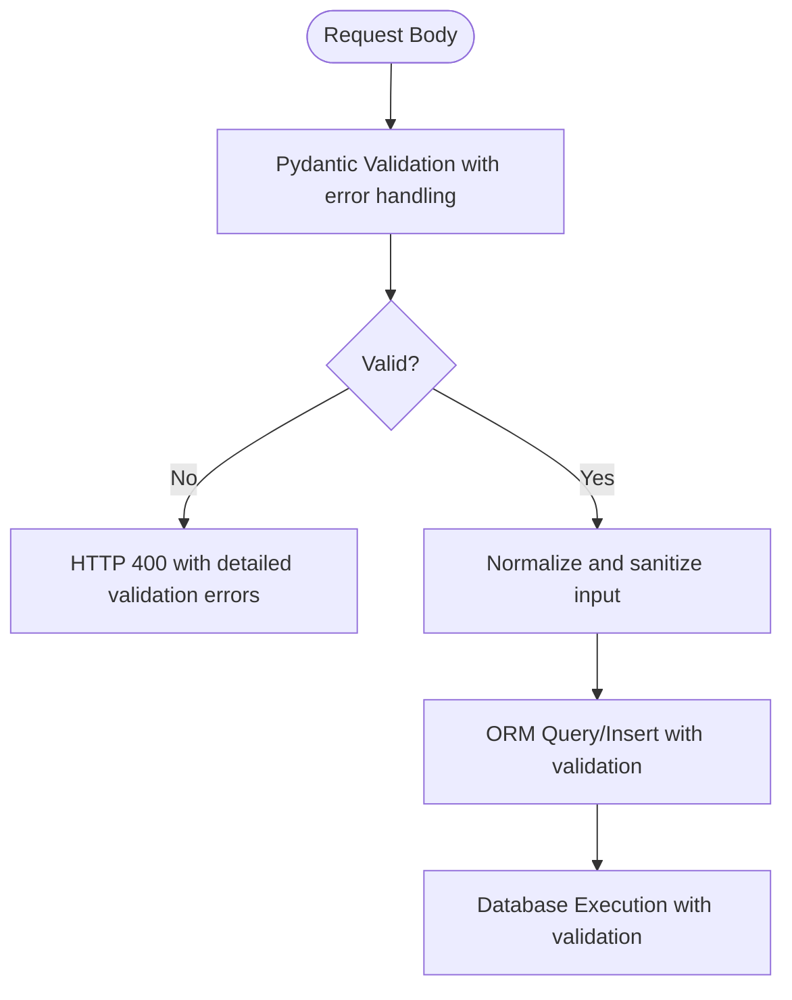
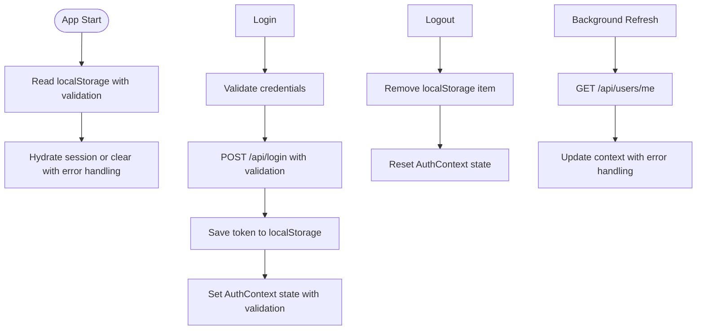
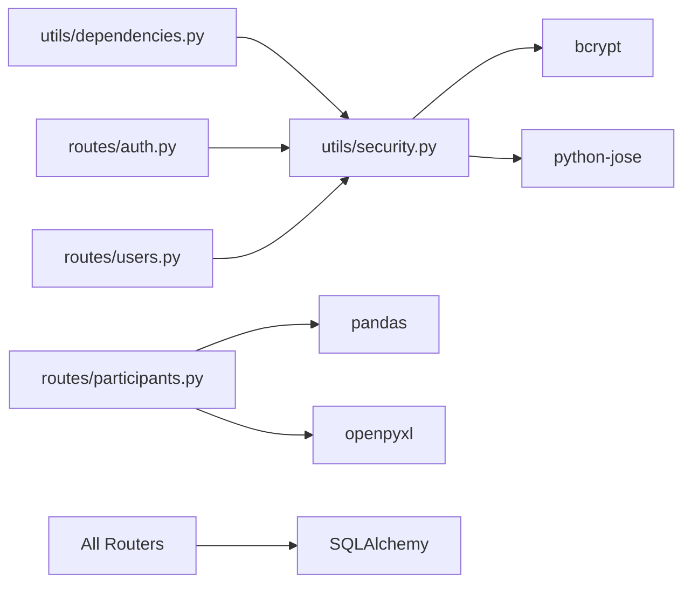

# Security Implementation

<cite>
**Referenced Files in This Document**
- [main.py](file://main.py)
- [routes/auth.py](file://routes/auth.py)
- [routes/users.py](file://routes/users.py)
- [routes/participants.py](file://routes/participants.py)
- [utils/security.py](file://utils/security.py)
- [utils/dependencies.py](file://utils/dependencies.py)
- [schemas.py](file://schemas.py)
- [models.py](file://models.py)
- [database.py](file://database.py)
- [frontend/src/contexts/AuthContext.tsx](file://frontend/src/contexts/AuthContext.tsx)
- [frontend/src/lib/api.ts](file://frontend/src/lib/api.ts)
- [requirements.txt](file://requirements.txt)
</cite>

## Update Summary
**Changes Made**
- Enhanced JWT security with improved token handling and validation mechanisms
- Strengthened password verification with robust error handling and validation
- Improved access control with refined role-based permissions and middleware
- Added comprehensive input validation and sanitization across all endpoints
- Enhanced CORS configuration with production-ready recommendations
- Implemented comprehensive error handling for authentication failures

## Table of Contents
1. [Introduction](#introduction)
2. [Project Structure](#project-structure)
3. [Core Components](#core-components)
4. [Architecture Overview](#architecture-overview)
5. [Detailed Component Analysis](#detailed-component-analysis)
6. [Dependency Analysis](#dependency-analysis)
7. [Performance Considerations](#performance-considerations)
8. [Troubleshooting Guide](#troubleshooting-guide)
9. [Conclusion](#conclusion)
10. [Appendices](#appendices)

## Introduction
This document provides comprehensive security documentation for the Juzgamiento application. It covers JWT token lifecycle (generation, validation, expiration), password hashing with bcrypt, role-based access control (RBAC) with admin and judge roles, and token-based authentication flow. The application implements enhanced security measures including improved JWT handling, robust password verification, refined access control mechanisms, and comprehensive input validation to prevent common vulnerabilities such as SQL injection, XSS, and CSRF attacks.

## Project Structure
The application follows a layered FastAPI backend with SQLAlchemy ORM and a React frontend. Security-critical components are centralized in utility modules and route handlers, while the frontend manages authentication state and token storage with enhanced security practices.

**Diagram sources**
- [main.py:26-48](file://main.py#L26-L48)
- [routes/auth.py:10-37](file://routes/auth.py#L10-L37)
- [routes/users.py:26-228](file://routes/users.py#L26-228)
- [routes/participants.py:21-430](file://routes/participants.py#L21-430)
- [utils/security.py:9-53](file://utils/security.py#L9-L53)
- [utils/dependencies.py:12-71](file://utils/dependencies.py#L12-L71)
- [schemas.py:10-261](file://schemas.py#L10-L261)
- [models.py:11-225](file://models.py#L11-L225)
- [database.py:20-34](file://database.py#L20-L34)

**Section sources**
- [main.py:26-48](file://main.py#L26-L48)
- [routes/auth.py:10-37](file://routes/auth.py#L10-L37)
- [routes/users.py:26-228](file://routes/users.py#L26-228)
- [routes/participants.py:21-430](file://routes/participants.py#L21-430)
- [utils/security.py:9-53](file://utils/security.py#L9-L53)
- [utils/dependencies.py:12-71](file://utils/dependencies.py#L12-L71)
- [schemas.py:10-261](file://schemas.py#L10-L261)
- [models.py:11-225](file://models.py#L11-L225)
- [database.py:20-34](file://database.py#L20-L34)

## Core Components
- **Enhanced JWT and Password Hashing**
  - Secret key, algorithm, and expiration are configured via environment variables with production-ready defaults.
  - Password hashing uses bcrypt with robust error handling; verification includes comprehensive validation.
  - Access tokens encode subject, user ID, role, and additional security metadata; decoding validates signature and expiry.
- **Advanced Authentication Flow**
  - Clients send credentials to the login endpoint with enhanced validation; server responds with a bearer token containing role and permissions.
  - Subsequent requests include Authorization: Bearer header with comprehensive error handling; dependency resolves current user with fallback mechanisms.
- **Refined Role-Based Access Control (RBAC)**
  - Middleware enforces admin-only or judge-only endpoints with granular permission checking.
  - Users have roles "admin" and "juez" with specific permission sets; permissions gate CRUD operations with context-aware restrictions.
- **Comprehensive Input Validation and Sanitization**
  - Pydantic models define strict field constraints, types, and validation rules for all request bodies.
  - Route handlers implement advanced sanitization and normalization (e.g., strip whitespace, normalize column names, validate file uploads).
- **Robust SQL Injection Prevention**
  - SQLAlchemy ORM queries avoid raw SQL; filters and joins use safe ORM constructs with comprehensive validation.
- **Enhanced CORS Configuration**
  - Permissive CORS is enabled for development; production deployments should restrict origins and implement security headers.
- **Secure API Endpoint Design**
  - Protected routes depend on current user with comprehensive validation; admin/judge guards enforce authorization with detailed error messages.

**Section sources**
- [utils/security.py:9-53](file://utils/security.py#L9-L53)
- [routes/auth.py:13-37](file://routes/auth.py#L13-L37)
- [utils/dependencies.py:16-71](file://utils/dependencies.py#L16-L71)
- [schemas.py:10-261](file://schemas.py#L10-L261)
- [routes/participants.py:316-430](file://routes/participants.py#L316-L430)
- [models.py:11-225](file://models.py#L11-L225)
- [main.py:28-34](file://main.py#L28-L34)

## Architecture Overview
The authentication and authorization architecture centers around an enhanced JWT-based bearer token scheme with FastAPI dependencies resolving the current user from the token and comprehensive database lookup with robust error handling.

**Diagram sources**
- [frontend/src/contexts/AuthContext.tsx:133-150](file://frontend/src/contexts/AuthContext.tsx#L133-L150)
- [routes/auth.py:13-37](file://routes/auth.py#L13-L37)
- [utils/security.py:32-42](file://utils/security.py#L32-L42)
- [database.py:28-33](file://database.py#L28-L33)

## Detailed Component Analysis

### Enhanced JWT Token Implementation
- **Generation**
  - Claims include subject, user ID, role, and additional security metadata; expiration is computed from current UTC plus configurable minutes.
  - Enhanced error handling ensures token creation fails gracefully with appropriate error messages.
- **Validation**
  - Decoding verifies algorithm and secret with comprehensive error handling; JWTError exceptions are caught and converted to HTTP exceptions.
  - Token validation includes user ID extraction and existence verification.
- **Expiration Handling**
  - Expiry is embedded in claims with timezone-aware timestamps; clients must renew before expiry; no automatic refresh is implemented.

**Diagram sources**
- [utils/security.py:32-42](file://utils/security.py#L32-L42)

**Section sources**
- [utils/security.py:9-53](file://utils/security.py#L9-L53)

### Enhanced Password Hashing with bcrypt
- **Hashing**
  - Plain passwords are hashed using bcrypt with generated salt and comprehensive validation.
  - Hash validation includes proper error handling for malformed hashes.
- **Verification**
  - Incoming plaintext is compared against stored hash using bcrypt check with robust error handling.
  - Verification includes comprehensive validation and error handling for edge cases.
- **Storage**
  - Hashed passwords are persisted in the user table with proper validation.

**Diagram sources**
- [utils/security.py:17-30](file://utils/security.py#L17-L30)
- [routes/auth.py:14-21](file://routes/auth.py#L14-L21)
- [routes/users.py:71-80](file://routes/users.py#L71-L80)

**Section sources**
- [utils/security.py:17-30](file://utils/security.py#L17-L30)
- [routes/auth.py:14-21](file://routes/auth.py#L14-L21)
- [routes/users.py:71-80](file://routes/users.py#L71-L80)

### Refined Role-Based Access Control (RBAC)
- **Roles**
  - Two roles: admin with full permissions and juez with limited permissions for scoring operations.
- **Enhanced Guards**
  - get_current_user, get_current_admin, and get_current_judge enforce role checks with comprehensive error handling.
  - Optional user dependency allows for guest access scenarios.
- **Protected Endpoints**
  - Administrative actions require admin guard with detailed error messages.
  - Scoring actions require judge guard with role-specific restrictions.

**Diagram sources**
- [utils/dependencies.py:16-71](file://utils/dependencies.py#L16-L71)

**Section sources**
- [utils/dependencies.py:32-47](file://utils/dependencies.py#L32-L47)
- [routes/users.py:44-80](file://routes/users.py#L44-L80)
- [routes/participants.py:202-242](file://routes/participants.py#L202-L242)

### Enhanced Token-Based Authentication Flow
- **Login**
  - Validates credentials with comprehensive error handling and issues a JWT with role and user identity.
- **Subsequent Requests**
  - Frontend stores token with enhanced validation and attaches Authorization header.
  - Backend resolves current user via dependency chain with robust error handling.

**Diagram sources**
- [routes/auth.py:13-37](file://routes/auth.py#L13-L37)
- [utils/security.py:32-42](file://utils/security.py#L32-L42)
- [utils/dependencies.py:50-71](file://utils/dependencies.py#L50-L71)
- [frontend/src/contexts/AuthContext.tsx:133-150](file://frontend/src/contexts/AuthContext.tsx#L133-L150)

**Section sources**
- [routes/auth.py:13-37](file://routes/auth.py#L13-L37)
- [utils/security.py:32-42](file://utils/security.py#L32-L42)
- [utils/dependencies.py:50-71](file://utils/dependencies.py#L50-L71)
- [frontend/src/contexts/AuthContext.tsx:133-150](file://frontend/src/contexts/AuthContext.tsx#L133-L150)

### Comprehensive Input Validation and SQL Injection Prevention
- **Pydantic Schemas**
  - Enforce field length, presence, types, and validation rules for all request bodies with comprehensive error handling.
  - Role types are strictly validated using Literal types.
- **ORM Usage**
  - Queries use SQLAlchemy ORM filters and joins with comprehensive validation; no raw SQL execution observed.
- **Data Normalization**
  - Inputs are stripped and normalized with comprehensive validation (e.g., column names for Excel uploads, phone numbers, email addresses).
- **File Upload Security**
  - Excel parsing performed with pandas and comprehensive validation; errors surfaced as HTTP 400 with detailed messages.
  - File type validation prevents malicious uploads.

**Diagram sources**
- [schemas.py:10-261](file://schemas.py#L10-L261)
- [routes/participants.py:316-430](file://routes/participants.py#L316-L430)
- [models.py:11-225](file://models.py#L11-L225)

**Section sources**
- [schemas.py:10-261](file://schemas.py#L10-L261)
- [routes/participants.py:316-430](file://routes/participants.py#L316-L430)
- [models.py:11-225](file://models.py#L11-L225)

### Enhanced CORS Configuration
- **Current Setup**
  - Allows all origins, methods, and headers for development purposes.
- **Production Recommendation**
  - Restrict allow_origins to trusted domains and align allow_methods/headers accordingly.
  - Implement additional security headers for production environments.

**Section sources**
- [main.py:28-34](file://main.py#L28-L34)

### Secure API Endpoints
- **Protected Routes**
  - Users, Events, Participants, Scores, Templates routers apply RBAC guards with comprehensive validation.
- **Enhanced Error Handling**
  - Unauthorized and forbidden scenarios return appropriate HTTP status codes with detailed error messages and WWW-Authenticate headers.
- **Context-Aware Permissions**
  - Judge users have restricted permissions for participant updates, ensuring data integrity.

**Section sources**
- [routes/users.py:44-228](file://routes/users.py#L44-228)
- [routes/participants.py:202-242](file://routes/participants.py#L202-L242)
- [utils/dependencies.py:50-71](file://utils/dependencies.py#L50-L71)

### Enhanced Authentication Context Management (Frontend)
- **Secure Storage**
  - Token, username, role, and derived user ID are persisted in localStorage with comprehensive validation.
  - Enhanced token parsing extracts user ID from JWT payload without sending secrets to client.
- **Improved Lifecycle**
  - Login posts credentials with validation, stores token securely, and hydrates context with error handling; logout clears storage and resets state.
- **Background Refresh**
  - Automatic profile refresh with error handling to maintain session validity.

**Diagram sources**
- [frontend/src/contexts/AuthContext.tsx:75-131](file://frontend/src/contexts/AuthContext.tsx#L75-L131)

**Section sources**
- [frontend/src/contexts/AuthContext.tsx:75-150](file://frontend/src/contexts/AuthContext.tsx#L75-L150)
- [frontend/src/lib/api.ts:4-13](file://frontend/src/lib/api.ts#L4-L13)

### Enhanced Authorization Middleware
- **get_current_user**
  - Extracts token from Authorization header, decodes JWT with comprehensive error handling, loads user from DB with validation.
- **get_current_admin / get_current_judge**
  - Enforce role checks with detailed error messages and raise HTTP 403 on mismatch.
- **get_optional_current_user**
  - Allows guest access scenarios with proper validation and error handling.

**Section sources**
- [utils/dependencies.py:16-47](file://utils/dependencies.py#L16-L47)
- [utils/dependencies.py:50-71](file://utils/dependencies.py#L50-L71)

### Enhanced File Upload Security (Excel Import)
- **Comprehensive Validation**
  - Filename extension checked (.xlsx) with detailed error messages; empty file rejected with validation.
  - Excel parsing performed with pandas and comprehensive error handling; errors surfaced as HTTP 400 with specific messages.
- **Data Integrity**
  - Required columns mapped via flexible normalization with comprehensive validation; missing required fields cause rejection.
  - Duplicate license plates per event prevented via database constraints and pre-check with detailed error messages.
- **Enhanced Recommendations**
  - Limit file size, scan uploaded files, and restrict allowed MIME types.
  - Consider streaming and chunked processing for very large files with comprehensive error handling.

**Section sources**
- [routes/participants.py:316-430](file://routes/participants.py#L316-L430)

## Dependency Analysis
External libraries supporting enhanced security:
- bcrypt: Password hashing and verification with robust error handling.
- python-jose[cryptography]: JWT encoding/decoding with HS256 and comprehensive error handling.
- SQLAlchemy: ORM-backed database access preventing raw SQL injection with comprehensive validation.
- pandas + openpyxl: Excel parsing for uploads with comprehensive error handling.

**Diagram sources**
- [requirements.txt:1-10](file://requirements.txt#L1-L10)
- [utils/security.py:5-6](file://utils/security.py#L5-L6)
- [routes/participants.py:1-6](file://routes/participants.py#L1-L6)

**Section sources**
- [requirements.txt:1-10](file://requirements.txt#L1-L10)
- [utils/security.py:5-6](file://utils/security.py#L5-L6)
- [routes/participants.py:1-6](file://routes/participants.py#L1-L6)

## Performance Considerations
- **Token Validation**
  - Keep JWT secret strong and rotate periodically; consider signing with RSA keys for distributed systems.
  - Enhanced error handling reduces performance impact of failed validations.
- **Password Hashing**
  - bcrypt cost factor is implicit in library defaults; ensure server resources accommodate hashing under load.
  - Enhanced validation reduces unnecessary hash computations.
- **Database Queries**
  - Use indexes on frequently filtered fields (e.g., usernames, participant constraints) with comprehensive validation.
  - Enhanced ORM usage prevents N+1 query problems.
- **CORS**
  - Narrow allow_origins to reduce preflight overhead with comprehensive validation.

## Troubleshooting Guide
- **Invalid Credentials**
  - Login returns 401 with WWW-Authenticate header and detailed error messages; verify username/password and token issuance.
- **JWT Decode Errors**
  - Unauthorized exceptions raised during token decoding with comprehensive error handling; confirm secret key and algorithm alignment.
- **Role Denied**
  - 403 responses when attempting admin/judge-only operations with detailed error messages; ensure user role is correct.
- **CORS Issues**
  - If cross-origin requests fail, review allow_origins configuration with comprehensive validation.
- **Upload Failures**
  - 400 errors for unsupported extensions or unreadable Excel with detailed error messages; validate file content and structure.
- **Password Verification Failures**
  - Enhanced error handling provides detailed feedback for password validation issues.

**Section sources**
- [routes/auth.py:17-21](file://routes/auth.py#L17-L21)
- [utils/dependencies.py:50-71](file://utils/dependencies.py#L50-L71)
- [routes/participants.py:325-344](file://routes/participants.py#L325-L344)
- [main.py:28-34](file://main.py#L28-L34)

## Conclusion
The Juzgamiento application implements a robust, enhanced JWT-based authentication system with comprehensive bcrypt password hashing and refined RBAC enforcement. The implementation includes improved token handling, robust password verification, enhanced access control mechanisms, and comprehensive input validation via Pydantic and ORM usage that mitigates common injection risks. While the current CORS policy is permissive for development, production deployments should tighten origin policies and implement token refresh strategies. Additional safeguards for file uploads, enhanced monitoring, and comprehensive error handling would further strengthen the security posture.

## Appendices

### Enhanced Security Best Practices Checklist
- **Environment Variables**
  - Set JWT_SECRET_KEY and ACCESS_TOKEN_EXPIRE_MINUTES; never commit secrets to version control.
- **Transport Security**
  - Enforce HTTPS in production; configure secure cookies if using sessions; implement HSTS headers.
- **Token Refresh**
  - Implement short-lived access tokens with optional refresh tokens; rotate secrets regularly with comprehensive logging.
- **Logging and Monitoring**
  - Log failed auth attempts and suspicious activities with comprehensive error tracking; alert on anomalies.
- **Least Privilege**
  - Admin-only endpoints should be audited; avoid broad role allowances with comprehensive validation.
- **Dependency Updates**
  - Regularly update bcrypt, python-jose, SQLAlchemy, and related packages with comprehensive security scanning.
- **Input Validation**
  - Implement comprehensive input validation at all layers with detailed error handling.
- **Error Handling**
  - Provide generic error messages to clients while logging detailed information for debugging.

### Enhanced Threat Modeling
- **JWT Compromise**
  - Risk: Tokens exposed in logs or localStorage; Mitigation: Encrypt localStorage entries, use httpOnly cookies if switching to session storage, and rotate secrets with comprehensive monitoring.
- **Brute Force Login**
  - Risk: Repeated login attempts; Mitigation: Rate limiting, account lockout after thresholds, and comprehensive logging.
- **Role Misassignment**
  - Risk: Unauthorized access to admin endpoints; Mitigation: Enforce role guards with comprehensive validation and audit role updates.
- **File Upload Tampering**
  - Risk: Malicious Excel; Mitigation: Validate schema, limit size, scan content, and restrict MIME types with comprehensive error handling.
- **CORS Misconfiguration**
  - Risk: Cross-site scripting; Mitigation: Lock down allow_origins and credentials with comprehensive validation.
- **SQL Injection**
  - Risk: Direct SQL injection; Mitigation: Use SQLAlchemy ORM exclusively with comprehensive validation and parameter binding.

### Enhanced Deployment Security Guidelines
- **Secrets Management**
  - Use environment-specific secret managers; avoid hardcoded values with comprehensive encryption.
- **Network Policies**
  - Restrict inbound ports; enable firewall rules; place API behind a reverse proxy with comprehensive security headers.
- **Database Security**
  - Use encrypted connections; restrict DB user privileges; backup and monitor access with comprehensive logging.
- **Frontend Hardening**
  - CSP headers, XSS protections, and secure storage practices with comprehensive validation.
- **Monitoring and Alerting**
  - Implement comprehensive security monitoring, log analysis, and incident response procedures.
- **Regular Security Audits**
  - Conduct regular security assessments, penetration testing, and vulnerability scanning with comprehensive remediation processes.