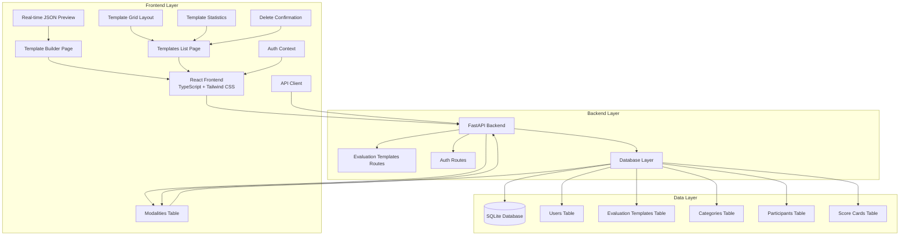
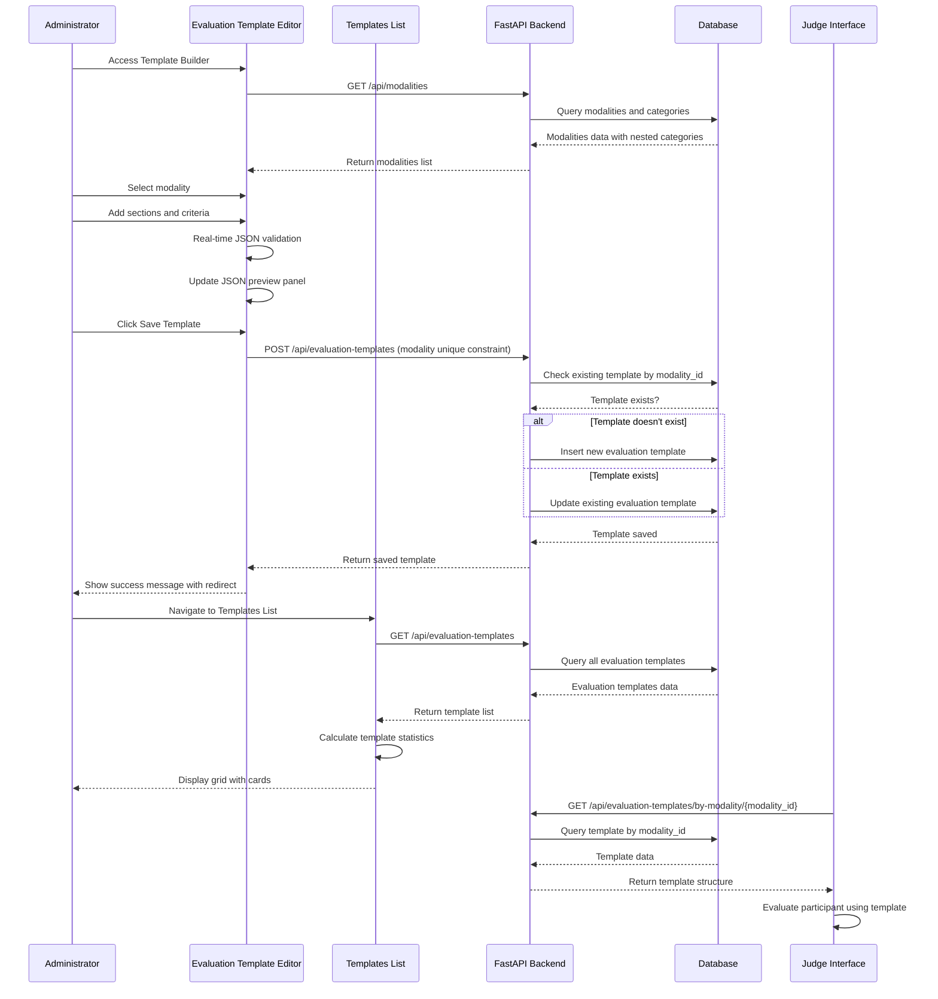
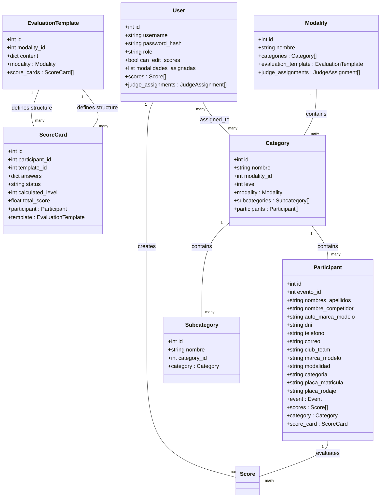
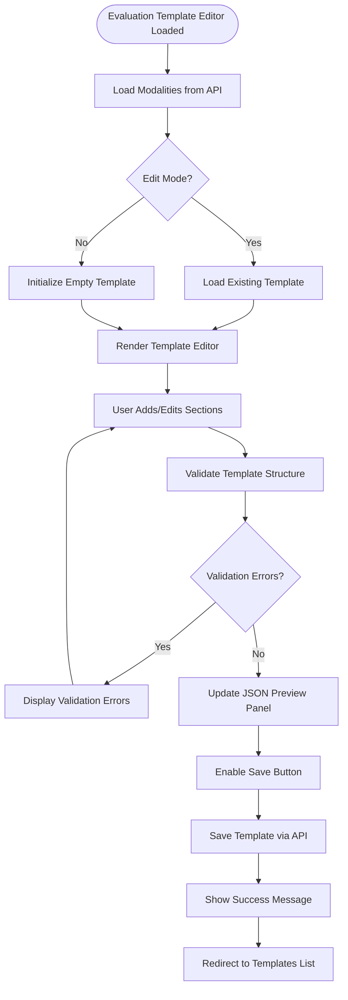
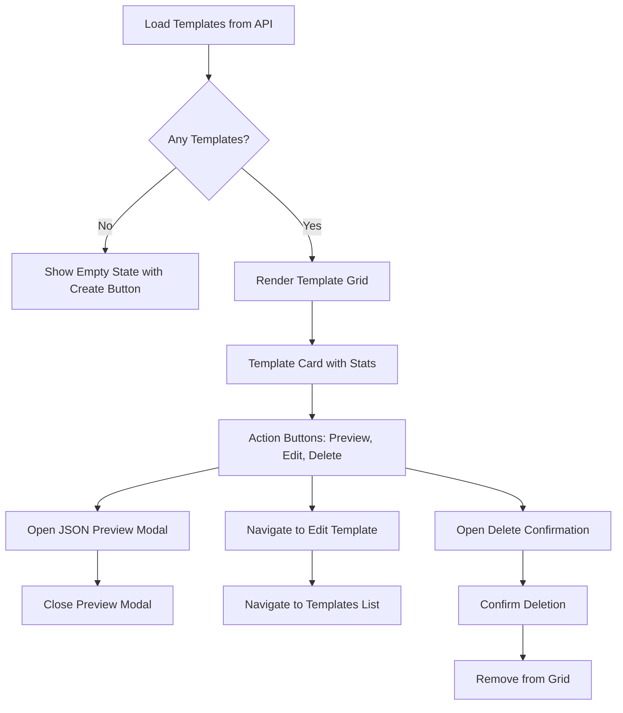
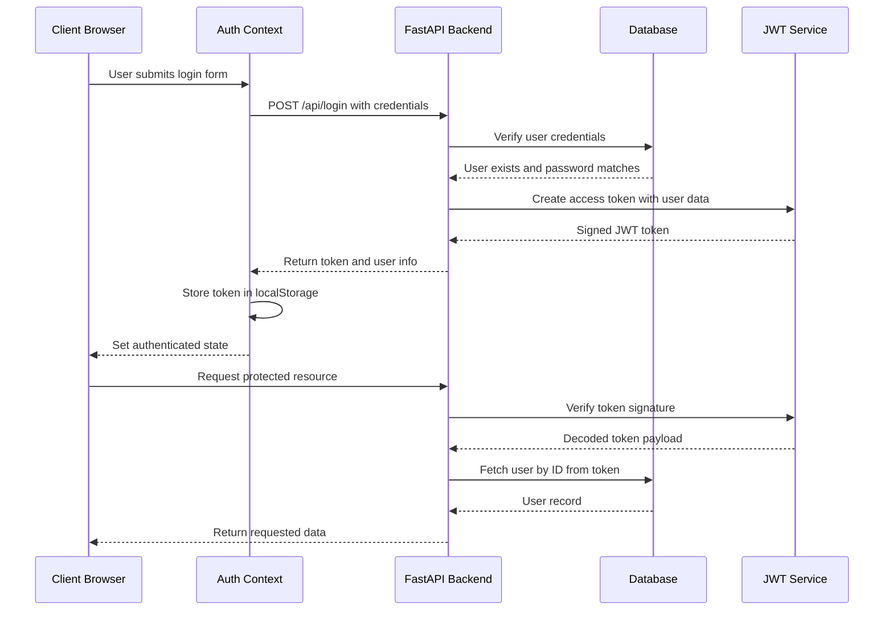
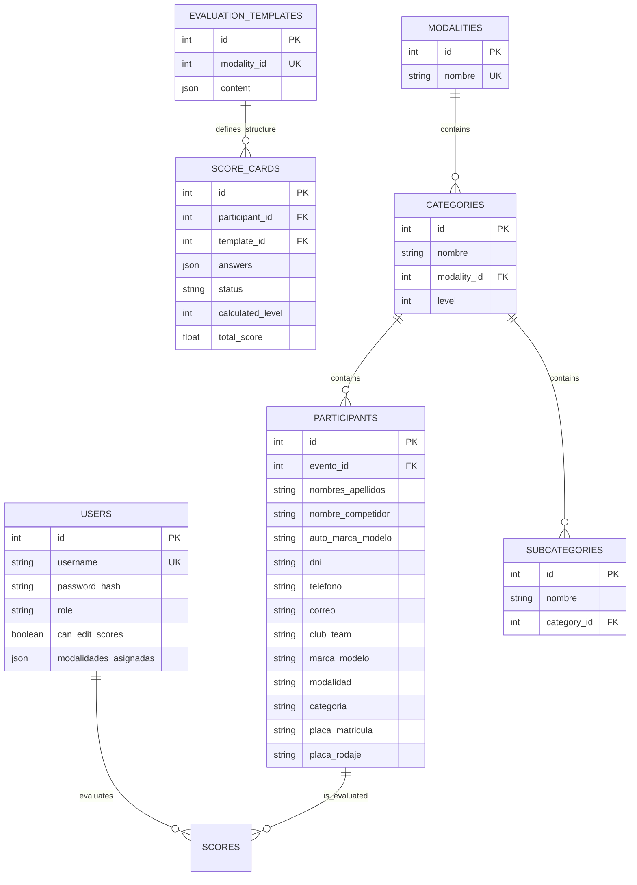

# Template Management System

<cite>
**Referenced Files in This Document**
- [main.py](file://main.py)
- [database.py](file://database.py)
- [models.py](file://models.py)
- [schemas.py](file://schemas.py)
- [routes/evaluation_templates.py](file://routes/evaluation_templates.py)
- [routes/modalities.py](file://routes/modalities.py)
- [utils/dependencies.py](file://utils/dependencies.py)
- [utils/security.py](file://utils/security.py)
- [frontend/src/pages/admin/EvaluationTemplateEditor.tsx](file://frontend/src/pages/admin/EvaluationTemplateEditor.tsx)
- [frontend/src/pages/admin/TemplatesList.tsx](file://frontend/src/pages/admin/TemplatesList.tsx)
- [frontend/src/lib/api.ts](file://frontend/src/lib/api.ts)
- [frontend/src/contexts/AuthContext.tsx](file://frontend/src/contexts/AuthContext.tsx)
- [frontend/src/App.tsx](file://frontend/src/App.tsx)
- [seed_init.py](file://seed_init.py)
</cite>

## Update Summary
**Changes Made**
- **Replaced Form Template System**: Migrated from `FormTemplate` to `EvaluationTemplate` with enhanced template structure
- **Enhanced Template Builder Component**: Added sophisticated `EvaluationTemplateEditor.tsx` with real-time JSON preview, dynamic section management, and advanced criteria editing
- **New Templates List Interface**: Implemented comprehensive `TemplatesList.tsx` with grid-based template management, JSON preview modal, and bulk operations
- **Enhanced Validation System**: Real-time validation with comprehensive error handling and template statistics calculation
- **Unique Template Assignment**: Each modality now has exactly one evaluation template with unique constraint enforcement
- **Improved Routing System**: Dedicated routes for evaluation template management (`/admin/plantillas`, `/admin/plantillas/nueva`, `/admin/plantillas/maestra/:id`)
- **Enhanced Data Model**: Updated `EvaluationTemplate` model with JSON content storage and modality relationship
- **Advanced Template Features**: Support for categorization options, evaluation scales, and bonification items

## Table of Contents
1. [Introduction](#introduction)
2. [System Architecture](#system-architecture)
3. [Core Components](#core-components)
4. [Template Management Workflow](#template-management-workflow)
5. [Data Model](#data-model)
6. [Frontend Implementation](#frontend-implementation)
7. [Security and Authentication](#security-and-authentication)
8. [Database Schema](#database-schema)
9. [Template Structure Definition](#template-structure-definition)
10. [API Endpoints](#api-endpoints)
11. [Development Setup](#development-setup)
12. [Conclusion](#conclusion)

## Introduction

The Template Management System is a comprehensive web application designed for managing evaluation templates in car audio and tuning competitions. The system provides administrators with the ability to create, edit, and manage structured evaluation forms that judges can use during competitions. The platform supports multiple modalities (Car Audio Master, Tuning Pro) and categories, with each modality having its own customizable evaluation template.

The system consists of a FastAPI backend with a PostgreSQL/SQLite database and a React frontend built with TypeScript. It features role-based access control, real-time template editing, JSON preview capabilities, and comprehensive template management functionality with unique template assignment per modality.

**Updated** Enhanced with a sophisticated Evaluation Template system that provides real-time JSON preview, dynamic section management, and advanced criteria editing capabilities, plus a new Templates List interface for streamlined template administration. The system now integrates with a hierarchical category structure through modalities and categories, enabling category-specific template assignment with unique constraints.

## System Architecture

The Template Management System follows a modern full-stack architecture with clear separation of concerns between frontend, backend, and database layers.



**Diagram sources**
- [main.py:26-44](file://main.py#L26-L44)
- [routes/evaluation_templates.py:10](file://routes/evaluation_templates.py#L10)
- [routes/modalities.py:16](file://routes/modalities.py#L16)
- [frontend/src/App.tsx:101-112](file://frontend/src/App.tsx#L101-L112)

The architecture implements a client-server model where the React frontend communicates with the FastAPI backend through RESTful APIs. The backend manages database operations and business logic, while the frontend provides an intuitive interface for template management with real-time preview capabilities and comprehensive template administration features.

**Section sources**
- [main.py:26-44](file://main.py#L26-L44)
- [database.py:19-34](file://database.py#L19-L34)

## Core Components

### Backend Services

The backend is built with FastAPI and provides several key services:

**Evaluation Template Management Service**: Handles CRUD operations for evaluation templates with validation and unique constraint enforcement per modality
**Authentication Service**: Manages user authentication and authorization with JWT tokens
**Modalities Service**: Provides hierarchical structure support for competition categories with nested categories and subcategories
**Database Service**: Manages SQLite operations with automatic migration support

### Frontend Components

**Evaluation Template Editor**: Interactive editor for creating and modifying evaluation templates with real-time JSON preview and comprehensive template management features
**Templates List**: Grid-based interface for viewing and managing existing evaluation templates with JSON preview and deletion capabilities
**Authentication Context**: Handles user sessions and role-based access control
**API Client**: Centralized HTTP client for backend communication with error handling

**Updated** The Templates List interface now features a comprehensive grid layout with template cards displaying statistics, action buttons for preview, edit, and delete operations, and modal-based JSON preview functionality. The system now integrates with modalities and categories for hierarchical template organization with unique template assignment per modality.

**Section sources**
- [routes/evaluation_templates.py:13-172](file://routes/evaluation_templates.py#L13-L172)
- [frontend/src/pages/admin/EvaluationTemplateEditor.tsx:30-1241](file://frontend/src/pages/admin/EvaluationTemplateEditor.tsx#L30-L1241)
- [frontend/src/pages/admin/TemplatesList.tsx:24-252](file://frontend/src/pages/admin/TemplatesList.tsx#L24-L252)

## Template Management Workflow

The template management process follows a structured workflow that ensures proper template creation, validation, and deployment with real-time feedback.



**Diagram sources**
- [frontend/src/pages/admin/EvaluationTemplateEditor.tsx:208-277](file://frontend/src/pages/admin/EvaluationTemplateEditor.tsx#L208-L277)
- [routes/evaluation_templates.py:26-53](file://routes/evaluation_templates.py#L26-L53)
- [frontend/src/pages/admin/TemplatesList.tsx:45-58](file://frontend/src/pages/admin/TemplatesList.tsx#L45-L58)

The workflow ensures that templates are properly validated before saving, with real-time feedback to administrators through the JSON preview panel. The system maintains referential integrity and prevents duplicate template assignments through unique constraints on modality_id fields. The new Templates List interface provides streamlined access to all templates with comprehensive management capabilities.

**Section sources**
- [frontend/src/pages/admin/EvaluationTemplateEditor.tsx:208-277](file://frontend/src/pages/admin/EvaluationTemplateEditor.tsx#L208-L277)
- [routes/evaluation_templates.py:26-53](file://routes/evaluation_templates.py#L26-L53)
- [frontend/src/pages/admin/TemplatesList.tsx:45-58](file://frontend/src/pages/admin/TemplatesList.tsx#L45-L58)

## Data Model

The system uses SQLAlchemy ORM to define the data model with clear relationships between entities.



**Diagram sources**
- [models.py:115-225](file://models.py#L115-L225)

The data model supports complex relationships with proper foreign key constraints and cascading operations. The `EvaluationTemplate` entity serves as the central hub for evaluation structure definition with JSON storage for flexible template structures. The hierarchical category structure enables category-specific template assignment through modalities and categories with unique template constraints.

**Section sources**
- [models.py:115-129](file://models.py#L115-L129)

## Frontend Implementation

The frontend is built with React and TypeScript, providing a responsive and interactive user experience with sophisticated template editing capabilities and comprehensive template management features.

### Evaluation Template Editor Interface

The Evaluation Template Editor component offers a sophisticated editing interface with real-time validation, JSON preview, and comprehensive template management features.



**Diagram sources**
- [frontend/src/pages/admin/EvaluationTemplateEditor.tsx:74-105](file://frontend/src/pages/admin/EvaluationTemplateEditor.tsx#L74-L105)
- [frontend/src/pages/admin/EvaluationTemplateEditor.tsx:208-277](file://frontend/src/pages/admin/EvaluationTemplateEditor.tsx#L208-L277)

### Templates List Interface

The Templates List provides a grid-based view for managing multiple evaluation templates with bulk operations, JSON preview capabilities, and template statistics display.



**Diagram sources**
- [frontend/src/pages/admin/TemplatesList.tsx:149-217](file://frontend/src/pages/admin/TemplatesList.tsx#L149-L217)
- [frontend/src/pages/admin/TemplatesList.tsx:251-280](file://frontend/src/pages/admin/TemplatesList.tsx#L251-L280)

**Updated** Enhanced with comprehensive template statistics including section counts, criteria counts, and maximum possible scores for each template. The grid layout displays template cards with metadata, statistics, and action buttons for efficient template management. The system now integrates with modalities and categories for hierarchical template organization with unique template assignment per modality.

**Section sources**
- [frontend/src/pages/admin/EvaluationTemplateEditor.tsx:30-1241](file://frontend/src/pages/admin/EvaluationTemplateEditor.tsx#L30-L1241)
- [frontend/src/pages/admin/TemplatesList.tsx:24-252](file://frontend/src/pages/admin/TemplatesList.tsx#L24-L252)

## Security and Authentication

The system implements robust security measures using JWT tokens and role-based access control.



**Diagram sources**
- [frontend/src/contexts/AuthContext.tsx:95-111](file://frontend/src/contexts/AuthContext.tsx#L95-L111)
- [utils/dependencies.py:16-38](file://utils/dependencies.py#L16-L38)

The authentication system uses bearer tokens with configurable expiration times and supports both required and optional authentication scenarios.

**Section sources**
- [utils/dependencies.py:16-38](file://utils/dependencies.py#L16-L38)
- [utils/security.py:29-39](file://utils/security.py#L29-L39)

## Database Schema

The database schema is designed to support the evaluation template management functionality with proper indexing and constraints.



**Diagram sources**
- [models.py:115-225](file://models.py#L115-L225)

The schema includes unique constraints for template assignments and proper foreign key relationships to maintain data integrity. The JSON column type allows for flexible template structure storage. The hierarchical category structure supports category-specific template assignment with unique template constraints per modality.

**Section sources**
- [models.py:115-129](file://models.py#L115-L129)

## Template Structure Definition

Templates are defined using a hierarchical JSON structure that supports nested sections, criteria, categorization options, and bonification items with comprehensive validation.

### Template Structure Format

Each evaluation template consists of a structured JSON object with sections, items, and optional bonifications:

```json
{
  "template_name": "String",
  "modality": "String",
  "version": "String",
  "evaluation_scale": {
    "0": "String",
    "1": "String",
    "2": "String",
    "3": "String",
    "4": "String",
    "5": "String"
  },
  "sections": [
    {
      "section_id": "String",
      "section_title": "String",
      "assigned_role": "String",
      "items": [
        {
          "item_id": "String",
          "label": "String",
          "evaluation_type": "String",
          "max_score": "Number",
          "categorization_options": [
            {
              "label": "String",
              "triggers_level": "Number",
              "category_id": "Number",
              "category_name": "String"
            }
          ]
        }
      ]
    }
  ],
  "bonifications": {
    "section_id": "String",
    "assigned_role": "String",
    "items": [
      {
        "item_id": "String",
        "label": "String",
        "max_score": "Number"
      }
    ]
  }
}
```

### Evaluation Template Builder Features

**Real-time JSON Preview**: The system provides instant JSON preview updates as administrators modify template sections and criteria
**Dynamic Section Management**: Users can add, remove, and reorder sections with validation
**Advanced Criteria Editing**: Individual criteria can be edited with real-time validation for naming, scoring limits, and categorization options
**Template Statistics**: Automatic calculation of total sections, criteria, and maximum possible scores
**Validation Feedback**: Comprehensive error checking for empty sections, invalid criteria, and scoring constraints
**Categorization Options**: Support for category-specific scoring with trigger levels and category associations
**Bonification Items**: Special scoring items that can be assigned to specific roles

### Templates List Features

**Grid-based Display**: Template cards show modality, category, and statistics in a responsive grid layout
**Template Statistics**: Each card displays section count, criteria count, and maximum possible score
**Action Buttons**: Preview JSON, Edit template, and Delete template operations
**JSON Preview Modal**: Detailed JSON structure display in a modal dialog
**Unique Template Assignment**: Each modality has exactly one evaluation template with unique constraint enforcement

### Predefined Templates

The system includes predefined templates for common competition formats:

**Tuning Template**: Comprehensive evaluation for vehicle tuning competitions with 6 main sections covering exterior appearance, interior appearance, engine performance, cleaning, lighting, and miscellaneous categories
**Categorization Template**: Simplified template for basic vehicle categorization with a single section for modification level assessment

**Section sources**
- [seed_init.py:41-48](file://seed_init.py#L41-L48)
- [seed_init.py:68-87](file://seed_init.py#L68-L87)

## API Endpoints

The system provides RESTful endpoints for evaluation template management operations with comprehensive CRUD functionality.

### Evaluation Template Management Endpoints

| Method | Endpoint | Description | Authentication |
|--------|----------|-------------|----------------|
| GET | `/api/evaluation-templates` | List all evaluation templates ordered by modality | User |
| POST | `/api/evaluation-templates` | Create or update evaluation template by modality_id | Admin |
| GET | `/api/evaluation-templates/{template_id}` | Get evaluation template by ID | User |
| GET | `/api/evaluation-templates/by-modality/{modality_id}` | Get evaluation template by modality_id | User |
| PUT | `/api/evaluation-templates/{template_id}` | Update existing evaluation template | Admin |

### Modalities Endpoints

| Method | Endpoint | Description | Authentication |
|--------|----------|-------------|----------------|
| GET | `/api/modalities` | List modalities with nested categories | User |
| POST | `/api/modalities` | Create new modality | Admin |
| POST | `/api/modalities/{modality_id}/categories` | Create category | Admin |
| POST | `/api/modalities/categories/{category_id}/subcategories` | Create subcategory | Admin |
| DELETE | `/api/modalities/{modality_id}` | Delete modality | Admin |
| DELETE | `/api/modalities/categories/{category_id}` | Delete category | Admin |
| DELETE | `/api/modalities/subcategories/{subcategory_id}` | Delete subcategory | Admin |

**Section sources**
- [routes/evaluation_templates.py:13-172](file://routes/evaluation_templates.py#L13-L172)
- [routes/modalities.py:19-192](file://routes/modalities.py#L19-L192)

## Development Setup

### Prerequisites

- Python 3.8+
- Node.js 16+
- pip for Python packages
- npm for JavaScript packages

### Backend Setup

1. Install Python dependencies:
```bash
pip install -r requirements.txt
```

2. Initialize database:
```bash
python seed_init.py
```

3. Start backend server:
```bash
uvicorn main:app --reload
```

### Frontend Setup

1. Install JavaScript dependencies:
```bash
npm install
```

2. Start development server:
```bash
npm run dev
```

### Environment Configuration

Set the following environment variables for production:

- `JWT_SECRET_KEY`: Secret key for JWT token signing
- `ACCESS_TOKEN_EXPIRE_MINUTES`: Token expiration time in minutes

**Section sources**
- [main.py:1-53](file://main.py#L1-L53)
- [database.py:1-93](file://database.py#L1-L93)

## Conclusion

The Template Management System provides a robust and scalable solution for managing evaluation templates in competitive events. The system's architecture supports extensible template structures, role-based access control, and real-time collaboration between administrators and judges.

Key strengths of the system include:

- **Enhanced Template Structure**: Hierarchical JSON-based evaluation template definition allows for complex evaluation criteria with real-time validation and categorization options
- **Sophisticated User Interface**: Advanced React-based editor with split-pane layout, real-time JSON preview, and comprehensive validation feedback
- **Unique Template Assignment**: Each modality has exactly one evaluation template with unique constraint enforcement, preventing duplication
- **Comprehensive Template Management**: Dynamic section and criteria management with automatic statistics calculation
- **Enhanced Template Administration**: New Templates List interface with grid-based management, JSON preview, and bulk operations
- **Hierarchical Category Integration**: Modalities and categories provide structured organization for category-specific template assignment
- **Security-First Design**: JWT-based authentication with role-based access control
- **Database Integrity**: Proper constraints and relationships ensure data consistency
- **Extensible Architecture**: Modular design supports easy addition of new features

The system is well-suited for car audio and tuning competitions but can be adapted for other types of evaluations through template customization. The comprehensive API and frontend components provide a solid foundation for future enhancements and integrations.

**Updated** The enhanced Evaluation Template system significantly improves the user experience with real-time feedback, comprehensive validation, and intuitive template management capabilities that streamline the template creation and editing process for administrators. The new Templates List interface provides efficient template administration with statistics display and bulk operations, completing the template lifecycle management workflow. The integration with hierarchical category structure through modalities and categories enables sophisticated template organization and category-specific template assignment with unique constraints per modality.