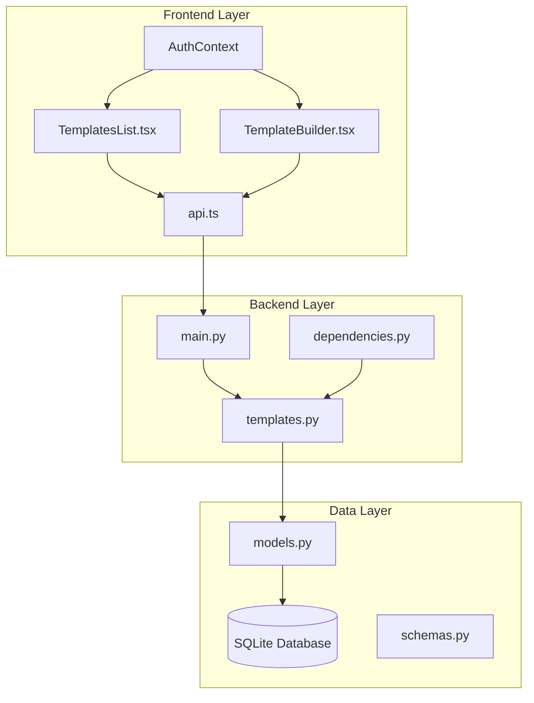
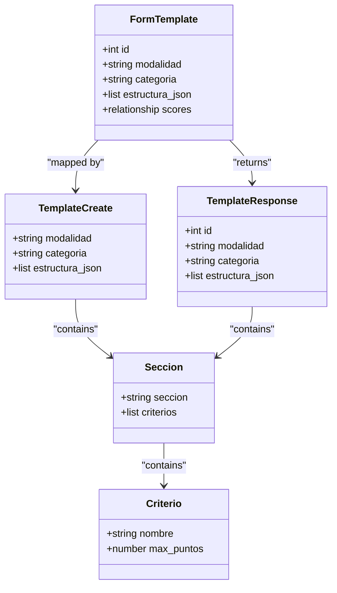
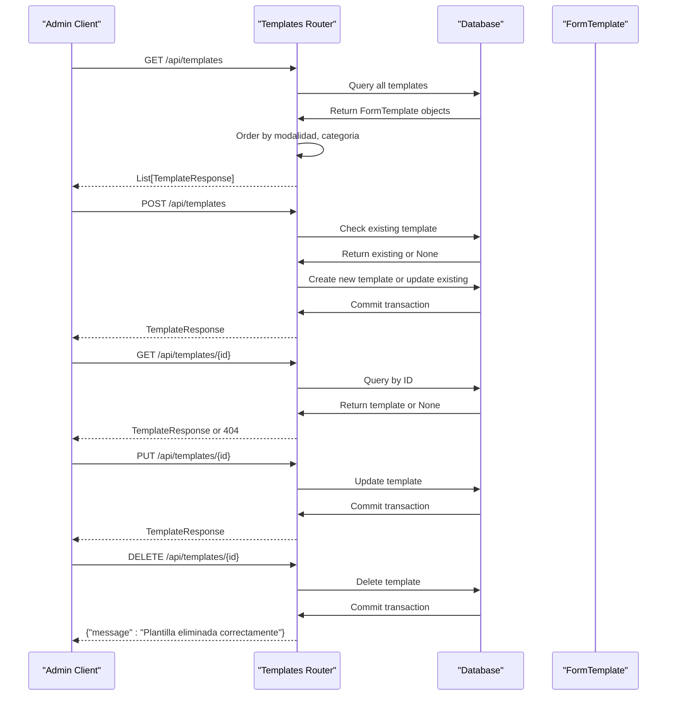
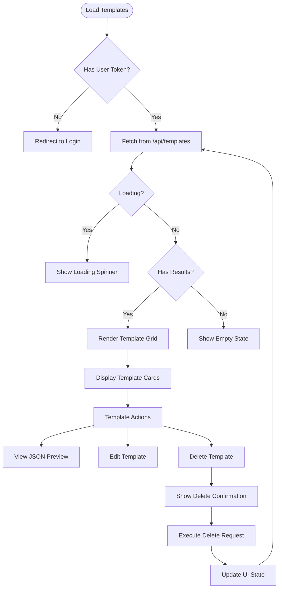
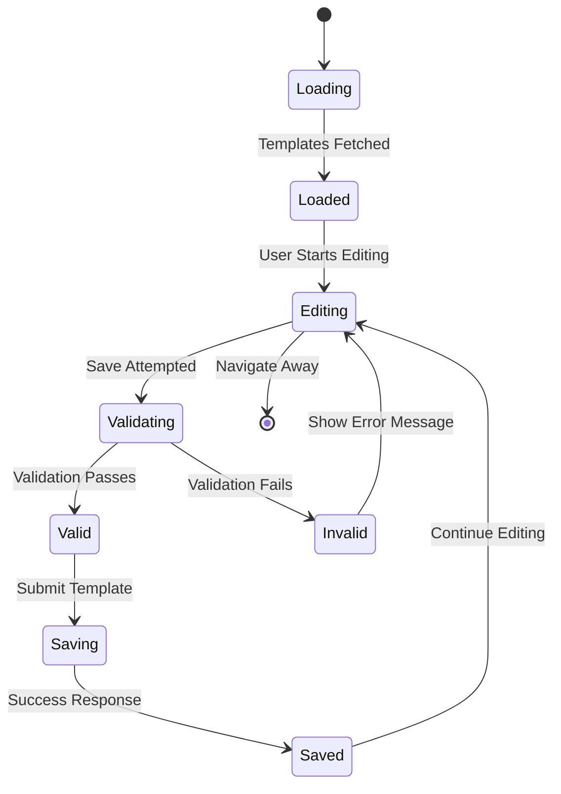
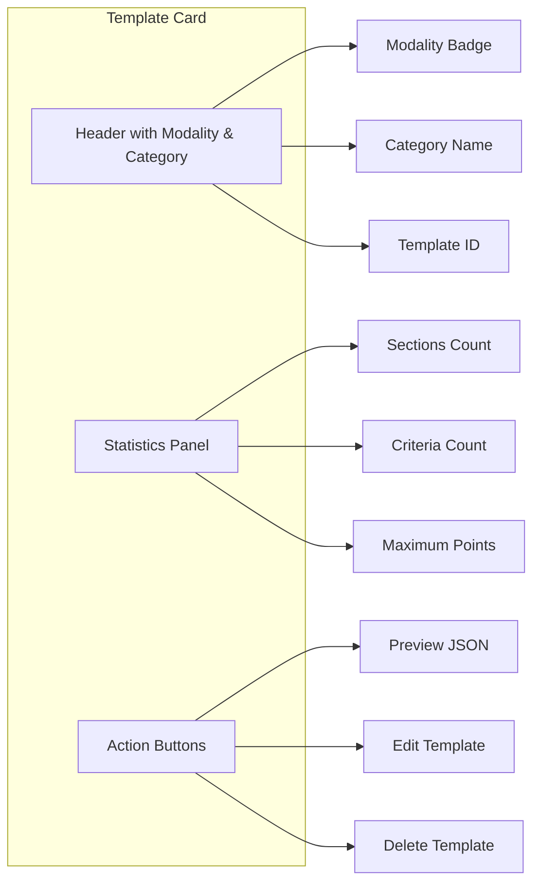
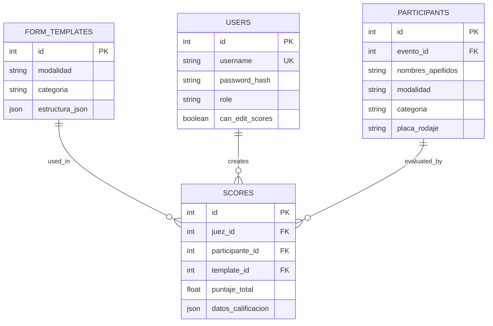
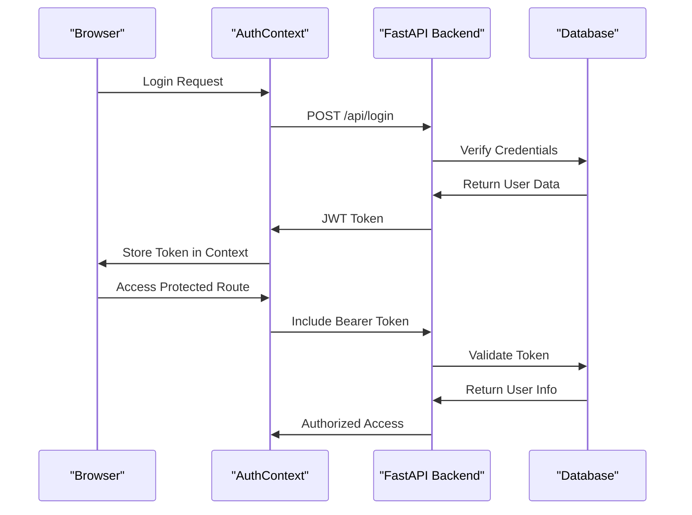

# Templates List Management

<cite>
**Referenced Files in This Document**
- [templates.py](file://routes/templates.py)
- [TemplatesList.tsx](file://frontend/src/pages/admin/TemplatesList.tsx)
- [TemplateBuilder.tsx](file://frontend/src/pages/admin/TemplateBuilder.tsx)
- [api.ts](file://frontend/src/lib/api.ts)
- [models.py](file://models.py)
- [schemas.py](file://schemas.py)
- [App.tsx](file://frontend/src/App.tsx)
- [main.py](file://main.py)
- [database.py](file://database.py)
- [dependencies.py](file://utils/dependencies.py)
- [seed_templates.py](file://seed_templates.py)
</cite>

## Table of Contents
1. [Introduction](#introduction)
2. [System Architecture](#system-architecture)
3. [Core Components](#core-components)
4. [Templates Data Model](#templates-data-model)
5. [API Endpoints](#api-endpoints)
6. [Frontend Implementation](#frontend-implementation)
7. [Template Builder](#template-builder)
8. [Template List Management](#template-list-management)
9. [Database Schema](#database-schema)
10. [Security and Access Control](#security-and-access-control)
11. [Performance Considerations](#performance-considerations)
12. [Troubleshooting Guide](#troubleshooting-guide)
13. [Conclusion](#conclusion)

## Introduction

The Templates List Management system is a comprehensive solution for managing evaluation templates in a car audio and tuning competition scoring platform. This system allows administrators to create, manage, and organize evaluation templates categorized by competition modalities and categories. The templates define structured evaluation criteria with weighted scoring systems that judges use during competitions.

The system consists of a FastAPI backend with SQLAlchemy ORM for data persistence and a React frontend with TypeScript for the administrative interface. Templates are stored as JSON structures containing sections and criteria with maximum point allocations.

## System Architecture

The Templates List Management system follows a client-server architecture with clear separation of concerns:

**Diagram sources**
- [main.py:26-48](file://main.py#L26-L48)
- [templates.py:10-134](file://routes/templates.py#L10-L134)
- [models.py:72-84](file://models.py#L72-L84)

**Section sources**
- [main.py:1-53](file://main.py#L1-L53)
- [App.tsx:95-127](file://frontend/src/App.tsx#L95-L127)

## Core Components

### Backend Components

The backend is built with FastAPI and provides RESTful APIs for template management:

- **Template Router**: Handles all template-related operations
- **Database Models**: SQLAlchemy ORM definitions for template storage
- **Validation Schemas**: Pydantic models for request/response validation
- **Dependency Injection**: Authentication and authorization middleware

### Frontend Components

The frontend provides two main interfaces:

- **Templates List Page**: Grid-based interface for viewing and managing templates
- **Template Builder**: Interactive editor for creating and modifying template structures

**Section sources**
- [templates.py:13-134](file://routes/templates.py#L13-L134)
- [models.py:72-84](file://models.py#L72-L84)
- [schemas.py:120-133](file://schemas.py#L120-L133)

## Templates Data Model

The template system uses a hierarchical JSON structure to define evaluation criteria:

**Diagram sources**
- [models.py:72-84](file://models.py#L72-L84)
- [schemas.py:120-133](file://schemas.py#L120-L133)
- [TemplatesList.tsx:7-22](file://frontend/src/pages/admin/TemplatesList.tsx#L7-L22)

### Template Structure

Each template follows a consistent structure:

- **Sections**: Logical groupings of evaluation criteria
- **Criteria**: Specific evaluation items with maximum point values
- **Hierarchical Organization**: Nested arrays for complex evaluation structures

**Section sources**
- [seed_templates.py:5-86](file://seed_templates.py#L5-L86)
- [TemplateBuilder.tsx:7-28](file://frontend/src/pages/admin/TemplateBuilder.tsx#L7-L28)

## API Endpoints

The template management API provides comprehensive CRUD operations:

**Diagram sources**
- [templates.py:13-134](file://routes/templates.py#L13-L134)

### Endpoint Specifications

| Method | Endpoint | Description | Authentication |
|--------|----------|-------------|----------------|
| GET | `/api/templates` | List all templates | User |
| POST | `/api/templates` | Create/update template | Admin |
| GET | `/api/templates/{template_id}` | Get template by ID | User |
| PUT | `/api/templates/{template_id}` | Update template | Admin |
| DELETE | `/api/templates/{template_id}` | Delete template | Admin |
| GET | `/api/templates/{modalidad}/{categoria}` | Get template by category | User |

**Section sources**
- [templates.py:13-134](file://routes/templates.py#L13-L134)

## Frontend Implementation

### Templates List Interface

The Templates List page provides a comprehensive grid-based interface for template management:

**Diagram sources**
- [TemplatesList.tsx:39-58](file://frontend/src/pages/admin/TemplatesList.tsx#L39-L58)
- [TemplatesList.tsx:60-75](file://frontend/src/pages/admin/TemplatesList.tsx#L60-L75)

### Template Statistics Calculation

The system automatically calculates template statistics:

- **Total Sections**: Count of evaluation sections
- **Total Criteria**: Sum of all evaluation criteria across sections
- **Maximum Points**: Sum of all maximum point values

**Section sources**
- [TemplatesList.tsx:77-89](file://frontend/src/pages/admin/TemplatesList.tsx#L77-L89)

## Template Builder

The Template Builder provides an interactive interface for creating and editing evaluation templates:

**Diagram sources**
- [TemplateBuilder.tsx:74-105](file://frontend/src/pages/admin/TemplateBuilder.tsx#L74-L105)
- [TemplateBuilder.tsx:208-277](file://frontend/src/pages/admin/TemplateBuilder.tsx#L208-L277)

### Builder Features

- **Dynamic Section Management**: Add/remove sections with real-time updates
- **Criteria Management**: Add/remove evaluation criteria within sections
- **Real-time Validation**: Immediate feedback on form completeness
- **JSON Preview**: Live preview of the template structure
- **Auto-save Capability**: Automatic saving with conflict resolution

**Section sources**
- [TemplateBuilder.tsx:129-205](file://frontend/src/pages/admin/TemplateBuilder.tsx#L129-L205)
- [TemplateBuilder.tsx:107-116](file://frontend/src/pages/admin/TemplateBuilder.tsx#L107-L116)

## Template List Management

### Grid Layout and Organization

The template list displays templates in a responsive grid layout:

**Diagram sources**
- [TemplatesList.tsx:149-217](file://frontend/src/pages/admin/TemplatesList.tsx#L149-L217)

### User Experience Features

- **Responsive Design**: Adapts to mobile, tablet, and desktop screens
- **Visual Feedback**: Loading states, success/error messages
- **Intuitive Navigation**: Clear pathways to create/edit templates
- **Accessibility**: Keyboard navigation and screen reader support

**Section sources**
- [TemplatesList.tsx:91-147](file://frontend/src/pages/admin/TemplatesList.tsx#L91-L147)

## Database Schema

The template system uses a normalized SQLite database with the following structure:

**Diagram sources**
- [models.py:72-101](file://models.py#L72-L101)

### Key Constraints and Indexes

- **Unique Constraint**: `(modalidad, categoria)` prevents duplicate templates
- **Foreign Keys**: Proper relationships with users and participants
- **Indexes**: Optimized queries on frequently accessed fields

**Section sources**
- [models.py:72-84](file://models.py#L72-L84)

## Security and Access Control

### Authentication Flow

**Diagram sources**
- [dependencies.py:16-71](file://utils/dependencies.py#L16-L71)

### Authorization Roles

- **Admin Users**: Full access to template management operations
- **Judge Users**: Read-only access to templates for evaluation
- **Token Validation**: JWT-based authentication with automatic refresh

**Section sources**
- [dependencies.py:32-47](file://utils/dependencies.py#L32-L47)
- [templates.py:28-31](file://routes/templates.py#L28-L31)

## Performance Considerations

### Database Optimization

- **Query Optimization**: Ordered queries with appropriate indexing
- **Connection Pooling**: Efficient database connection management
- **Transaction Handling**: Atomic operations for template updates

### Frontend Performance

- **State Management**: Efficient React state updates
- **Lazy Loading**: Conditional loading of heavy components
- **Memory Management**: Proper cleanup of event listeners and timers

### API Performance

- **Response Caching**: Appropriate caching strategies
- **Pagination**: Scalable handling of large datasets
- **Error Handling**: Graceful degradation on failures

## Troubleshooting Guide

### Common Issues and Solutions

**Template Loading Failures**
- Verify API connectivity to `/api/templates`
- Check authentication token validity
- Ensure database is properly initialized

**Template Creation/Update Errors**
- Validate modalidad and categoria uniqueness
- Check JSON structure format compliance
- Verify admin role permissions

**Frontend Rendering Issues**
- Confirm React component dependencies
- Check API response format consistency
- Validate TypeScript type definitions

### Debugging Tools

- **Network Inspector**: Monitor API requests and responses
- **Console Logging**: Track application state changes
- **Database Queries**: Verify SQL execution plans

**Section sources**
- [api.ts:24-40](file://frontend/src/lib/api.ts#L24-L40)
- [templates.py:63-68](file://routes/templates.py#L63-L68)

## Conclusion

The Templates List Management system provides a robust foundation for organizing and managing evaluation templates in competitive scenarios. The system's architecture balances simplicity with functionality, offering administrators powerful tools for template creation while maintaining ease of use for end users.

Key strengths include:
- **Flexible Template Structure**: Hierarchical JSON format supports complex evaluation criteria
- **Intuitive Administration**: User-friendly interfaces for both viewing and editing templates
- **Strong Security**: Role-based access control with JWT authentication
- **Scalable Architecture**: Well-designed backend API with efficient database operations

The system serves as a solid foundation for competition management applications, with clear extension points for future enhancements such as template versioning, bulk operations, and advanced analytics capabilities.