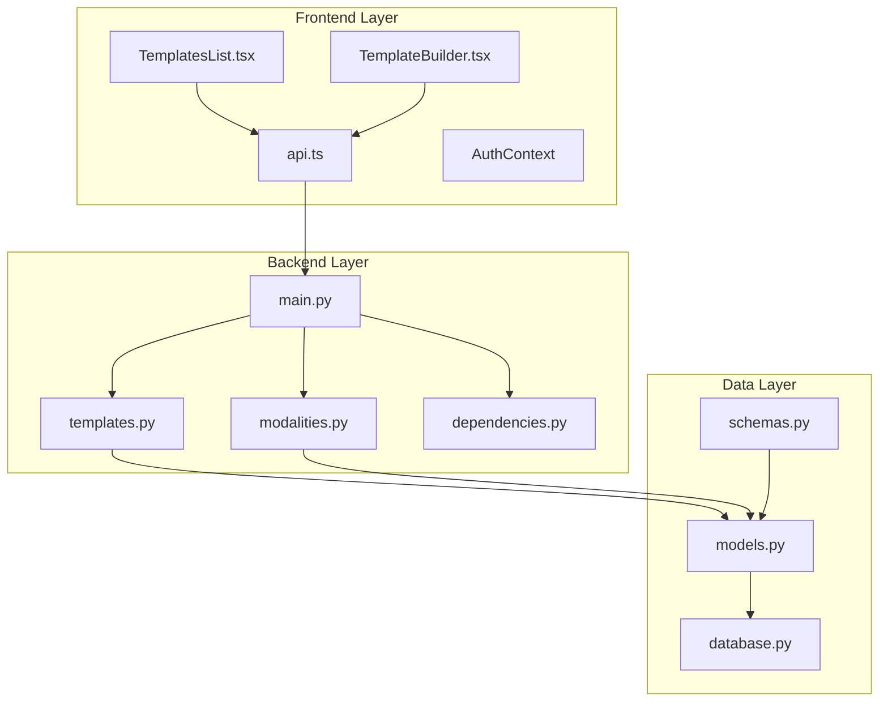
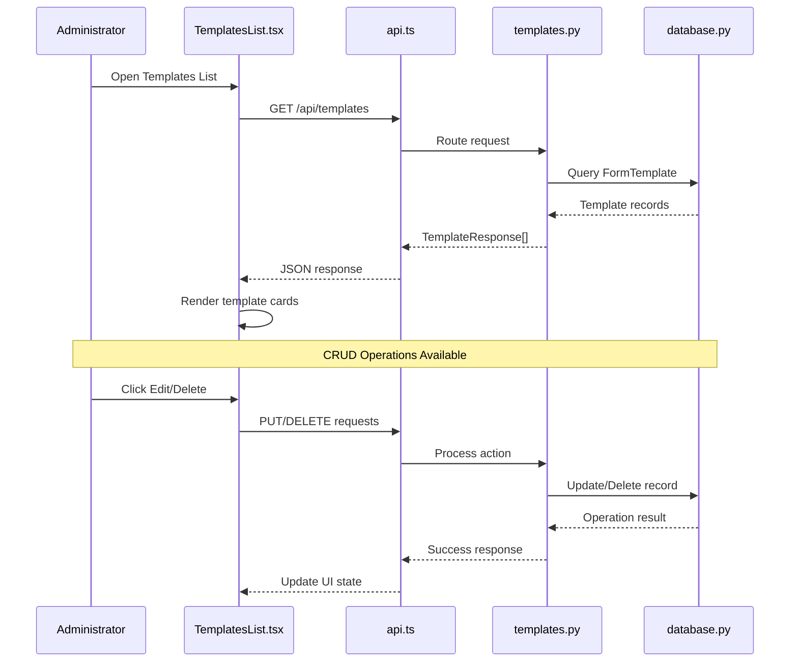
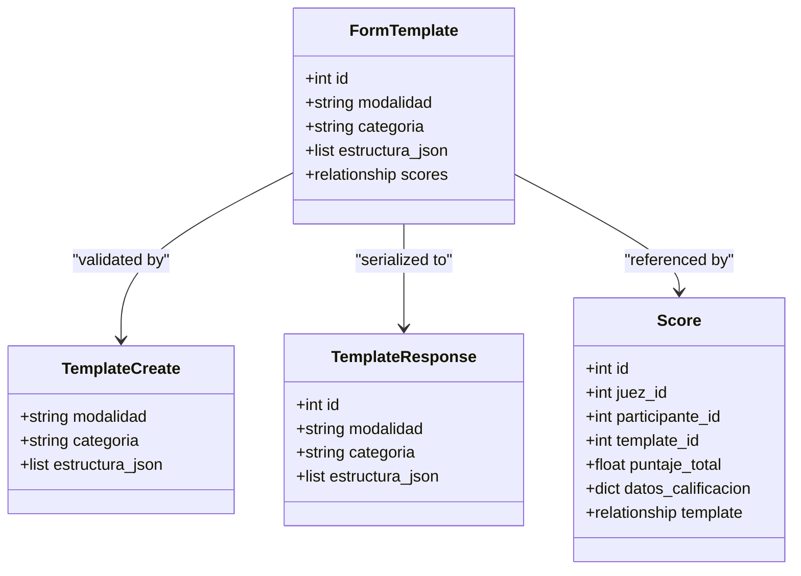
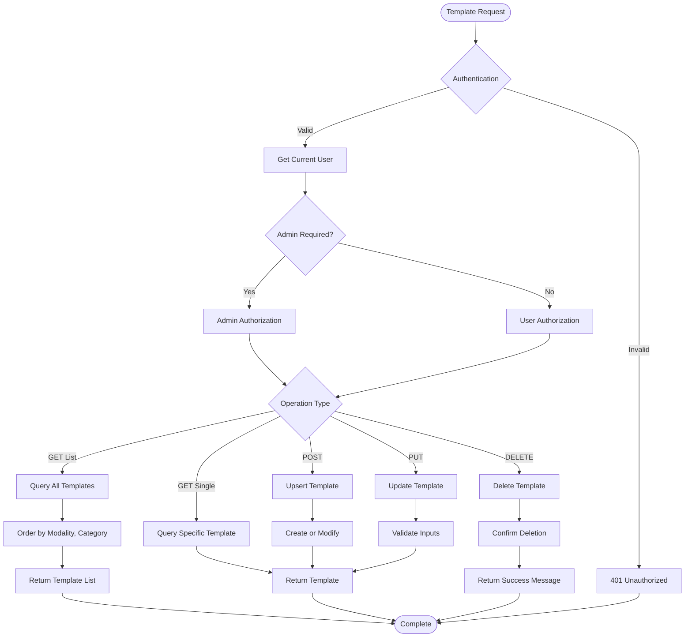
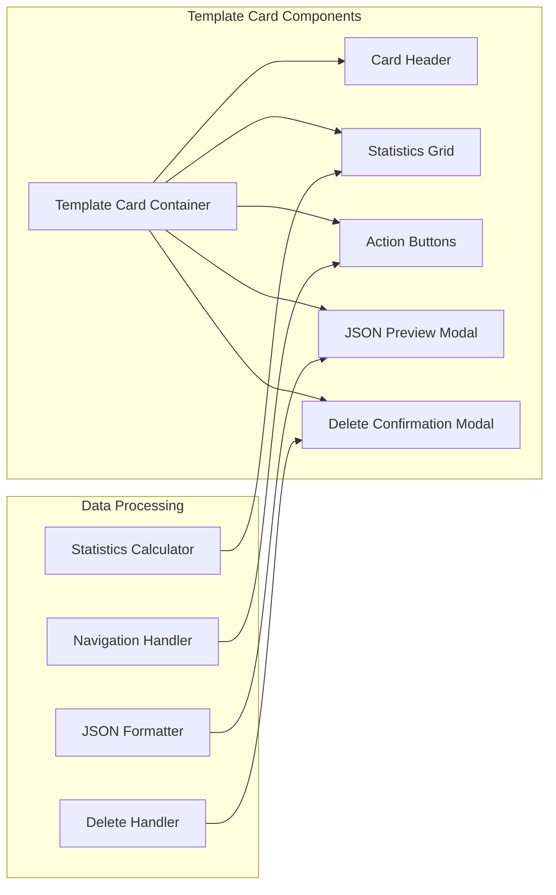
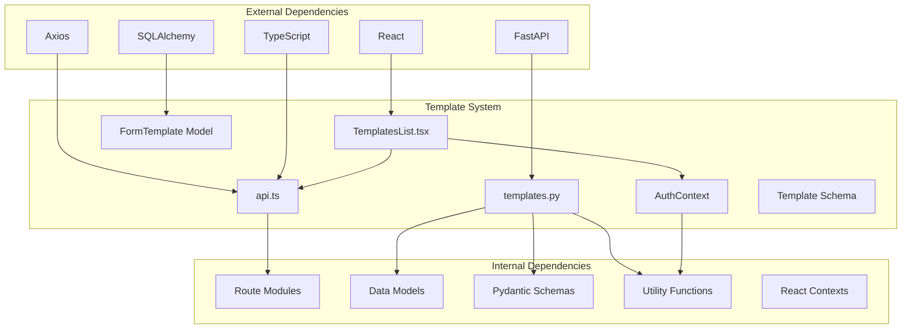

# Templates List

<cite>
**Referenced Files in This Document**
- [templates.py](file://routes/templates.py)
- [TemplatesList.tsx](file://frontend/src/pages/admin/TemplatesList.tsx)
- [api.ts](file://frontend/src/lib/api.ts)
- [models.py](file://models.py)
- [schemas.py](file://schemas.py)
- [main.py](file://main.py)
- [database.py](file://database.py)
- [dependencies.py](file://utils/dependencies.py)
- [TemplateBuilder.tsx](file://frontend/src/pages/admin/TemplateBuilder.tsx)
- [modalities.py](file://routes/modalities.py)
</cite>

## Table of Contents
1. [Introduction](#introduction)
2. [Project Structure](#project-structure)
3. [Core Components](#core-components)
4. [Architecture Overview](#architecture-overview)
5. [Detailed Component Analysis](#detailed-component-analysis)
6. [Dependency Analysis](#dependency-analysis)
7. [Performance Considerations](#performance-considerations)
8. [Troubleshooting Guide](#troubleshooting-guide)
9. [Conclusion](#conclusion)

## Introduction
This document provides comprehensive documentation for the Templates List functionality within the Car Audio and Tuning Judging System. The Templates List feature enables administrators to view, manage, and maintain evaluation templates used for scoring participants in various modalities and categories. The system consists of a FastAPI backend with SQLAlchemy ORM for data persistence and a React/TypeScript frontend for user interaction.

The Templates List serves as the primary interface for managing evaluation templates, allowing administrators to:
- View all available templates organized by modality and category
- Preview template structures in JSON format
- Edit existing templates
- Delete templates
- Navigate to the template builder for creating new templates

## Project Structure
The Templates List functionality spans three main architectural layers: frontend presentation, backend API services, and database persistence.

**Diagram sources**
- [main.py:26-48](file://main.py#L26-L48)
- [templates.py:10-134](file://routes/templates.py#L10-L134)
- [database.py:15-34](file://database.py#L15-L34)

**Section sources**
- [main.py:1-53](file://main.py#L1-L53)
- [database.py:1-93](file://database.py#L1-L93)

## Core Components

### Backend Template Management API
The backend provides a comprehensive REST API for template operations with proper authentication and authorization mechanisms.

Key endpoints include:
- GET `/api/templates` - Retrieve all templates ordered by modality and category
- GET `/api/templates/{template_id}` - Fetch a specific template by ID
- POST `/api/templates` - Create or update a template
- PUT `/api/templates/{template_id}` - Update an existing template
- DELETE `/api/templates/{template_id}` - Remove a template
- GET `/api/templates/{modalidad}/{categoria}` - Find template by modality and category

### Frontend Template List Interface
The React-based frontend presents templates in an intuitive card-based grid layout with comprehensive management capabilities including real-time statistics calculation and modal-based interactions.

### Data Model Architecture
Templates are stored as structured JSON data within the database, supporting flexible evaluation criteria definition across different modalities and categories.

**Section sources**
- [templates.py:13-134](file://routes/templates.py#L13-L134)
- [TemplatesList.tsx:24-284](file://frontend/src/pages/admin/TemplatesList.tsx#L24-L284)
- [models.py:72-84](file://models.py#L72-L84)

## Architecture Overview

**Diagram sources**
- [TemplatesList.tsx:39-58](file://frontend/src/pages/admin/TemplatesList.tsx#L39-L58)
- [api.ts:11-13](file://frontend/src/lib/api.ts#L11-L13)
- [templates.py:13-23](file://routes/templates.py#L13-L23)

The architecture follows a clean separation of concerns with clear boundaries between presentation, business logic, and data access layers.

**Section sources**
- [main.py:36-44](file://main.py#L36-L44)
- [dependencies.py:16-38](file://utils/dependencies.py#L16-L38)

## Detailed Component Analysis

### Template Data Model
The FormTemplate model serves as the foundation for template storage and management, implementing a unique constraint on the combination of modalidad and categoria fields.

**Diagram sources**
- [models.py:72-84](file://models.py#L72-L84)
- [schemas.py:120-133](file://schemas.py#L120-L133)

### Template Management Workflow
The template management process involves several coordinated steps for creation, retrieval, updates, and deletion operations.

**Diagram sources**
- [templates.py:13-134](file://routes/templates.py#L13-L134)
- [dependencies.py:32-38](file://utils/dependencies.py#L32-L38)

### Frontend Template Rendering System
The TemplatesList component implements a sophisticated rendering system with real-time statistics calculation and interactive modal dialogs.

**Diagram sources**
- [TemplatesList.tsx:77-89](file://frontend/src/pages/admin/TemplatesList.tsx#L77-L89)
- [TemplatesList.tsx:219-280](file://frontend/src/pages/admin/TemplatesList.tsx#L219-L280)

**Section sources**
- [models.py:72-84](file://models.py#L72-L84)
- [schemas.py:120-133](file://schemas.py#L120-L133)
- [TemplatesList.tsx:24-284](file://frontend/src/pages/admin/TemplatesList.tsx#L24-L284)

## Dependency Analysis

The Templates List system exhibits well-structured dependencies with clear separation between components and minimal circular dependencies.

**Diagram sources**
- [requirements.txt:1-10](file://requirements.txt#L1-L10)
- [main.py:9-17](file://main.py#L9-L17)

**Section sources**
- [requirements.txt:1-10](file://requirements.txt#L1-L10)
- [main.py:1-53](file://main.py#L1-L53)

## Performance Considerations

### Database Optimization
The template listing operation utilizes efficient database queries with appropriate ordering and indexing:

- Composite index on `(modalidad, categoria)` for optimal sorting performance
- Lazy loading of related data to minimize query overhead
- Efficient filtering for template retrieval operations

### Frontend Performance
The React implementation incorporates several performance optimizations:

- Memoized calculations for template statistics
- Conditional rendering for loading states
- Efficient state management with React hooks
- Debounced API calls for improved user experience

### API Response Optimization
Backend endpoints are designed for optimal performance:

- Minimal data transfer through focused response models
- Proper HTTP status codes for different scenarios
- Efficient error handling with specific error messages

## Troubleshooting Guide

### Common Issues and Solutions

**Template Loading Failures**
- Verify API endpoint accessibility at `/api/templates`
- Check authentication token validity
- Ensure database connectivity and proper migrations

**Authorization Problems**
- Confirm user role is set to "admin" for template management
- Verify JWT token expiration and renewal
- Check CORS configuration for cross-origin requests

**Database Connection Issues**
- Validate SQLite database file permissions
- Ensure proper database initialization
- Check for concurrent access conflicts

**Frontend Rendering Problems**
- Verify TypeScript compilation success
- Check React component dependencies
- Ensure proper state initialization

**Section sources**
- [templates.py:63-67](file://routes/templates.py#L63-L67)
- [dependencies.py:50-70](file://utils/dependencies.py#L50-L70)
- [api.ts:24-40](file://frontend/src/lib/api.ts#L24-L40)

## Conclusion

The Templates List functionality represents a well-architected solution for managing evaluation templates within the Car Audio and Tuning Judging System. The implementation demonstrates strong separation of concerns, proper authentication and authorization mechanisms, and a responsive user interface.

Key strengths of the implementation include:

- **Robust Data Model**: Well-designed SQLAlchemy models with appropriate constraints and relationships
- **Secure Access Control**: Clear distinction between user and admin operations with proper authorization checks
- **Responsive Frontend**: Intuitive card-based interface with comprehensive management capabilities
- **Efficient Performance**: Optimized database queries and frontend rendering
- **Comprehensive Error Handling**: Proper HTTP status codes and meaningful error messages

The system provides a solid foundation for template management while maintaining flexibility for future enhancements and extensions.